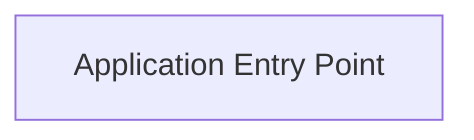

## Details

Updated the entry point based on the feedback.

### Application Entry Point [[Expand]](./Application_Entry_Point.md)
The main entry point for the PyTorch training application.

**Related Classes/Methods**:

- <a href="https://github.com/luuuyi/CBAM.PyTorch/blob/master/train.py" target="_blank" rel="noopener noreferrer">`train.py`</a>

### [FAQ](https://github.com/CodeBoarding/GeneratedOnBoardings/tree/main?tab=readme-ov-file#faq)