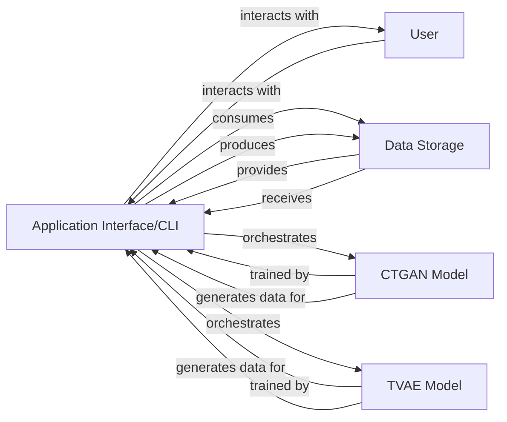

## Details

The CTGAN system's architecture is centered around its `Application Interface/CLI`, which acts as the primary interaction point for the `User`. This interface is responsible for managing the entire data synthesis workflow, from parsing user commands and loading `Raw Input Data` from `Data Storage` to orchestrating the training and generation processes of either the `CTGAN Model` or the `TVAE Model`. Once synthetic data is generated by the chosen model, the `Application Interface/CLI` ensures it is persistently stored back into `Data Storage`. This design clearly separates user interaction and data management from the core generative modeling capabilities.

### Application Interface/CLI [[Expand]](./Application_Interface_CLI.md)
The primary user-facing component, responsible for parsing command-line arguments, loading raw input data, orchestrating the training and generation processes of the selected generative model (CTGAN or TVAE), and saving the resulting synthetic data. It acts as the central coordinator for the entire data synthesis workflow, utilizing libraries like `argparse` for argument parsing and `pandas` for data handling.

**Related Classes/Methods**:

- <a href="https://github.com/sdv-dev/CTGAN/blob/main/ctgan/__main__.py#L89-L130" target="_blank" rel="noopener noreferrer">`ctgan.__main__.main`:89-130</a>

### User
The external actor who initiates and controls the data synthesis process through the command-line interface.

**Related Classes/Methods**: _None_

### Data Storage
Represents the persistent storage mechanism (e.g., file system) for both the raw input datasets consumed by the application and the synthetic datasets produced. This component abstracts the underlying file system interactions for data input and output.

**Related Classes/Methods**: _None_

### CTGAN Model [[Expand]](./CTGAN_Model.md)
The core generative adversarial network model responsible for learning the distribution of tabular data and generating high-quality synthetic samples. It is trained and utilized by the `Application Interface/CLI` to perform the primary data synthesis task.

**Related Classes/Methods**: _None_

### TVAE Model [[Expand]](./TVAE_Model.md)
An alternative generative model based on a Variational Autoencoder, designed for learning data distributions and generating synthetic data. Similar to CTGAN, it is trained and utilized by the `Application Interface/CLI` as an option for data synthesis.

**Related Classes/Methods**: _None_

### [FAQ](https://github.com/CodeBoarding/GeneratedOnBoardings/tree/main?tab=readme-ov-file#faq)