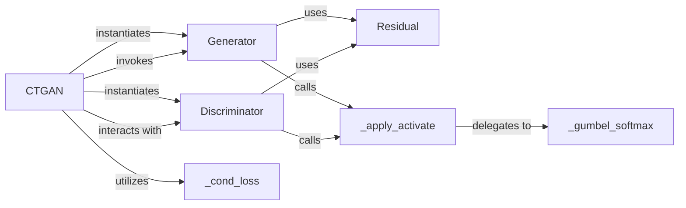

## Details

The CTGAN subsystem is orchestrated by the `CTGAN` component, which serves as the primary interface and training manager. It is responsible for instantiating and coordinating the `Generator` and `Discriminator` neural networks, which form the core of the adversarial training process. The `Generator` creates synthetic data, while the `Discriminator` evaluates its authenticity, providing crucial feedback. Both the `Generator` and `Discriminator` leverage `Residual` blocks to build deeper and more stable network architectures. During their operation, both the `Generator` and `Discriminator` directly utilize the `_apply_activate` utility function to apply various activation functions, including the specialized `_gumbel_softmax` for handling categorical data. The `CTGAN` orchestrator also utilizes the `_cond_loss` function to compute conditional loss, enabling the generation of synthetic data based on specified conditions. This architecture highlights a clear separation of concerns, with `CTGAN` managing the overall training flow and the `Generator` and `Discriminator` handling the core data generation and evaluation tasks, supported by specialized utility components.

### CTGAN
The primary orchestrator and public API for the CTGAN model. It manages the entire training lifecycle, including initializing the Generator and Discriminator, executing their adversarial training loops, and handling data sampling. It embodies the "Model Implementations," "Training Logic," "Sampling/Generation Logic," and "Public API/Interface" patterns.

**Related Classes/Methods**:

- <a href="https://github.com/sdv-dev/CTGAN/blob/main/ctgan/synthesizers/ctgan.py#L100-L549" target="_blank" rel="noopener noreferrer">`ctgan.synthesizers.ctgan.CTGAN`:100-549</a>

### Generator
A neural network responsible for generating synthetic data samples. It learns to mimic the distribution of real data based on feedback from the Discriminator. This is a core "Model Implementation" component.

**Related Classes/Methods**:

- <a href="https://github.com/sdv-dev/CTGAN/blob/main/ctgan/synthesizers/ctgan.py#L81-L97" target="_blank" rel="noopener noreferrer">`ctgan.synthesizers.ctgan.Generator`:81-97</a>

### Discriminator
A neural network that evaluates the authenticity of data samples, distinguishing between real data and synthetic data produced by the Generator. Its feedback is crucial for training the Generator. This is a core "Model Implementation" component.

**Related Classes/Methods**: _None_

### Residual
A building block (likely a PyTorch module) that implements residual connections within the Generator and Discriminator networks. These connections help improve training stability and enable deeper network architectures.

**Related Classes/Methods**:

- <a href="https://github.com/sdv-dev/CTGAN/blob/main/ctgan/synthesizers/ctgan.py#L64-L78" target="_blank" rel="noopener noreferrer">`ctgan.synthesizers.ctgan.Residual`:64-78</a>

### _apply_activate
A utility function that applies various activation functions to the outputs of neural network layers, including specialized ones like Gumbel Softmax, ensuring non-linearity and appropriate output distributions.

**Related Classes/Methods**:

- <a href="https://github.com/sdv-dev/CTGAN/blob/main/ctgan/synthesizers/ctgan.py#L224-L242" target="_blank" rel="noopener noreferrer">`ctgan.synthesizers.ctgan._apply_activate`:224-242</a>

### _gumbel_softmax
Implements the Gumbel Softmax activation function, specifically used for generating differentiable discrete samples. This is critical for CTGAN's ability to handle categorical data effectively.

**Related Classes/Methods**:

- <a href="https://github.com/sdv-dev/CTGAN/blob/main/ctgan/synthesizers/ctgan.py#L196-L222" target="_blank" rel="noopener noreferrer">`ctgan.synthesizers.ctgan._gumbel_softmax`:196-222</a>

### _cond_loss
Computes the conditional loss component during the CTGAN training process. This loss function is essential for enabling conditional synthetic data generation, allowing users to specify conditions for the generated data.

**Related Classes/Methods**:

- <a href="https://github.com/sdv-dev/CTGAN/blob/main/ctgan/synthesizers/ctgan.py#L244-L266" target="_blank" rel="noopener noreferrer">`ctgan.synthesizers.ctgan._cond_loss`:244-266</a>

### [FAQ](https://github.com/CodeBoarding/GeneratedOnBoardings/tree/main?tab=readme-ov-file#faq)