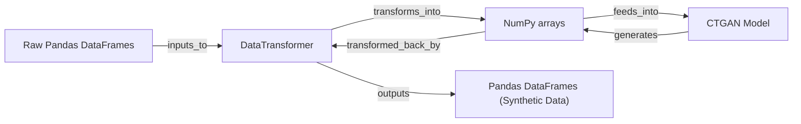

## Details

The `CTGAN` subsystem is centered around the `DataTransformer` and the `CTGAN Model`. The process begins with `Raw Pandas DataFrames` which are ingested by the `DataTransformer`. The `DataTransformer` then transforms this raw tabular data into `NumPy arrays`, a numerical format suitable for deep learning. These `NumPy arrays` are fed into the `CTGAN Model` for training and synthetic data generation. The `CTGAN Model` outputs generated data, also in the form of `NumPy arrays`, which are then passed back to the `DataTransformer`. The `DataTransformer` performs an inverse transformation, converting the numerical synthetic data back into human-readable `Pandas DataFrames (Synthetic Data)`, thus completing the data synthesis pipeline. This architecture clearly delineates the roles of data preparation, model training/generation, and output formatting.

### DataTransformer
This component is responsible for the entire lifecycle of data preparation for generative models. It learns the statistical distributions of raw tabular data, transforms this data into a numerical format suitable for model training (e.g., PyTorch tensors), and performs the inverse transformation to convert generated synthetic data back into its original, human-readable representation. It specifically handles both continuous and discrete data types, ensuring data integrity and compatibility throughout the synthesis pipeline.

**Related Classes/Methods**:

- <a href="https://github.com/sdv-dev/CTGAN/blob/main/ctgan/data_transformer.py#L17-L265" target="_blank" rel="noopener noreferrer">`ctgan.data_transformer.DataTransformer`:17-265</a>

### Raw Pandas DataFrames
Raw tabular data, typically provided as Pandas DataFrames, serving as the initial input for fitting and transformation. This represents the external data source.

**Related Classes/Methods**: _None_

### NumPy arrays
Numerical data in the form of NumPy arrays, which are the standard input format for the deep learning models after transformation by the `DataTransformer`.

**Related Classes/Methods**: _None_

### Pandas DataFrames (Synthetic Data)
Structured Pandas DataFrames, representing the generated synthetic data restored to its original tabular representation by the `DataTransformer`.

**Related Classes/Methods**: _None_

### CTGAN Model [[Expand]](./CTGAN_Model.md)
The core generative adversarial network model responsible for learning the underlying data distribution and generating synthetic data. It consumes numerical data prepared by `DataTransformer` for training and generation.

**Related Classes/Methods**:

- <a href="https://github.com/sdv-dev/CTGAN/blob/main/ctgan/ctgan.py#L17-L265" target="_blank" rel="noopener noreferrer">`ctgan.ctgan.CTGAN`:17-265</a>

### [FAQ](https://github.com/CodeBoarding/GeneratedOnBoardings/tree/main?tab=readme-ov-file#faq)