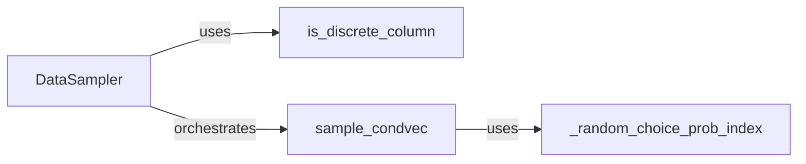

## Details

The Data Sampling subsystem is encapsulated within the ctgan.data_sampler module. This module is responsible for all operations related to preparing and sampling data, particularly for generating conditional vectors that guide the synthetic data generation process.

### DataSampler
The primary orchestrator of the data sampling process. It identifies discrete columns, prepares the input data, and manages the generation of conditional vectors. It serves as the main interface for other parts of the CTGAN model to obtain sampled data and conditional information.

**Related Classes/Methods**:

- <a href="https://github.com/sdv-dev/CTGAN/blob/main/ctgan/data_sampler.py#L6-L153" target="_blank" rel="noopener noreferrer">`ctgan.data_sampler.DataSampler`:6-153</a>

### is_discrete_column
A utility function that determines whether a given column in the dataset is discrete. This is crucial for applying appropriate encoding and sampling strategies during data preparation.

**Related Classes/Methods**:

- <a href="https://github.com/sdv-dev/CTGAN/blob/main/ctgan/data_sampler.py#L12-L13" target="_blank" rel="noopener noreferrer">`ctgan.data_sampler.is_discrete_column`:12-13</a>

### sample_condvec
Generates the conditional vectors. These vectors are fundamental for guiding the generative models (e.g., CTGAN's generator) to produce synthetic data with specific characteristics, especially for discrete columns, ensuring the generated data adheres to desired distributions.

**Related Classes/Methods**:

- <a href="https://github.com/sdv-dev/CTGAN/blob/main/ctgan/data_sampler.py#L81-L106" target="_blank" rel="noopener noreferrer">`ctgan.data_sampler.sample_condvec`:81-106</a>

### _random_choice_prob_index
A low-level utility function that performs probabilistic index selection based on given probabilities. It ensures diversity and adherence to data distributions during the sampling process, particularly when selecting indices for conditional vectors.

**Related Classes/Methods**:

- <a href="https://github.com/sdv-dev/CTGAN/blob/main/ctgan/data_sampler.py#L76-L79" target="_blank" rel="noopener noreferrer">`ctgan.data_sampler._random_choice_prob_index`:76-79</a>

### [FAQ](https://github.com/CodeBoarding/GeneratedOnBoardings/tree/main?tab=readme-ov-file#faq)