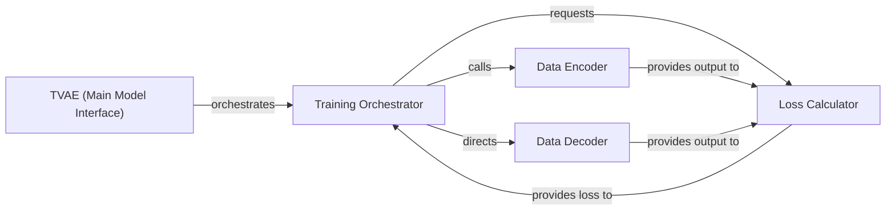

## Details

The TVAE Model subsystem is a core component of the synthetic data generation library, specifically implementing the Tabular Variational Autoencoder algorithm. It adheres to the "ML Toolkit/Library" and "Pipeline/Workflow" architectural patterns, focusing on modularity for model implementation and training logic.

### TVAE (Main Model Interface)
Serves as the primary public interface for the Tabular Variational Autoencoder. It orchestrates the overall training and sampling processes, initializing the Encoder and Decoder networks and managing the model's lifecycle.

**Related Classes/Methods**:

- <a href="https://github.com/sdv-dev/CTGAN/blob/main/ctgan/synthesizers/tvae.py#L105-L246" target="_blank" rel="noopener noreferrer">`ctgan.synthesizers.tvae.TVAE`:105-246</a>

### Training Orchestrator
Manages the iterative training loop for the TVAE model. It coordinates the data flow through the `Data Encoder` and `Data Decoder`, and utilizes the `Loss Calculator` to compute gradients and optimize the model's parameters.

**Related Classes/Methods**:

- <a href="https://github.com/sdv-dev/CTGAN/blob/main/ctgan/synthesizers/tvae.py" target="_blank" rel="noopener noreferrer">`ctgan.synthesizers.tvae.TVAE:fit`</a>

### Data Encoder
Implements the neural network responsible for mapping high-dimensional input data into a lower-dimensional latent space. It learns to extract and represent the essential features of the input data.

**Related Classes/Methods**:

- <a href="https://github.com/sdv-dev/CTGAN/blob/main/ctgan/synthesizers/tvae.py" target="_blank" rel="noopener noreferrer">`ctgan.synthesizers.tvae.Encoder`</a>

### Data Decoder
Implements the neural network responsible for reconstructing data from the latent space back into the original data space. Its goal is to generate synthetic data that closely resembles the distribution of the original data.

**Related Classes/Methods**:

- <a href="https://github.com/sdv-dev/CTGAN/blob/main/ctgan/synthesizers/tvae.py" target="_blank" rel="noopener noreferrer">`ctgan.synthesizers.tvae.Decoder`</a>

### Loss Calculator
Computes the combined loss function for the TVAE, which typically includes a reconstruction loss (e.g., Mean Squared Error or Binary Cross-Entropy) and a Kullback-Leibler (KL) divergence term. This loss guides the model's learning process.

**Related Classes/Methods**:

- <a href="https://github.com/sdv-dev/CTGAN/blob/main/ctgan/synthesizers/tvae.py" target="_blank" rel="noopener noreferrer">`ctgan.synthesizers.tvae.TVAE:_loss_function`</a>

### [FAQ](https://github.com/CodeBoarding/GeneratedOnBoardings/tree/main?tab=readme-ov-file#faq)