```mermaid
graph LR
    Application_Interface_CLI["Application Interface/CLI"]
    Data_Preprocessing_Transformation["Data Preprocessing & Transformation"]
    Data_Sampling["Data Sampling"]
    CTGAN_Model["CTGAN Model"]
    TVAE_Model["TVAE Model"]
    Application_Interface_CLI -- "Initiates Processing & Provides Raw Data" --> Data_Preprocessing_Transformation
    Application_Interface_CLI -- "Initializes & Orchestrates" --> CTGAN_Model
    Application_Interface_CLI -- "Initializes & Orchestrates" --> TVAE_Model
    Data_Preprocessing_Transformation -- "Returns Inverse Transformed Data" --> Application_Interface_CLI
    Data_Preprocessing_Transformation -- "Provides Transformed Data" --> CTGAN_Model
    Data_Preprocessing_Transformation -- "Provides Transformed Data" --> TVAE_Model
    CTGAN_Model -- "Sends Synthetic Data for Inverse Transform" --> Data_Preprocessing_Transformation
    TVAE_Model -- "Sends Synthetic Data for Inverse Transform" --> Data_Preprocessing_Transformation
    Data_Sampling -- "Provides Conditional Vectors" --> CTGAN_Model
    Data_Sampling -- "Provides Conditional Vectors" --> TVAE_Model
    CTGAN_Model -- "Requests Conditional Vectors" --> Data_Sampling
    TVAE_Model -- "Requests Conditional Vectors" --> Data_Sampling
    click Application_Interface_CLI href "https://github.com/CodeBoarding/GeneratedOnBoardings/blob/main/CTGAN/Application_Interface_CLI.md" "Details"
    click Data_Preprocessing_Transformation href "https://github.com/CodeBoarding/GeneratedOnBoardings/blob/main/CTGAN/Data_Preprocessing_Transformation.md" "Details"
    click Data_Sampling href "https://github.com/CodeBoarding/GeneratedOnBoardings/blob/main/CTGAN/Data_Sampling.md" "Details"
    click CTGAN_Model href "https://github.com/CodeBoarding/GeneratedOnBoardings/blob/main/CTGAN/CTGAN_Model.md" "Details"
    click TVAE_Model href "https://github.com/CodeBoarding/GeneratedOnBoardings/blob/main/CTGAN/TVAE_Model.md" "Details"
```

## Details

The CTGAN architecture is designed as a modular pipeline for generating synthetic tabular data. The `Application Interface/CLI` serves as the primary user interaction point, managing data input and output, and orchestrating the overall workflow. Raw data is first handled by the `Data Preprocessing & Transformation` component, which prepares it for model consumption and later restores the original data format for synthetic outputs. The core generative logic is encapsulated within either the `CTGAN Model` or `TVAE Model`, which leverage `Data Sampling` to guide the generation process. This clear separation of concerns facilitates maintainability and allows for easy extension with new generative models or data transformation techniques.

### Application Interface/CLI [[Expand]](./Application_Interface_CLI.md)
The user-facing entry point for the CTGAN library. It manages command-line argument parsing, loads raw input data (e.g., CSV/TSV), initializes and orchestrates the selected generative model (CTGAN or TVAE), triggers the training process, and handles the sampling and saving of synthetic data.

**Related Classes/Methods**:

- <a href="https://github.com/sdv-dev/CTGAN/blob/main/ctgan/__main__.py#L89-L130" target="_blank" rel="noopener noreferrer">`ctgan.__main__.main`:89-130</a>

### Data Preprocessing & Transformation [[Expand]](./Data_Preprocessing_Transformation.md)
This module is responsible for preparing raw tabular data for consumption by the generative models. It fits transformers to learn data distributions, transforms raw data into a numerical, model-compatible format, and performs the inverse transformation on generated synthetic data to restore its original representation. It handles both continuous and discrete data types.

**Related Classes/Methods**:

- <a href="https://github.com/sdv-dev/CTGAN/blob/main/ctgan/data_transformer.py#L17-L265" target="_blank" rel="noopener noreferrer">`ctgan.data_transformer.DataTransformer`:17-265</a>

### Data Sampling [[Expand]](./Data_Sampling.md)
Manages the sampling of conditional vectors and subsets of original training data. Conditional vectors are crucial for guiding the generative models to produce synthetic data with specific characteristics, particularly for discrete columns, ensuring the generated data adheres to desired distributions.

**Related Classes/Methods**:

- <a href="https://github.com/sdv-dev/CTGAN/blob/main/ctgan/data_sampler.py#L6-L153" target="_blank" rel="noopener noreferrer">`ctgan.data_sampler.DataSampler`:6-153</a>

### CTGAN Model [[Expand]](./CTGAN_Model.md)
Implements the core Conditional Tabular Generative Adversarial Network (CTGAN) algorithm. This component orchestrates the Generator and Discriminator neural networks, along with their specific training loops and sampling logic. It interacts with the Data Preprocessing and Data Sampling modules to facilitate its operations.

**Related Classes/Methods**:

- <a href="https://github.com/sdv-dev/CTGAN/blob/main/ctgan/synthesizers/ctgan.py#L100-L549" target="_blank" rel="noopener noreferrer">`ctgan.synthesizers.ctgan.CTGAN`:100-549</a>
- <a href="https://github.com/sdv-dev/CTGAN/blob/main/ctgan/synthesizers/ctgan.py#L81-L97" target="_blank" rel="noopener noreferrer">`ctgan.synthesizers.ctgan.Generator`:81-97</a>

### TVAE Model [[Expand]](./TVAE_Model.md)
Implements the Tabular Variational Autoencoder (TVAE) algorithm. This component defines the Encoder and Decoder neural networks and their respective training logic. Similar to the CTGAN Model, it interacts with the Data Preprocessing module for data transformation and the Data Sampling module for conditional generation.

**Related Classes/Methods**:

- <a href="https://github.com/sdv-dev/CTGAN/blob/main/ctgan/synthesizers/tvae.py#L105-L246" target="_blank" rel="noopener noreferrer">`ctgan.synthesizers.tvae.TVAE`:105-246</a>

### [FAQ](https://github.com/CodeBoarding/GeneratedOnBoardings/tree/main?tab=readme-ov-file#faq)