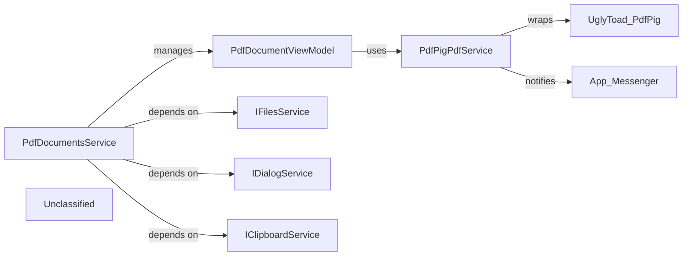

## Details

The PDF subsystem in Caly.Core is architected around two primary components: `PdfDocumentsService` and `PdfPigPdfService`. The `PdfDocumentsService` acts as the application-level manager for PDF documents, orchestrating their loading, display, and lifecycle. It leverages an asynchronous processing queue for document operations and maintains a collection of `PdfDocumentViewModel` instances, each representing an open PDF. Each `PdfDocumentViewModel`, in turn, relies on an instance of `PdfPigPdfService` (accessed through the `IPdfService` interface) to perform the low-level parsing and data extraction from PDF files using the `UglyToad.PdfPig` library. This clear division ensures that `PdfDocumentsService` handles the overall document flow and user interaction, while `PdfPigPdfService` encapsulates the intricate details of PDF file manipulation, including handling password protection through an application-wide messaging system.

### PdfPigPdfService
This component serves as the direct, low-level interface to the PdfPig library. Its primary responsibility is to encapsulate all interactions with the PdfPig API, handling operations such as opening PDF files, parsing their internal structure, and extracting raw data like pages, text content, and images. It effectively abstracts the complexities and specifics of the PdfPig library from the rest of the application, ensuring that changes to the underlying PDF parsing library have minimal impact on other components. It also handles password-protected documents by interacting with the application's messaging system to request a password.

**Related Classes/Methods**:

- `Caly.Core.Services.PdfPigPdfService`

### PdfDocumentsService
This component provides a higher-level, application-specific interface for managing PDF documents. It orchestrates the use of the `PdfPigPdfService` (via `IPdfService`) to fulfill requests for document-level operations. Its responsibilities include managing the lifecycle of an opened PDF document (e.g., opening, closing), providing access to aggregated document properties (e.g., page count, metadata), and potentially implementing caching strategies for performance optimization. It acts as a facade, simplifying document interactions for other application layers and handling asynchronous document loading.

**Related Classes/Methods**:

- `Caly.Core.Services.PdfDocumentsService`

### Unclassified
Component for all unclassified files and utility functions (Utility functions/External Libraries/Dependencies)

**Related Classes/Methods**: _None_

### [FAQ](https://github.com/CodeBoarding/GeneratedOnBoardings/tree/main?tab=readme-ov-file#faq)