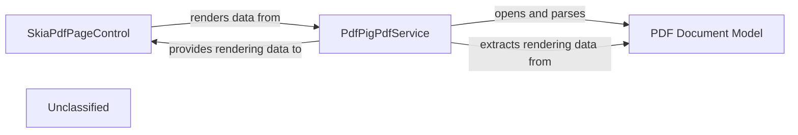

## Details

The PDF rendering subsystem in Caly.Core is designed to display PDF documents efficiently within an Avalonia UI application. It leverages external libraries, SkiaSharp for high-performance graphics rendering and PdfPig for PDF document parsing. The PdfPigPdfService acts as an intermediary, extracting PDF data from PdfPig and preparing it for rendering by the SkiaPdfPageControl, which uses SkiaSharp to draw the content on the UI. This separation of concerns allows for flexible handling of PDF data and optimized rendering.

### SkiaPdfPageControl
This is an Avalonia UI control responsible for displaying a single PDF page. It directly utilizes the SkiaSharp library for high-performance 2D graphics rendering. It receives processed PDF data (in the form of an SKPicture) and translates it into a visual representation on the UI.

**Related Classes/Methods**:

- <a href="https://github.com/CalyPdf/Caly/blob/master/Caly.Core/Controls/SkiaPdfPageControl.cs" target="_blank" rel="noopener noreferrer">`Caly.Core.Controls.SkiaPdfPageControl`</a>

### PdfPigPdfService
This service is responsible for interacting with the PdfPig library to open, parse, and extract data from PDF documents. It acts as an adapter, converting raw PDF page data into a format suitable for rendering by the SkiaPdfPageControl. It also manages document-level information and page-specific data extraction, such as page size and text layers.

**Related Classes/Methods**:

- <a href="https://github.com/CalyPdf/Caly/blob/master/Caly.Core/Services/PdfPigPdfService.cs" target="_blank" rel="noopener noreferrer">`Caly.Core.Services.PdfPigPdfService`</a>

### PDF Document Model
This component represents the underlying PDF document structure and its content, as managed and exposed by the PdfPig library. It is the source from which PdfPigPdfService extracts page information, text, and vector graphics for rendering.

**Related Classes/Methods**:

- `PdfPig`

### Unclassified
Component for all unclassified files and utility functions (Utility functions/External Libraries/Dependencies)

**Related Classes/Methods**: _None_

### [FAQ](https://github.com/CodeBoarding/GeneratedOnBoardings/tree/main?tab=readme-ov-file#faq)