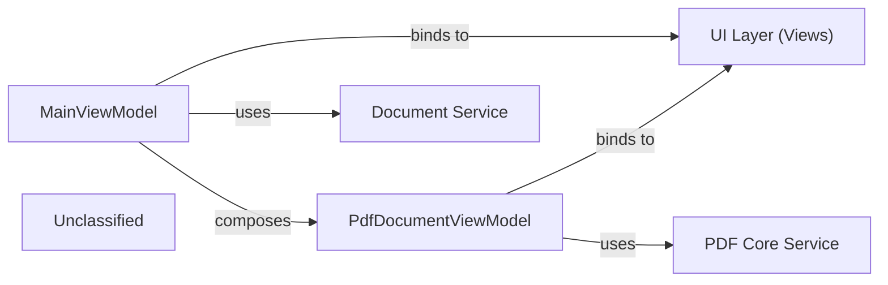

## Details

The application's core functionality revolves around managing and displaying PDF documents. The MainViewModel acts as the central orchestrator, managing the lifecycle of individual PdfDocumentViewModel instances. It delegates document-level operations like opening and closing to a Document Service. Each PdfDocumentViewModel is responsible for the presentation logic of a single PDF, interacting with a PDF Core Service for low-level document access, rendering, and interactive features. The UI Layer (Views) binds to these ViewModels to present information and capture user interactions. The application employs an MVVM (Model-View-ViewModel) architectural pattern, with MainViewModel serving as the primary orchestrator for application-wide concerns and managing multiple PdfDocumentViewModel instances. The UI Layer (Views) provides the visual interface, binding directly to these ViewModels. Document management at a higher level is handled by the Document Service, which MainViewModel utilizes to open and close PDF files. For detailed, low-level interactions with PDF document content, rendering, and interactive elements, PdfDocumentViewModel relies on the PDF Core Service, which acts as a unified interface for document data, rendering, and interactive features. This structure ensures a clear separation of concerns, promoting maintainability and testability.

### MainViewModel
Manages overall application state, orchestrates PdfDocumentViewModel instances, and handles application-level commands (e.g., open file, close document).

**Related Classes/Methods**:

- `Caly.Core.ViewModels.MainViewModel`

### PdfDocumentViewModel
Manages the presentation state and logic for a single PDF document, including page navigation, zoom, text selection, and search.

**Related Classes/Methods**:

- `Caly.Core.ViewModels.PdfDocumentViewModel`

### UI Layer (Views)
Provides the visual representation of the application and its PDF documents, allowing user interaction.

**Related Classes/Methods**:

- `Application.UI.Views`

### Document Service
Handles high-level operations related to PDF documents, such as opening, loading, and closing documents.

**Related Classes/Methods**:

- `IPdfDocumentsService`

### PDF Core Service
Provides low-level access and operations on a single PDF document, including rendering pages, managing interactive layers, handling annotations, and providing thumbnail data. This component encapsulates functionalities previously identified as 'PDF Document Model', 'Document Rendering Engine', 'Interaction & Annotation Service', and 'Thumbnail Service'.

**Related Classes/Methods**:

- `IPdfService`

### Unclassified
Component for all unclassified files and utility functions (Utility functions/External Libraries/Dependencies)

**Related Classes/Methods**: _None_

### [FAQ](https://github.com/CodeBoarding/GeneratedOnBoardings/tree/main?tab=readme-ov-file#faq)