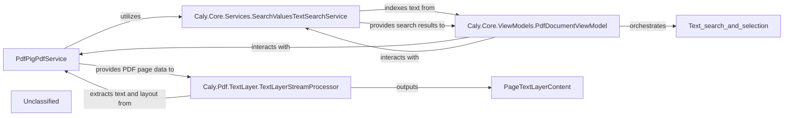

## Details

The PDF text search subsystem is built around four core components: the `PdfPigPdfService`, which acts as the primary interface for PDF document operations and text layer retrieval; the `TextLayerStreamProcessor`, responsible for extracting detailed text and layout information from individual PDF pages; the `SearchValuesTextSearchService`, which efficiently indexes and searches the extracted text content; and the `PdfDocumentViewModel`, serving as the central orchestrator for user-initiated search requests and the presentation of results within the UI. The `PdfPigPdfService` provides the raw PDF page data, which is then processed by the `TextLayerStreamProcessor` to yield structured text. This structured text is subsequently indexed by the `SearchValuesTextSearchService`. The `PdfDocumentViewModel` initiates both the indexing and search processes, receiving and displaying the search results to the user.

### PdfPigPdfService
This foundational service is responsible for opening PDF documents, managing pages, and providing access to page information and text layers. It acts as the primary data source for text extraction, ensuring that the `TextLayerStreamProcessor` has the necessary input to perform its function. It also utilizes the `ITextSearchService` for building the search index.

**Related Classes/Methods**:

- <a href="https://github.com/CalyPdf/Caly/blob/master/Caly.Core/Services/PdfPigPdfService.cs" target="_blank" rel="noopener noreferrer">`Caly.Core.Services.PdfPigPdfService`</a>

### Caly.Pdf.TextLayer.TextLayerStreamProcessor
Extracts text content and its layout information (e.g., position, font, size) from PDF pages by processing the PDF's text layer stream. It acts as the low-level provider of structured text data, translating raw PDF data into usable text elements.

**Related Classes/Methods**:

- <a href="https://github.com/CalyPdf/Caly/blob/master/Caly.Pdf/TextLayer/TextLayerStreamProcessor.cs" target="_blank" rel="noopener noreferrer">`Caly.Pdf.TextLayer.TextLayerStreamProcessor`</a>

### Caly.Core.Services.SearchValuesTextSearchService
Implements the core logic and algorithms for searching text within the extracted PDF content. It performs string matching or other search operations and identifies occurrences of search queries, providing a dedicated service for search functionality. It builds an index of the PDF document's text content and performs search operations against this index.

**Related Classes/Methods**:

- <a href="https://github.com/CalyPdf/Caly/blob/master/Caly.Core/Services/SearchValuesTextSearchService.cs" target="_blank" rel="noopener noreferrer">`Caly.Core.Services.SearchValuesTextSearchService`</a>

### Caly.Core.ViewModels.PdfDocumentViewModel
Orchestrates text selection and search requests, translating user actions from the UI into calls to the `SearchValuesTextSearchService` and updating the UI based on the search results or selected text. It acts as the bridge between the UI and the core text processing/search services.

**Related Classes/Methods**:

- <a href="https://github.com/CalyPdf/Caly/blob/master/Caly.Core/ViewModels/PdfDocumentViewModel.TextSearch.cs" target="_blank" rel="noopener noreferrer">`Caly.Core.ViewModels.PdfDocumentViewModel`</a>

### Unclassified
Component for all unclassified files and utility functions (Utility functions/External Libraries/Dependencies)

**Related Classes/Methods**: _None_

### [FAQ](https://github.com/CodeBoarding/GeneratedOnBoardings/tree/main?tab=readme-ov-file#faq)