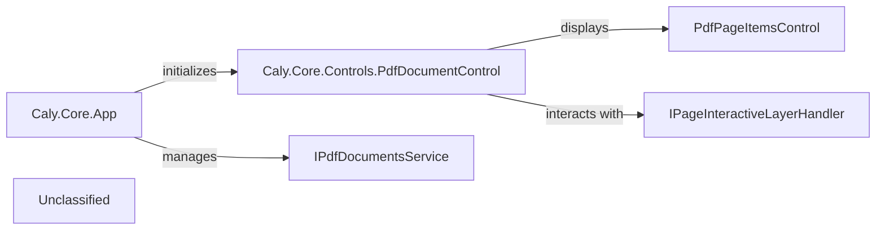

## Details

The Caly application's core architecture is centered around the `Caly.Core.App` component, which serves as the application's entry point and orchestrator. It initializes the Avalonia UI framework, sets up the main application window (`MainWindow`), and manages the dependency injection container, making critical services like `IPdfDocumentsService` available. The `IPdfDocumentsService` is responsible for the lifecycle and operations related to PDF documents. User interaction and PDF content display are handled by the `Caly.Core.Controls.PdfDocumentControl`, a specialized UI component that renders PDF pages and facilitates navigation and interaction, often delegating specific interactive behaviors to an `IPageInteractiveLayerHandler`. This structure ensures a clear separation of concerns between application setup, document management, and user interface presentation.

### Caly.Core.App
This component serves as the main entry point for the Caly application, responsible for initializing the Avalonia UI framework, setting up application-wide resources, and defining the main window or shell that hosts all other UI components. It manages the overall lifecycle and structure of the user interface. It is fundamental as the application's root UI container.

**Related Classes/Methods**:

- <a href="https://github.com/CalyPdf/Caly/blob/master/Caly.Core/App.axaml.cs" target="_blank" rel="noopener noreferrer">`Caly.Core.App`</a>

### Caly.Core.Controls.PdfDocumentControl
This specialized custom control is designed specifically for displaying PDF document content. It handles the rendering of PDF pages, manages user interactions such as scrolling, zooming, and potentially text selection within the PDF view. It acts as the primary visual component for presenting PDF documents to the user. It is crucial for the core functionality of a PDF reader.

**Related Classes/Methods**:

- <a href="https://github.com/CalyPdf/Caly/blob/master/Caly.Core/Controls/PdfDocumentControl.axaml.cs" target="_blank" rel="noopener noreferrer">`Caly.Core.Controls.PdfDocumentControl`</a>

### Unclassified
Component for all unclassified files and utility functions (Utility functions/External Libraries/Dependencies)

**Related Classes/Methods**: _None_

### [FAQ](https://github.com/CodeBoarding/GeneratedOnBoardings/tree/main?tab=readme-ov-file#faq)