```mermaid
graph LR
    User_Interface_UI_["User Interface (UI)"]
    Presentation_Logic_View_Models_["Presentation Logic (View Models)"]
    PDF_Document_Core["PDF Document Core"]
    PDF_Rendering_Engine["PDF Rendering Engine"]
    Text_Processing_Search["Text Processing & Search"]
    File_System_Storage["File System & Storage"]
    Unclassified["Unclassified"]
    User_Interface_UI_ -- "User Input / Command Invocation" --> Presentation_Logic_View_Models_
    Presentation_Logic_View_Models_ -- "Data Binding / UI Updates" --> User_Interface_UI_
    Presentation_Logic_View_Models_ -- "Document Operations" --> PDF_Document_Core
    Presentation_Logic_View_Models_ -- "File Dialog Invocation" --> File_System_Storage
    File_System_Storage -- "File Loading / Saving" --> PDF_Document_Core
    PDF_Document_Core -- "Page Rendering Request" --> PDF_Rendering_Engine
    PDF_Rendering_Engine -- "Rendered Output Display" --> User_Interface_UI_
    PDF_Document_Core -- "Text Extraction Request" --> Text_Processing_Search
    Text_Processing_Search -- "Search Results / Text Selection Data" --> Presentation_Logic_View_Models_
    click User_Interface_UI_ href "https://github.com/CodeBoarding/GeneratedOnBoardings/blob/main/Caly/User_Interface_UI_.md" "Details"
    click Presentation_Logic_View_Models_ href "https://github.com/CodeBoarding/GeneratedOnBoardings/blob/main/Caly/Presentation_Logic_View_Models_.md" "Details"
    click PDF_Document_Core href "https://github.com/CodeBoarding/GeneratedOnBoardings/blob/main/Caly/PDF_Document_Core.md" "Details"
    click PDF_Rendering_Engine href "https://github.com/CodeBoarding/GeneratedOnBoardings/blob/main/Caly/PDF_Rendering_Engine.md" "Details"
    click Text_Processing_Search href "https://github.com/CodeBoarding/GeneratedOnBoardings/blob/main/Caly/Text_Processing_Search.md" "Details"
```

## Details

The Caly application follows a clear separation of concerns, primarily adhering to an MVVM (Model-View-ViewModel) pattern for its user interface. The `User Interface (UI)` component, built with Avalonia, provides the visual elements and handles user interactions. It communicates with the `Presentation Logic (View Models)` component, which manages the application's state and exposes data and commands to the UI. Core functionalities, such as PDF document handling, rendering, text processing, and file system interactions, are encapsulated within dedicated service components. The `PDF Document Core` component leverages the PdfPig library to manage PDF documents, while the `PDF Rendering Engine` uses SkiaSharp for efficient page rendering. Text extraction and searching are handled by the `Text Processing & Search` component, and file operations are managed by the `File System & Storage` component. This modular design promotes maintainability, testability, and a clear data flow throughout the application.

### User Interface (UI) [[Expand]](./User_Interface_UI_.md)
Handles all visual presentation, user input, and navigation. It is the direct interface for the user.

**Related Classes/Methods**:

- <a href="https://github.com/CalyPdf/Caly/blob/master/Caly.Core/App.axaml.cs" target="_blank" rel="noopener noreferrer">`Caly.Core.App`</a>
- <a href="https://github.com/CalyPdf/Caly/blob/master/Caly.Core/Controls/PdfDocumentControl.axaml.cs" target="_blank" rel="noopener noreferrer">`Caly.Core.Controls.PdfDocumentControl`</a>

### Presentation Logic (View Models) [[Expand]](./Presentation_Logic_View_Models_.md)
Manages the application's presentation state and logic, exposing data and commands to the UI. It acts as the bridge between the UI and the core services.

**Related Classes/Methods**:

- <a href="https://github.com/CalyPdf/Caly/blob/master/Caly.Core/ViewModels/MainViewModel.cs" target="_blank" rel="noopener noreferrer">`Caly.Core.ViewModels.MainViewModel`</a>
- <a href="https://github.com/CalyPdf/Caly/blob/master/Caly.Core/ViewModels/PdfDocumentViewModel.cs" target="_blank" rel="noopener noreferrer">`Caly.Core.ViewModels.PdfDocumentViewModel`</a>

### PDF Document Core [[Expand]](./PDF_Document_Core.md)
Provides fundamental operations for loading, parsing, and managing PDF documents, abstracting the underlying PdfPig library.

**Related Classes/Methods**:

- <a href="https://github.com/CalyPdf/Caly/blob/master/Caly.Core/Services/PdfDocumentsService.cs" target="_blank" rel="noopener noreferrer">`Caly.Core.Services.PdfDocumentsService`</a>
- <a href="https://github.com/CalyPdf/Caly/blob/master/Caly.Core/Services/PdfPigPdfService.cs" target="_blank" rel="noopener noreferrer">`Caly.Core.Services.PdfPigPdfService`</a>

### PDF Rendering Engine [[Expand]](./PDF_Rendering_Engine.md)
Converts PDF page data into visual representations (bitmaps) for display, leveraging SkiaSharp for high-performance graphics.

**Related Classes/Methods**:

- <a href="https://github.com/CalyPdf/Caly/blob/master/Caly.Core/Services/PdfPigPdfService.cs" target="_blank" rel="noopener noreferrer">`Caly.Core.Services.PdfPigPdfService`</a>
- <a href="https://github.com/CalyPdf/Caly/blob/master/Caly.Core/Controls/SkiaPdfPageControl.cs" target="_blank" rel="noopener noreferrer">`Caly.Core.Controls.SkiaPdfPageControl`</a>

### Text Processing & Search [[Expand]](./Text_Processing_Search.md)
Handles the extraction, selection, and searching of text within PDF documents.

**Related Classes/Methods**:

- <a href="https://github.com/CalyPdf/Caly/blob/master/Caly.Core/Services/SearchValuesTextSearchService.cs" target="_blank" rel="noopener noreferrer">`Caly.Core.Services.SearchValuesTextSearchService`</a>
- <a href="https://github.com/CalyPdf/Caly/blob/master/Caly.Pdf/TextLayer/TextLayerStreamProcessor.cs" target="_blank" rel="noopener noreferrer">`Caly.Pdf.TextLayer.TextLayerStreamProcessor`</a>

### File System & Storage
Manages interactions with the file system for opening, saving, and managing PDF files.

**Related Classes/Methods**:

- <a href="https://github.com/CalyPdf/Caly/blob/master/Caly.Core/Services/FilesService.cs" target="_blank" rel="noopener noreferrer">`Caly.Core.Services.FilesService`</a>

### Unclassified
Component for all unclassified files and utility functions (Utility functions/External Libraries/Dependencies)

**Related Classes/Methods**: _None_

### [FAQ](https://github.com/CodeBoarding/GeneratedOnBoardings/tree/main?tab=readme-ov-file#faq)