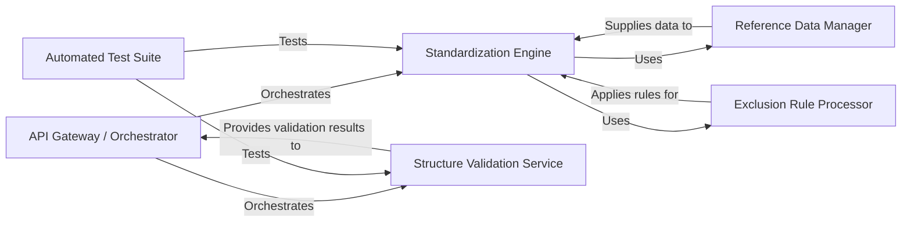

## Details

This document outlines the key components of the chembl_structure_pipeline library, detailing their responsibilities, associated source files, and inter-component relationships. The justification for component selection is also provided, aligning with common cheminformatics library patterns.

### API Gateway / Orchestrator [[Expand]](./API_Gateway_Orchestrator.md)
Serves as the primary public interface for the library, exposing high-level functions for chemical structure standardization and validation. It orchestrates the workflow by coordinating calls to the underlying `Standardization Engine` and `Structure Validation Service`, managing the overall pipeline execution. This component embodies the "Pipeline/Workflow" pattern by defining the sequence of operations.

**Related Classes/Methods**:

- <a href="https://github.com/chembl/ChEMBL_Structure_Pipeline/blob/master/chembl_structure_pipeline/standardizer.py#L508-L513" target="_blank" rel="noopener noreferrer">`chembl_structure_pipeline.standardizer:standardize_molblock` (508:513)</a>
- <a href="https://github.com/chembl/ChEMBL_Structure_Pipeline/blob/master/chembl_structure_pipeline/checker.py#L486-L509" target="_blank" rel="noopener noreferrer">`chembl_structure_pipeline.checker:check_molblock` (486:509)</a>

### Standardization Engine [[Expand]](./Standardization_Engine.md)
This is the core processing unit responsible for applying a series of chemical standardization rules to input molecules. Its functions include tasks like salt stripping, tautomer standardization, and charge neutralization, ensuring that chemical structures conform to a consistent format. This component is fundamental for data consistency in any cheminformatics pipeline, aligning with the "Data-Centric Processing" pattern.

**Related Classes/Methods**:

- <a href="https://github.com/chembl/ChEMBL_Structure_Pipeline/blob/master/chembl_structure_pipeline/standardizer.py#L1-L1" target="_blank" rel="noopener noreferrer">`chembl_structure_pipeline.standardizer` (1:1)</a>

### Structure Validation Service
This component provides a comprehensive suite of checks to validate the integrity and correctness of chemical structures. It identifies common issues such as illegal bond types, stereochemical errors, or the presence of problematic 3D flags. The `checker.py` module, with its `CheckerBase` and `MolChecker` hierarchy, exemplifies a well-defined "Utility/Service Layer" for various validation tasks.

**Related Classes/Methods**:

- <a href="https://github.com/chembl/ChEMBL_Structure_Pipeline/blob/master/chembl_structure_pipeline/checker.py#L1-L1" target="_blank" rel="noopener noreferrer">`chembl_structure_pipeline.checker` (1:1)</a>
- <a href="https://github.com/chembl/ChEMBL_Structure_Pipeline/blob/master/chembl_structure_pipeline/checker.py#L25-L26" target="_blank" rel="noopener noreferrer">`chembl_structure_pipeline.checker:CheckerBase` (25:26)</a>
- <a href="https://github.com/chembl/ChEMBL_Structure_Pipeline/blob/master/chembl_structure_pipeline/checker.py#L29-L30" target="_blank" rel="noopener noreferrer">`chembl_structure_pipeline.checker:MolChecker` (29:30)</a>

### Reference Data Manager
This component is responsible for managing and providing access to external chemical reference data. This includes crucial information like lists of common salts (`salts.smi`) and solvents (`solvents.smi`), which are essential for operations performed by other components, particularly during standardization (e.g., salt stripping). This aligns with the "Data-Centric Processing" pattern by managing external data dependencies.

**Related Classes/Methods**:

- `chembl_structure_pipeline.data.salts.smi` (1:1)
- `chembl_structure_pipeline.data.solvents.smi` (1:1)

### Exclusion Rule Processor
This component implements the logic for identifying and flagging chemical structures that should be excluded from further processing based on predefined criteria. It acts as a filter, ensuring that only relevant and appropriate structures continue through the pipeline. This component contributes to the "Pipeline/Workflow" pattern by providing a filtering step.

**Related Classes/Methods**:

- <a href="https://github.com/chembl/ChEMBL_Structure_Pipeline/blob/master/chembl_structure_pipeline/exclude_flag.py#L84-L113" target="_blank" rel="noopener noreferrer">`chembl_structure_pipeline.exclude_flag` (84:113)</a>

### Automated Test Suite
This component encompasses all unit and integration tests for the standardization and checking functionalities. It plays a critical role in ensuring the correctness, robustness, and reliability of the pipeline's operations, verifying that chemical transformations and validations behave as expected. This component is essential for maintaining the "Modular Design" and overall quality.

**Related Classes/Methods**:

- <a href="https://github.com/chembl/ChEMBL_Structure_Pipeline/blob/master/chembl_structure_pipeline/test/test_checker.py#L1-L1" target="_blank" rel="noopener noreferrer">`chembl_structure_pipeline.test.test_checker` (1:1)</a>
- <a href="https://github.com/chembl/ChEMBL_Structure_Pipeline/blob/master/chembl_structure_pipeline/test/test_standardizer.py#L1-L1" target="_blank" rel="noopener noreferrer">`chembl_structure_pipeline.test.test_standardizer` (1:1)</a>
- `chembl_structure_pipeline.test.test_data` (1:1)

### [FAQ](https://github.com/CodeBoarding/GeneratedOnBoardings/tree/main?tab=readme-ov-file#faq)