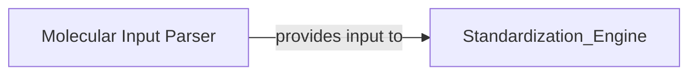

## Details

One paragraph explaining the functionality which is represented by this graph. What the main flow is and what is its purpose.

### Molecular Input Parser
Responsible for handling the conversion of chemical structure data from external formats (e.g., molblocks) into the internal RDKit Mol object representation. It ensures consistent data ingestion and preparation for subsequent processing, primarily for the standardization process.

**Related Classes/Methods**:

- <a href="https://github.com/chembl/ChEMBL_Structure_Pipeline/blob/master/chembl_structure_pipeline/standardizer.py#L486-L505" target="_blank" rel="noopener noreferrer">`chembl_structure_pipeline.standardizer:parse_molblock` (486:505)</a>

### [FAQ](https://github.com/CodeBoarding/GeneratedOnBoardings/tree/main?tab=readme-ov-file#faq)