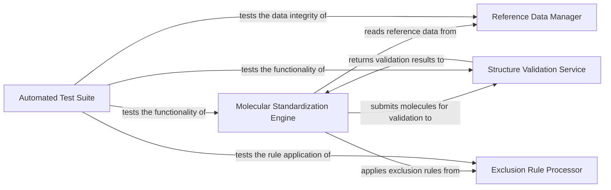

## Details

Component overview and relationships for the `chembl_structure_pipeline` project.

### Molecular Standardization Engine [[Expand]](./Molecular_Standardization_Engine.md)
The core processing unit for chemical structure normalization. It applies a series of predefined transformations (e.g., charge neutralization, fragment removal, tautomer standardization, drawing cleanup) to ensure consistency and adherence to chemical rules. It also incorporates exclusion rules during certain standardization steps.

**Related Classes/Methods**:

- <a href="https://github.com/chembl/ChEMBL_Structure_Pipeline/blob/master/chembl_structure_pipeline/standardizer.py#L455-L472" target="_blank" rel="noopener noreferrer">`chembl_structure_pipeline.standardizer:standardize_mol` (455:472)</a>
- <a href="https://github.com/chembl/ChEMBL_Structure_Pipeline/blob/master/chembl_structure_pipeline/standardizer.py#L438-L443" target="_blank" rel="noopener noreferrer">`chembl_structure_pipeline.standardizer:get_parent_mol` (438:443)</a>
- <a href="https://github.com/chembl/ChEMBL_Structure_Pipeline/blob/master/chembl_structure_pipeline/standardizer.py#L252-L266" target="_blank" rel="noopener noreferrer">`chembl_structure_pipeline.standardizer:cleanup_drawing_mol` (252:266)</a>
- <a href="https://github.com/chembl/ChEMBL_Structure_Pipeline/blob/master/chembl_structure_pipeline/standardizer.py#L290-L427" target="_blank" rel="noopener noreferrer">`chembl_structure_pipeline.standardizer:get_fragment_parent_mol` (290:427)</a>

### Structure Validation Service
This component provides a comprehensive suite of checks to validate the integrity and correctness of chemical structures. It identifies common issues such as illegal bond types, stereochemical errors, or the presence of problematic 3D flags. The `checker.py` module, with its `CheckerBase` and `MolChecker` hierarchy, exemplifies a well-defined service layer for various validation tasks.

**Related Classes/Methods**:

- <a href="https://github.com/chembl/ChEMBL_Structure_Pipeline/blob/master/chembl_structure_pipeline/checker.py#L25-L26" target="_blank" rel="noopener noreferrer">`chembl_structure_pipeline.checker.CheckerBase` (25:26)</a>
- <a href="https://github.com/chembl/ChEMBL_Structure_Pipeline/blob/master/chembl_structure_pipeline/checker.py#L29-L30" target="_blank" rel="noopener noreferrer">`chembl_structure_pipeline.checker.MolChecker` (29:30)</a>

### Reference Data Manager
This component is responsible for managing and providing access to external chemical reference data. This includes crucial information like lists of common salts (`salts.smi`) and solvents (`solvents.smi`), which are essential for operations performed by other components, particularly during standardization (e.g., salt stripping).

**Related Classes/Methods**:

- `chembl_structure_pipeline/data/salts.smi`
- `chembl_structure_pipeline/data/solvents.smi`

### Exclusion Rule Processor
This component implements the logic for identifying and flagging chemical structures that should be excluded from further processing based on predefined criteria. It acts as a filter, ensuring that only relevant and appropriate structures continue through the pipeline.

**Related Classes/Methods**:

- <a href="https://github.com/chembl/ChEMBL_Structure_Pipeline/blob/master/chembl_structure_pipeline/exclude_flag.py" target="_blank" rel="noopener noreferrer">`chembl_structure_pipeline/exclude_flag.py`</a>

### Automated Test Suite
This component encompasses all unit and integration tests for the standardization and checking functionalities. It plays a critical role in ensuring the correctness, robustness, and reliability of the pipeline's operations, verifying that chemical transformations and validations behave as expected.

**Related Classes/Methods**:

- <a href="https://github.com/chembl/ChEMBL_Structure_Pipeline/blob/master/chembl_structure_pipeline/test/test_checker.py" target="_blank" rel="noopener noreferrer">`chembl_structure_pipeline/test/test_checker.py`</a>
- <a href="https://github.com/chembl/ChEMBL_Structure_Pipeline/blob/master/chembl_structure_pipeline/test/test_standardizer.py" target="_blank" rel="noopener noreferrer">`chembl_structure_pipeline/test/test_standardizer.py`</a>
- `chembl_structure_pipeline/test/test_data/`

### [FAQ](https://github.com/CodeBoarding/GeneratedOnBoardings/tree/main?tab=readme-ov-file#faq)