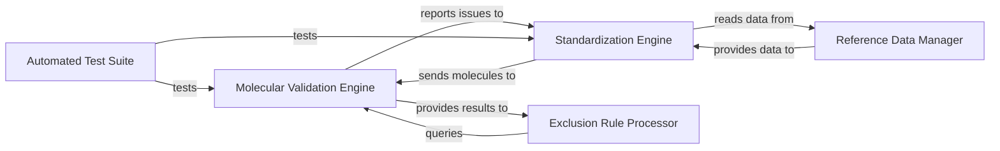

## Details

These components are fundamental to a Cheminformatics Library/Toolkit because they cover the essential aspects of chemical data processing: Standardization Engine: Ensures data consistency, which is paramount for accurate and comparable chemical analyses. Without standardization, variations in representation can lead to incorrect interpretations. Molecular Validation Engine: Guarantees data quality and integrity. Identifying and flagging problematic structures early prevents errors in downstream applications, ensuring that only chemically sound data is processed. Reference Data Manager: Provides the necessary external context (e.g., common salts, solvents) that is often required for robust standardization and validation processes. It centralizes and manages this crucial external knowledge. Exclusion Rule Processor: Acts as a quality control filter, allowing the pipeline to selectively process or discard molecules based on predefined criteria. This is vital for maintaining the relevance and purity of the dataset. Automated Test Suite: Crucial for the reliability and maintainability of the entire library. In cheminformatics, where subtle errors can have significant consequences, a comprehensive test suite ensures that all transformations and validations behave as expected, providing confidence in the processed data. Together, these components form a robust pipeline for handling and curating chemical structures, adhering to the principles of modular design, data-centric processing, and comprehensive testing expected in a high-quality cheminformatics toolkit.

### Molecular Validation Engine [[Expand]](./Molecular_Validation_Engine.md)
This component is responsible for assessing the quality, integrity, and adherence to specific chemical properties of molecular structures. It orchestrates various specialized checks (e.g., InChI validation, stereochemistry, atom counts, bond types, 3D flags, radical presence, overlapping atoms, illegal bond types/stereo) to identify potential issues. It performs its own internal molblock parsing and leverages a hierarchical structure of checkers (`CheckerBase`, `MolChecker`, and various specialized `MolChecker` subclasses) to perform comprehensive validation.

**Related Classes/Methods**:

- <a href="https://github.com/chembl/ChEMBL_Structure_Pipeline/blob/master/chembl_structure_pipeline/checker.py#L58-L117" target="_blank" rel="noopener noreferrer">`chembl_structure_pipeline.checker:InchiChecker` (58:117)</a>
- <a href="https://github.com/chembl/ChEMBL_Structure_Pipeline/blob/master/chembl_structure_pipeline/checker.py#L120-L199" target="_blank" rel="noopener noreferrer">`chembl_structure_pipeline.checker:StereoChecker` (120:199)</a>
- <a href="https://github.com/chembl/ChEMBL_Structure_Pipeline/blob/master/chembl_structure_pipeline/checker.py#L486-L509" target="_blank" rel="noopener noreferrer">`chembl_structure_pipeline.checker:check_molblock` (486:509)</a>
- <a href="https://github.com/chembl/ChEMBL_Structure_Pipeline/blob/master/chembl_structure_pipeline/checker.py#L29-L30" target="_blank" rel="noopener noreferrer">`chembl_structure_pipeline.checker:MolChecker` (29:30)</a>
- <a href="https://github.com/chembl/ChEMBL_Structure_Pipeline/blob/master/chembl_structure_pipeline/checker.py#L25-L26" target="_blank" rel="noopener noreferrer">`chembl_structure_pipeline.checker:CheckerBase` (25:26)</a>

### Standardization Engine [[Expand]](./Standardization_Engine.md)
This is the core processing unit responsible for applying a series of chemical standardization rules to input molecules. Its functions include tasks like salt stripping, tautomer standardization, and charge neutralization, ensuring that chemical structures conform to a consistent format. This component is fundamental for data consistency in any cheminformatics pipeline.

**Related Classes/Methods**:

- <a href="https://github.com/chembl/ChEMBL_Structure_Pipeline/blob/master/chembl_structure_pipeline/standardizer.py" target="_blank" rel="noopener noreferrer">`chembl_structure_pipeline/standardizer.py`</a>

### Reference Data Manager
This component is responsible for managing and providing access to external chemical reference data. This includes crucial information like lists of common salts (`salts.smi`) and solvents (`solvents.smi`), which are essential for operations performed by other components, particularly during standardization (e.g., salt stripping).

**Related Classes/Methods**:

- `chembl_structure_pipeline/data/salts.smi`
- `chembl_structure_pipeline/data/solvents.smi`

### Exclusion Rule Processor
This component implements the logic for identifying and flagging chemical structures that should be excluded from further processing based on predefined criteria. It acts as a filter, ensuring that only relevant and appropriate structures continue through the pipeline.

**Related Classes/Methods**:

- <a href="https://github.com/chembl/ChEMBL_Structure_Pipeline/blob/master/chembl_structure_pipeline/exclude_flag.py" target="_blank" rel="noopener noreferrer">`chembl_structure_pipeline/exclude_flag.py`</a>

### Automated Test Suite
This component encompasses all unit and integration tests for the standardization and checking functionalities. It plays a critical role in ensuring the correctness, robustness, and reliability of the pipeline's operations, verifying that chemical transformations and validations behave as expected.

**Related Classes/Methods**:

- <a href="https://github.com/chembl/ChEMBL_Structure_Pipeline/blob/master/chembl_structure_pipeline/test/test_checker.py" target="_blank" rel="noopener noreferrer">`chembl_structure_pipeline/test/test_checker.py`</a>
- <a href="https://github.com/chembl/ChEMBL_Structure_Pipeline/blob/master/chembl_structure_pipeline/test/test_standardizer.py" target="_blank" rel="noopener noreferrer">`chembl_structure_pipeline/test/test_standardizer.py`</a>
- `chembl_structure_pipeline/test/test_data/`

### [FAQ](https://github.com/CodeBoarding/GeneratedOnBoardings/tree/main?tab=readme-ov-file#faq)