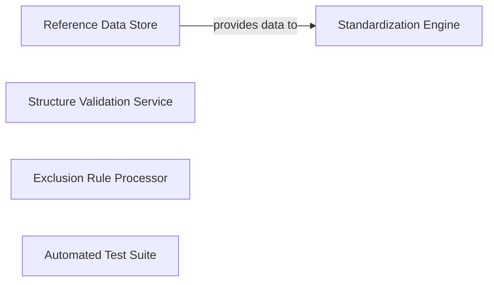

## Details

The identified components—Standardization Engine, Structure Validation Service, Reference Data Store, Exclusion Rule Processor, and Automated Test Suite—are fundamental to this cheminformatics library due to their distinct and crucial roles in achieving the project's goals of chemical data curation and standardization. They collectively form a robust and modular system, aligning with the project's architectural biases. These components, working in concert, embody the principles of modular design, utility/service layers, and data-centric processing, making the `chembl_structure_pipeline` a maintainable, reusable, and effective cheminformatics toolkit.

### Reference Data Store [[Expand]](./Reference_Data_Store.md)
The `Reference Data Store` is a passive component that serves as a centralized repository for static chemical data essential for standardization processes. This includes lists of common salts and solvents, which are stored in and read directly from `.smi` data files within the `data/` directory. It acts as a foundational data source for chemical transformations.

**Related Classes/Methods**: _None_

### Standardization Engine [[Expand]](./Standardization_Engine.md)
This is the core processing unit. It encapsulates the complex logic for applying various chemical standardization rules (e.g., salt stripping, tautomer standardization). It is fundamental because it directly addresses the primary objective of the library: transforming diverse chemical inputs into a consistent, standardized format. Its modular design allows for a flexible and extensible pipeline of chemical transformations.

**Related Classes/Methods**: _None_

### Structure Validation Service
This component is responsible for ensuring the integrity and chemical correctness of structures. It performs checks for common issues like illegal bond types or stereochemical errors. It is fundamental for maintaining data quality throughout the pipeline, acting as a critical gatekeeper that prevents erroneous or problematic structures from proceeding, thereby ensuring the reliability of downstream analyses.

**Related Classes/Methods**: _None_

### Exclusion Rule Processor
This component implements the logic for identifying and flagging chemical structures that should be excluded based on predefined criteria. It is fundamental for data filtering and quality control, ensuring that only relevant and appropriate structures are processed further. This prevents the system from wasting resources on or being compromised by undesirable inputs, which is vital in large-scale chemical data processing.

**Related Classes/Methods**: _None_

### Automated Test Suite
This component encompasses all unit and integration tests for the library's functionalities. It is absolutely fundamental for ensuring the correctness, robustness, and reliability of the chemical transformations and validations. In a domain like cheminformatics, where subtle errors can have significant implications, a comprehensive test suite is indispensable for verifying expected behavior, catching regressions, and promoting confidence in the processed data.

**Related Classes/Methods**: _None_

### [FAQ](https://github.com/CodeBoarding/GeneratedOnBoardings/tree/main?tab=readme-ov-file#faq)