```mermaid
graph LR
    API_Gateway_Orchestrator["API Gateway / Orchestrator"]
    Molecular_I_O_Utility["Molecular I/O Utility"]
    Molecular_Standardization_Engine["Molecular Standardization Engine"]
    Molecular_Validation_Engine["Molecular Validation Engine"]
    Reference_Data_Store["Reference Data Store"]
    Exclusion_Rule_Service["Exclusion Rule Service"]
    API_Gateway_Orchestrator -- "calls" --> Molecular_I_O_Utility
    API_Gateway_Orchestrator -- "orchestrates" --> Molecular_Standardization_Engine
    API_Gateway_Orchestrator -- "orchestrates" --> Molecular_Validation_Engine
    Molecular_I_O_Utility -- "provides input to" --> Molecular_Standardization_Engine
    Molecular_Standardization_Engine -- "returns to" --> API_Gateway_Orchestrator
    Molecular_Standardization_Engine -- "utilizes" --> Reference_Data_Store
    Molecular_Standardization_Engine -- "utilizes" --> Exclusion_Rule_Service
    Molecular_Validation_Engine -- "returns reports to" --> API_Gateway_Orchestrator
    Molecular_Validation_Engine -- "utilizes" --> Reference_Data_Store
    Reference_Data_Store -- "supplies data to" --> Molecular_Standardization_Engine
    Reference_Data_Store -- "supplies data to" --> Molecular_Validation_Engine
    Exclusion_Rule_Service -- "applies rules to" --> Molecular_Standardization_Engine
    click API_Gateway_Orchestrator href "https://github.com/CodeBoarding/GeneratedOnBoardings/blob/main/ChEMBL_Structure_Pipeline/API_Gateway_Orchestrator.md" "Details"
    click Molecular_I_O_Utility href "https://github.com/CodeBoarding/GeneratedOnBoardings/blob/main/ChEMBL_Structure_Pipeline/Molecular_I_O_Utility.md" "Details"
    click Molecular_Standardization_Engine href "https://github.com/CodeBoarding/GeneratedOnBoardings/blob/main/ChEMBL_Structure_Pipeline/Molecular_Standardization_Engine.md" "Details"
    click Molecular_Validation_Engine href "https://github.com/CodeBoarding/GeneratedOnBoardings/blob/main/ChEMBL_Structure_Pipeline/Molecular_Validation_Engine.md" "Details"
    click Reference_Data_Store href "https://github.com/CodeBoarding/GeneratedOnBoardings/blob/main/ChEMBL_Structure_Pipeline/Reference_Data_Store.md" "Details"
```

## Details

Abstract components and their relationships for a chemical structure standardization and validation library.

### API Gateway / Orchestrator [[Expand]](./API_Gateway_Orchestrator.md)
Serves as the primary public interface for the library, exposing high-level functions for chemical structure standardization and validation. It orchestrates the workflow by coordinating calls to the underlying processing engines and managing the overall pipeline execution.

**Related Classes/Methods**:

- <a href="https://github.com/chembl/ChEMBL_Structure_Pipeline/blob/master/chembl_structure_pipeline/standardizer.py#L508-L513" target="_blank" rel="noopener noreferrer">`chembl_structure_pipeline.standardizer:standardize_molblock` (508:513)</a>
- <a href="https://github.com/chembl/ChEMBL_Structure_Pipeline/blob/master/chembl_structure_pipeline/checker.py#L486-L509" target="_blank" rel="noopener noreferrer">`chembl_structure_pipeline.checker:check_molblock` (486:509)</a>

### Molecular I/O Utility [[Expand]](./Molecular_I_O_Utility.md)
Responsible for handling the conversion of chemical structure data between external formats (e.g., molblocks) and the internal RDKit Mol object representation. It ensures consistent data ingestion and preparation for subsequent processing, primarily for the standardization process.

**Related Classes/Methods**:

- <a href="https://github.com/chembl/ChEMBL_Structure_Pipeline/blob/master/chembl_structure_pipeline/standardizer.py#L486-L505" target="_blank" rel="noopener noreferrer">`chembl_structure_pipeline.standardizer:parse_molblock` (486:505)</a>

### Molecular Standardization Engine [[Expand]](./Molecular_Standardization_Engine.md)
The core processing unit for chemical structure normalization. It applies a series of predefined transformations (e.g., charge neutralization, fragment removal, tautomer standardization, drawing cleanup) to ensure consistency and adherence to chemical rules. It also incorporates exclusion rules during certain standardization steps.

**Related Classes/Methods**:

- <a href="https://github.com/chembl/ChEMBL_Structure_Pipeline/blob/master/chembl_structure_pipeline/standardizer.py#L455-L472" target="_blank" rel="noopener noreferrer">`chembl_structure_pipeline.standardizer:standardize_mol` (455:472)</a>
- <a href="https://github.com/chembl/ChEMBL_Structure_Pipeline/blob/master/chembl_structure_pipeline/standardizer.py#L438-L443" target="_blank" rel="noopener noreferrer">`chembl_structure_pipeline.standardizer:get_parent_mol` (438:443)</a>
- <a href="https://github.com/chembl/ChEMBL_Structure_Pipeline/blob/master/chembl_structure_pipeline/standardizer.py#L252-L266" target="_blank" rel="noopener noreferrer">`chembl_structure_pipeline.standardizer:cleanup_drawing_mol` (252:266)</a>
- <a href="https://github.com/chembl/ChEMBL_Structure_Pipeline/blob/master/chembl_structure_pipeline/standardizer.py#L290-L427" target="_blank" rel="noopener noreferrer">`chembl_structure_pipeline.standardizer:get_fragment_parent_mol` (290:427)</a>

### Molecular Validation Engine [[Expand]](./Molecular_Validation_Engine.md)
Assesses the quality, integrity, and adherence to specific chemical properties of molecular structures. It orchestrates various specialized checks (e.g., InChI, stereochemistry, atom counts, bond types) to identify potential issues. It performs its own internal molblock parsing.

**Related Classes/Methods**:

- <a href="https://github.com/chembl/ChEMBL_Structure_Pipeline/blob/master/chembl_structure_pipeline/checker.py#L58-L117" target="_blank" rel="noopener noreferrer">`chembl_structure_pipeline.checker:InchiChecker` (58:117)</a>
- <a href="https://github.com/chembl/ChEMBL_Structure_Pipeline/blob/master/chembl_structure_pipeline/checker.py#L120-L199" target="_blank" rel="noopener noreferrer">`chembl_structure_pipeline.checker:StereoChecker` (120:199)</a>
- <a href="https://github.com/chembl/ChEMBL_Structure_Pipeline/blob/master/chembl_structure_pipeline/checker.py#L486-L509" target="_blank" rel="noopener noreferrer">`chembl_structure_pipeline.checker:check_molblock` (486:509)</a>

### Reference Data Store [[Expand]](./Reference_Data_Store.md)
A passive component that serves as a centralized repository for static chemical data essential for standardization processes. This includes lists of common salts and solvents, which are read directly from data files.

**Related Classes/Methods**:

- <a href="https://github.com/chembl/ChEMBL_Structure_Pipeline/blob/master/chembl_structure_pipeline/standardizer.py#L287-L287" target="_blank" rel="noopener noreferrer">`chembl_structure_pipeline.standardizer:_solvents_file` (287:287)</a>
- <a href="https://github.com/chembl/ChEMBL_Structure_Pipeline/blob/master/chembl_structure_pipeline/standardizer.py#L288-L288" target="_blank" rel="noopener noreferrer">`chembl_structure_pipeline.standardizer:_salts_file` (288:288)</a>
- <a href="https://github.com/chembl/ChEMBL_Structure_Pipeline/blob/master/chembl_structure_pipeline/standardizer.py#L290-L427" target="_blank" rel="noopener noreferrer">`chembl_structure_pipeline.standardizer:get_fragment_parent_mol` (290:427)</a>

### Exclusion Rule Service
Implements specific logic and rules to identify and flag chemical structures that should be excluded from further processing or analysis based on predefined criteria. This service is primarily utilized during the molecular standardization process.

**Related Classes/Methods**:

- <a href="https://github.com/chembl/ChEMBL_Structure_Pipeline/blob/master/chembl_structure_pipeline/exclude_flag.py#L84-L113" target="_blank" rel="noopener noreferrer">`chembl_structure_pipeline.exclude_flag:exclude_flag_mol` (84:113)</a>
- <a href="https://github.com/chembl/ChEMBL_Structure_Pipeline/blob/master/chembl_structure_pipeline/exclude_flag.py#L116-L125" target="_blank" rel="noopener noreferrer">`chembl_structure_pipeline.exclude_flag:exclude_flag_molblock` (116:125)</a>

### [FAQ](https://github.com/CodeBoarding/GeneratedOnBoardings/tree/main?tab=readme-ov-file#faq)