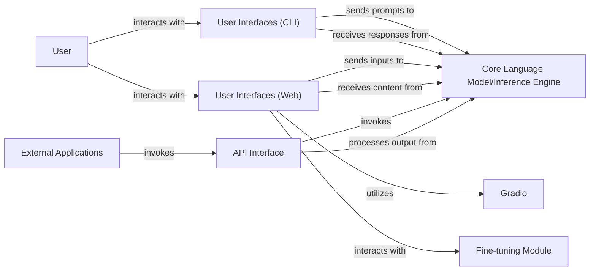

## Details

The ChatGLM-6B project is structured around a central Core Language Model/Inference Engine that handles all language and vision-centric processing. User interaction is facilitated through two primary channels: User Interfaces (CLI) for command-line operations and User Interfaces (Web), which leverage the Gradio library for interactive web demonstrations. For programmatic access, an API Interface is provided, allowing External Applications to invoke and process model outputs. Additionally, a dedicated Fine-tuning Module supports model adaptation, primarily accessed via specific web interfaces within the User Interfaces (Web) component. This architecture ensures flexible interaction methods while centralizing the core model's functionality.

### User
Represents the human user interacting with the system through various interfaces.

**Related Classes/Methods**: _None_

### External Applications
Represents external software systems or services that programmatically interact with the ChatGLM-6B model.

**Related Classes/Methods**: _None_

### User Interfaces (CLI)
Provides command-line interfaces for general text-based and vision-related interactions. This component manages user input and output via the command line, constructing prompts suitable for the Core Language Model.

**Related Classes/Methods**:

- <a href="https://github.com/zai-org/ChatGLM-6B/blob/main/cli_demo.py#L1-L1000" target="_blank" rel="noopener noreferrer">`cli_demo`:1-1000</a>
- <a href="https://github.com/zai-org/ChatGLM-6B/blob/main/cli_demo_vision.py#L1-L1000" target="_blank" rel="noopener noreferrer">`cli_demo_vision`:1-1000</a>

### User Interfaces (Web)
Provides web-based user interfaces for general text, vision-related, and p-tuning interactions. This component orchestrates the web-based user experience, handling inputs and displaying model outputs, and utilizes Gradio for its front-end presentation.

**Related Classes/Methods**:

- <a href="https://github.com/zai-org/ChatGLM-6B/blob/main/web_demo.py#L1-L1000" target="_blank" rel="noopener noreferrer">`web_demo`:1-1000</a>
- <a href="https://github.com/zai-org/ChatGLM-6B/blob/main/web_demo_vision.py#L1-L1000" target="_blank" rel="noopener noreferrer">`web_demo_vision`:1-1000</a>
- <a href="https://github.com/zai-org/ChatGLM-6B/blob/main/web_demo2.py#L1-L1000" target="_blank" rel="noopener noreferrer">`web_demo2`:1-1000</a>
- <a href="https://github.com/zai-org/ChatGLM-6B/blob/main/ptuning/web_demo.py#L1-L1000" target="_blank" rel="noopener noreferrer">`ptuning.web_demo`:1-1000</a>

### API Interface
Provides a programmatic API (FastAPI) for external applications to interact with the model. This component handles request parsing, model invocation, and response formatting, including resource management functions.

**Related Classes/Methods**:

- <a href="https://github.com/zai-org/ChatGLM-6B/blob/main/api.py#L1-L1000" target="_blank" rel="noopener noreferrer">`api`:1-1000</a>

### Gradio
An external Python library utilized by the User Interfaces (Web) component to build and render interactive web-based front-ends for machine learning models.

**Related Classes/Methods**: _None_

### Core Language Model/Inference Engine
The central component responsible for loading, running, and managing the ChatGLM-6B model. It handles prompt processing, text generation, and vision-centric inference for all interaction pathways.

**Related Classes/Methods**: _None_

### Fine-tuning Module
Manages the processes and logic related to fine-tuning the language model, specifically handling p-tuning operations initiated via the dedicated web interface within User Interfaces (Web).

**Related Classes/Methods**: _None_

### [FAQ](https://github.com/CodeBoarding/GeneratedOnBoardings/tree/main?tab=readme-ov-file#faq)