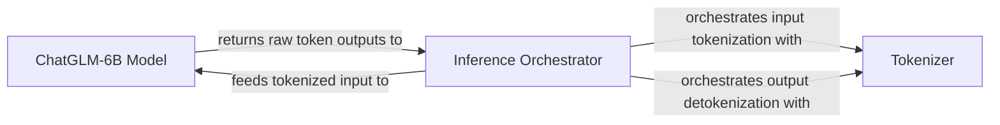

## Details

The ChatGLM-6B system is designed around a core inference pipeline orchestrated by the `Inference Orchestrator`. This orchestrator manages the flow from user input to model response, leveraging a `Tokenizer` for text-to-token conversion and vice-versa, and interacting with the `ChatGLM-6B Model` for the actual neural network computation. The system efficiently handles prompt processing, model inference, and response generation, ensuring a streamlined interaction between its key components.

### ChatGLM-6B Model
The foundational machine learning model component. It encapsulates the loaded ChatGLM-6B model and is solely responsible for executing the neural network's forward pass, transforming tokenized input into raw token outputs.

**Related Classes/Methods**:

- <a href="https://github.com/zai-org/ChatGLM-6B/blob/main/api.py" target="_blank" rel="noopener noreferrer">`transformers.AutoModel`</a>

### Inference Orchestrator
This component manages the end-to-end inference workflow. It takes a user's raw text prompt, coordinates with the Tokenizer for input preparation, feeds the processed input to the ChatGLM-6B Model, receives the raw token outputs, and then uses the Tokenizer again to convert these outputs into a human-readable response. It acts as the central coordinator for the inference pipeline.

**Related Classes/Methods**:

- <a href="https://github.com/zai-org/ChatGLM-6B/blob/main/api.py#L21-L49" target="_blank" rel="noopener noreferrer">`api.create_item`:21-49</a>

### Tokenizer
A crucial utility component responsible for converting human-readable text into numerical tokens (tokenization) that the ChatGLM-6B Model can process, and conversely, converting the model's numerical token outputs back into human-readable text (detokenization).

**Related Classes/Methods**:

- <a href="https://github.com/zai-org/ChatGLM-6B/blob/main/api.py" target="_blank" rel="noopener noreferrer">`transformers.AutoTokenizer`</a>

### [FAQ](https://github.com/CodeBoarding/GeneratedOnBoardings/tree/main?tab=readme-ov-file#faq)