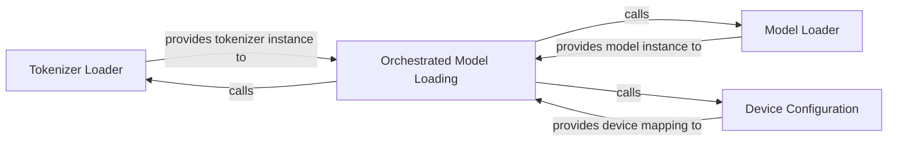

## Details

The Model Loading & Configuration subsystem is responsible for the initial setup and optimization of the ChatGLM-6B model and its associated tokenizer. Its boundaries encompass all functionalities related to loading the pre-trained model and tokenizer, configuring them for specific hardware environments (e.g., GPU, CPU), and managing device mapping for efficient resource utilization. This subsystem ensures the model is correctly initialized and ready for inference.

### Tokenizer Loader
Loads the pre-trained tokenizer, including its vocabulary and configuration, from a specified path or model identifier. It converts raw text into token IDs, a format the model can process.

**Related Classes/Methods**:

- <a href="https://github.com/zai-org/ChatGLM-6B/blob/main/api.py" target="_blank" rel="noopener noreferrer">`AutoTokenizer.from_pretrained`</a>

### Model Loader
Loads the pre-trained ChatGLM-6B model weights and architecture from a specified path or model identifier. It retrieves the core neural network structure and its learned parameters.

**Related Classes/Methods**:

- <a href="https://github.com/zai-org/ChatGLM-6B/blob/main/api.py" target="_blank" rel="noopener noreferrer">`AutoModel.from_pretrained`</a>

### Device Configuration
Automatically determines and sets up the optimal device mapping for the model. This involves calculating how model layers should be distributed across available hardware resources (e.g., multiple GPUs, CPU) to ensure efficient utilization and prevent out-of-memory errors.

**Related Classes/Methods**:

- <a href="https://github.com/zai-org/ChatGLM-6B/blob/main/utils.py#L8-L35" target="_blank" rel="noopener noreferrer">`utils.auto_configure_device_map`:8-35</a>

### Orchestrated Model Loading
Orchestrates the entire model and tokenizer loading process, specifically handling their placement and distribution across available GPU devices or other hardware. It integrates the tokenizer and model loading with the device mapping strategy.

**Related Classes/Methods**:

- <a href="https://github.com/zai-org/ChatGLM-6B/blob/main/utils.py#L38-L52" target="_blank" rel="noopener noreferrer">`utils.load_model_on_gpus`:38-52</a>

### [FAQ](https://github.com/CodeBoarding/GeneratedOnBoardings/tree/main?tab=readme-ov-file#faq)