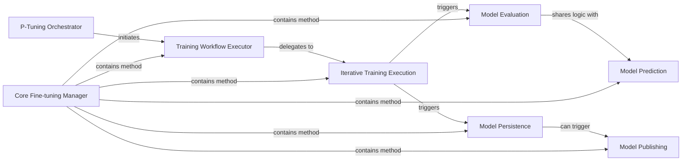

## Details

The P-Tuning Subsystem is a dedicated module within the ChatGLM-6B project, focused entirely on the Parameter-Efficient Fine-Tuning (PEFT) lifecycle using the P-Tuning v2 method. Its boundaries are primarily defined by the `ptuning.main` and `ptuning.trainer` modules.

### P-Tuning Orchestrator
Serves as the primary entry point for the P-Tuning fine-tuning process. It is responsible for initial setup, argument parsing, and orchestrating the overall fine-tuning workflow by initiating the `Trainer`.

**Related Classes/Methods**:

- <a href="https://github.com/zai-org/ChatGLM-6B/blob/main/ptuning/main.py#L49-L421" target="_blank" rel="noopener noreferrer">`ptuning.main.main`:49-421</a>

### Core Fine-tuning Manager
This is the central component that encapsulates and manages the entire fine-tuning lifecycle. It handles the initialization of the training environment, configuration of callbacks, and preparation of the model for device placement. It acts as the high-level manager for all training-related operations.

**Related Classes/Methods**:

- <a href="https://github.com/zai-org/ChatGLM-6B/blob/main/ptuning/trainer.py#L222-L3830" target="_blank" rel="noopener noreferrer">`ptuning.trainer.Trainer`:222-3830</a>

### Training Workflow Executor
Manages the overall training workflow, including loading from checkpoints, executing the core training loop, and handling model initialization. It's the method that kicks off the actual training process.

**Related Classes/Methods**:

- <a href="https://github.com/zai-org/ChatGLM-6B/blob/main/ptuning/trainer.py" target="_blank" rel="noopener noreferrer">`ptuning.trainer.Trainer:train`</a>

### Iterative Training Execution
Encapsulates the iterative training process, handling data loading, optimizer/scheduler creation, logging, periodic evaluation, and checkpoint saving. This is the core of the training execution where model parameters are updated.

**Related Classes/Methods**:

- <a href="https://github.com/zai-org/ChatGLM-6B/blob/main/ptuning/trainer.py" target="_blank" rel="noopener noreferrer">`ptuning.trainer.Trainer:_inner_training_loop`</a>

### Model Evaluation
Conducts model evaluation on a validation dataset to assess performance metrics during or after training. It provides insights into the model's generalization capabilities.

**Related Classes/Methods**:

- <a href="https://github.com/zai-org/ChatGLM-6B/blob/main/ptuning/trainer.py" target="_blank" rel="noopener noreferrer">`ptuning.trainer.Trainer:evaluate`</a>

### Model Prediction
Performs inference on a test dataset, generating predictions from the fine-tuned model. This method is used to assess the final performance of the model on unseen data.

**Related Classes/Methods**:

- <a href="https://github.com/zai-org/ChatGLM-6B/blob/main/ptuning/trainer.py" target="_blank" rel="noopener noreferrer">`ptuning.trainer.Trainer:predict`</a>

### Model Persistence
Persists the trained model and its configuration to local storage, ensuring that the fine-tuned model can be reloaded and reused later.

**Related Classes/Methods**:

- <a href="https://github.com/zai-org/ChatGLM-6B/blob/main/ptuning/trainer.py" target="_blank" rel="noopener noreferrer">`ptuning.trainer.Trainer:save_model`</a>

### Model Publishing
Facilitates the publishing of the trained model to an external model hub (e.g., Hugging Face Hub), enabling sharing, versioning, and broader deployment.

**Related Classes/Methods**:

- <a href="https://github.com/zai-org/ChatGLM-6B/blob/main/ptuning/trainer.py" target="_blank" rel="noopener noreferrer">`ptuning.trainer.Trainer:push_to_hub`</a>

### [FAQ](https://github.com/CodeBoarding/GeneratedOnBoardings/tree/main?tab=readme-ov-file#faq)