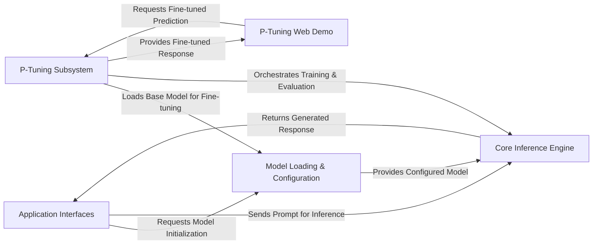

## Details

The ChatGLM-6B project is structured around a clear separation of concerns, facilitating both direct interaction and fine-tuning capabilities. At its core, the Core Inference Engine leverages the `transformers.AutoModel` to process prompts and generate responses. This engine is supported by a Model Loading & Configuration component, which efficiently loads and prepares the model and tokenizer for optimal performance. Users interact with the system through various Application Interfaces, including command-line, web, and API endpoints. For specialized tasks, the P-Tuning Subsystem provides a comprehensive framework for fine-tuning the model, complemented by a dedicated P-Tuning Web Demo for showcasing fine-tuned results. This modular design ensures a robust and scalable architecture for language model operations.

### Application Interfaces [[Expand]](./Application_Interfaces.md)
The primary entry point for users and external applications to interact with the ChatGLM-6B model, consolidating command-line, web-based, and programmatic (API) interfaces.

**Related Classes/Methods**:

- <a href="https://github.com/zai-org/ChatGLM-6B/blob/main/cli_demo.py" target="_blank" rel="noopener noreferrer">`cli_demo`</a>
- <a href="https://github.com/zai-org/ChatGLM-6B/blob/main/web_demo.py" target="_blank" rel="noopener noreferrer">`web_demo`</a>
- <a href="https://github.com/zai-org/ChatGLM-6B/blob/main/api.py" target="_blank" rel="noopener noreferrer">`api`</a>

### Model Loading & Configuration [[Expand]](./Model_Loading_Configuration.md)
Responsible for loading the ChatGLM-6B model and its associated tokenizer into memory, configuring them for optimal performance across different hardware environments, and handling device mapping and optimization strategies.

**Related Classes/Methods**:

- <a href="https://github.com/zai-org/ChatGLM-6B/blob/main/api.py" target="_blank" rel="noopener noreferrer">`AutoTokenizer.from_pretrained`</a>
- <a href="https://github.com/zai-org/ChatGLM-6B/blob/main/api.py" target="_blank" rel="noopener noreferrer">`AutoModel.from_pretrained`</a>

### Core Inference Engine [[Expand]](./Core_Inference_Engine.md)
The central component embodying the ChatGLM-6B language model itself, responsible for the actual processing of input prompts and generating textual responses by leveraging the loaded model and tokenizer.

**Related Classes/Methods**:

- <a href="https://github.com/zai-org/ChatGLM-6B/blob/main/api.py" target="_blank" rel="noopener noreferrer">`model.chat`</a>
- <a href="https://github.com/zai-org/ChatGLM-6B/blob/main/" target="_blank" rel="noopener noreferrer">`transformers.AutoModel`</a>

### P-Tuning Subsystem [[Expand]](./P_Tuning_Subsystem.md)
Manages the entire P-Tuning fine-tuning lifecycle, including data preparation, training loops, evaluation, prediction, and model saving/publishing to external hubs.

**Related Classes/Methods**:

- <a href="https://github.com/zai-org/ChatGLM-6B/blob/main/ptuning/main.py" target="_blank" rel="noopener noreferrer">`ptuning.main`</a>
- <a href="https://github.com/zai-org/ChatGLM-6B/blob/main/ptuning/trainer.py" target="_blank" rel="noopener noreferrer">`ptuning.trainer`</a>

### P-Tuning Web Demo
A dedicated web interface specifically designed to demonstrate the capabilities and performance of the P-Tuning fine-tuned model, separate from the main model's web demo.

**Related Classes/Methods**:

- <a href="https://github.com/zai-org/ChatGLM-6B/blob/main/ptuning/web_demo.py" target="_blank" rel="noopener noreferrer">`ptuning.web_demo`</a>

### [FAQ](https://github.com/CodeBoarding/GeneratedOnBoardings/tree/main?tab=readme-ov-file#faq)