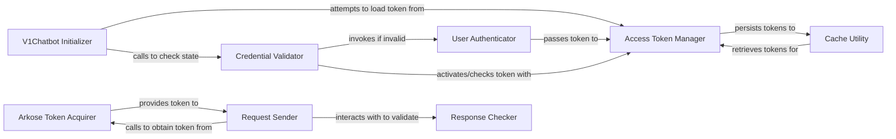

## Details

The Authentication & Session Manager subsystem is a critical part of the revChatGPT project, primarily residing within the src/revChatGPT/V1.py module. It is responsible for establishing and maintaining secure, authenticated sessions with the ChatGPT service, handling everything from initial login to token management and validation.

### V1Chatbot Initializer
Orchestrates the initial setup of the chatbot's session, including the first attempt to establish an authenticated state. It acts as the primary entry point for the authentication flow when a new V1 instance is created.

**Related Classes/Methods**:

- <a href="https://github.com/acheong08/ChatGPT/blob/main/src/revChatGPT/V1.py" target="_blank" rel="noopener noreferrer">`V1:__init__`</a>

### Credential Validator
Verifies the validity of existing authentication credentials (e.g., access tokens, session state). If credentials are found to be invalid or missing, it triggers the user login process. This component ensures that only valid sessions proceed.

**Related Classes/Methods**:

- <a href="https://github.com/acheong08/ChatGPT/blob/main/src/revChatGPT/V1.py" target="_blank" rel="noopener noreferrer">`V1:__check_credentials`</a>

### User Authenticator
Handles the direct user login process, typically involving interaction with the ChatGPT service to obtain a new access token based on user credentials. This is the core component for acquiring new authentication tokens.

**Related Classes/Methods**:

- <a href="https://github.com/acheong08/ChatGPT/blob/main/src/revChatGPT/V1.py" target="_blank" rel="noopener noreferrer">`V1:login`</a>

### Access Token Manager
Manages the lifecycle of access tokens. This includes activating a newly acquired token for use, retrieving previously cached tokens, and persisting tokens to a local cache for future use. It centralizes token handling.

**Related Classes/Methods**:

- <a href="https://github.com/acheong08/ChatGPT/blob/main/src/revChatGPT/V1.py" target="_blank" rel="noopener noreferrer">`V1:set_access_token`</a>
- <a href="https://github.com/acheong08/ChatGPT/blob/main/src/revChatGPT/V1.py" target="_blank" rel="noopener noreferrer">`V1:__get_cached_access_token`</a>
- <a href="https://github.com/acheong08/ChatGPT/blob/main/src/revChatGPT/V1.py" target="_blank" rel="noopener noreferrer">`V1:__cache_access_token`</a>

### Arkose Token Acquirer
Obtains a security token (Arkose token) which is often required by the ChatGPT service for bot detection and additional authentication layers, enhancing the security of API requests. This component handles a specific security challenge.

**Related Classes/Methods**:

- <a href="https://github.com/acheong08/ChatGPT/blob/main/src/revChatGPT/V1.py" target="_blank" rel="noopener noreferrer">`V1:get_arkose_token`</a>

### Request Sender
The point where the acquired authentication and Arkose tokens are utilized for API calls. It prepares and dispatches requests, ensuring they are properly authenticated and authorized before reaching the ChatGPT service.

**Related Classes/Methods**:

- <a href="https://github.com/acheong08/ChatGPT/blob/main/src/revChatGPT/V1.py" target="_blank" rel="noopener noreferrer">`V1:__send_request`</a>

### Response Checker
Handles authentication-related errors and ensures secure and valid communication by inspecting API responses for authentication failures or session invalidations. It acts as a gatekeeper for response integrity.

**Related Classes/Methods**:

- <a href="https://github.com/acheong08/ChatGPT/blob/main/src/revChatGPT/V1.py" target="_blank" rel="noopener noreferrer">`V1:__check_response`</a>

### Cache Utility
Provides utilities for reading from and writing to a local cache. This component is a foundational service for persisting sensitive authentication data like access tokens, reducing the need for repeated logins.

**Related Classes/Methods**:

- <a href="https://github.com/acheong08/ChatGPT/blob/main/src/revChatGPT/V1.py" target="_blank" rel="noopener noreferrer">`V1:__read_cache`</a>
- <a href="https://github.com/acheong08/ChatGPT/blob/main/src/revChatGPT/V1.py" target="_blank" rel="noopener noreferrer">`V1:__write_cache`</a>

### [FAQ](https://github.com/CodeBoarding/GeneratedOnBoardings/tree/main?tab=readme-ov-file#faq)