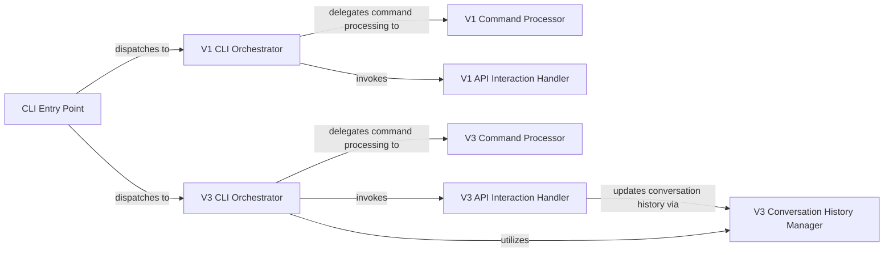

## Details

The CLI Application Layer subsystem is the user-facing interface of the revChatGPT project, responsible for handling command-line interactions, managing user input, and orchestrating the application's flow for both V1 and V3 of the ChatGPT API.

### CLI Entry Point
Serves as the primary entry point for the entire CLI application, responsible for initial argument parsing and dispatching control to the appropriate version-specific main function.

**Related Classes/Methods**:

- <a href="https://github.com/acheong08/ChatGPT/blob/main/src/revChatGPT/__main__.py" target="_blank" rel="noopener noreferrer">`src.revChatGPT.__main__`</a>

### V1 CLI Orchestrator
Manages the main interaction loop, handles user input, and coordinates the overall flow of commands and API interactions for V1. It also implicitly handles the setup of the V1 CLI environment.

**Related Classes/Methods**:

- <a href="https://github.com/acheong08/ChatGPT/blob/main/src/revChatGPT/V1.py" target="_blank" rel="noopener noreferrer">`src.revChatGPT.V1:main`</a>

### V3 CLI Orchestrator
Manages the main interaction loop, handles user input, and coordinates the overall flow of commands and API interactions for V3. It also implicitly handles the setup of the V3 CLI environment.

**Related Classes/Methods**:

- <a href="https://github.com/acheong08/ChatGPT/blob/main/src/revChatGPT/V3.py" target="_blank" rel="noopener noreferrer">`src.revChatGPT.V3:main`</a>

### V1 Command Processor
Parses and executes specific user-entered commands for V1 that control the CLI application's behavior (e.g., /reset, /exit).

**Related Classes/Methods**:

- <a href="https://github.com/acheong08/ChatGPT/blob/main/src/revChatGPT/V1.py" target="_blank" rel="noopener noreferrer">`src.revChatGPT.V1:handle_commands`</a>

### V3 Command Processor
Parses and executes specific user-entered commands for V3 that control the CLI application's behavior.

**Related Classes/Methods**:

- <a href="https://github.com/acheong08/ChatGPT/blob/main/src/revChatGPT/V3.py" target="_blank" rel="noopener noreferrer">`src.revChatGPT.V3:handle_commands`</a>

### V1 API Interaction Handler
Direct interface to the core ChatGPT API from the V1 CLI, formulating requests, sending user queries, and processing responses.

**Related Classes/Methods**:

- <a href="https://github.com/acheong08/ChatGPT/blob/main/src/revChatGPT/V1.py" target="_blank" rel="noopener noreferrer">`src.revChatGPT.V1:ask`</a>

### V3 API Interaction Handler
Direct interface to the core ChatGPT API from the V3 CLI, formulating requests, sending user queries, and processing responses, including streaming.

**Related Classes/Methods**:

- <a href="https://github.com/acheong08/ChatGPT/blob/main/src/revChatGPT/V3.py" target="_blank" rel="noopener noreferrer">`src.revChatGPT.V3:ask`</a>
- <a href="https://github.com/acheong08/ChatGPT/blob/main/src/revChatGPT/V3.py" target="_blank" rel="noopener noreferrer">`src.revChatGPT.V3:ask_stream`</a>

### V3 Conversation History Manager
Manages and stores the conversation history specifically for the V3 CLI, ensuring context is maintained across interactions.

**Related Classes/Methods**:

- <a href="https://github.com/acheong08/ChatGPT/blob/main/src/revChatGPT/V3.py" target="_blank" rel="noopener noreferrer">`src.revChatGPT.V3:add_to_conversation`</a>

### [FAQ](https://github.com/CodeBoarding/GeneratedOnBoardings/tree/main?tab=readme-ov-file#faq)