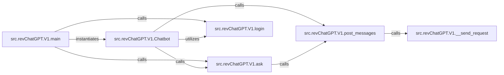

## Details

The `src.revChatGPT.V1` subsystem serves as a Python client for the ChatGPT V1 API, designed to simplify interactions with the service. At its core, the `Chatbot` component provides a high-level abstraction for managing conversational flows and API calls. The `main` component acts as the command-line interface entry point, orchestrating the application's startup, including the initialization of the `Chatbot` and handling user commands. Authentication is handled by the `login` component, which secures API access. Message formulation and dispatch are managed by `post_messages`, which relies on the `__send_request` component for low-level HTTP communication. The `ask` component offers a user-friendly method for initiating new conversations or single queries, building upon the `post_messages` functionality. This architecture ensures a clear separation of concerns, from user interaction and session management to secure communication and message handling.

### src.revChatGPT.V1.Chatbot
This is the primary facade for all V1 API interactions, providing a high-level, user-friendly interface to the ChatGPT API. It abstracts the underlying complexities of session management, conversation flow, and direct API calls, making it the core of the API wrapper.

**Related Classes/Methods**:

- <a href="https://github.com/acheong08/ChatGPT/blob/main/src/revChatGPT/V1.py#L502-L516" target="_blank" rel="noopener noreferrer">`src.revChatGPT.V1.login`:502-516</a>
- <a href="https://github.com/acheong08/ChatGPT/blob/main/src/revChatGPT/V1.py#L1221-L1312" target="_blank" rel="noopener noreferrer">`src.revChatGPT.V1.post_messages`:1221-1312</a>
- <a href="https://github.com/acheong08/ChatGPT/blob/main/src/revChatGPT/V1.py#L1314-L1367" target="_blank" rel="noopener noreferrer">`src.revChatGPT.V1.ask`:1314-1367</a>

### src.revChatGPT.V1.__send_request
This component is responsible for executing low-level HTTP requests to the ChatGPT V1 API endpoints. It handles the actual network communication, including request formulation, dispatch, and initial response handling, forming the foundation of the API client's network layer.

**Related Classes/Methods**:

- <a href="https://github.com/acheong08/ChatGPT/blob/main/src/revChatGPT/V1.py#L1122-L1219" target="_blank" rel="noopener noreferrer">`src.revChatGPT.V1.__send_request`:1122-1219</a>

### src.revChatGPT.V1.post_messages
This component specifically formulates and dispatches new messages or prompts to the ChatGPT API. It manages the payload structure required for conversation turns and ensures messages are correctly formatted for the API.

**Related Classes/Methods**:

- <a href="https://github.com/acheong08/ChatGPT/blob/main/src/revChatGPT/V1.py#L1122-L1219" target="_blank" rel="noopener noreferrer">`src.revChatGPT.V1.__send_request`:1122-1219</a>

### src.revChatGPT.V1.ask
This component provides a simplified interface for users to initiate new conversations or pose single questions. It builds upon the `post_messages` functionality, offering a more direct and user-friendly method for common chat interactions.

**Related Classes/Methods**:

- <a href="https://github.com/acheong08/ChatGPT/blob/main/src/revChatGPT/V1.py#L1221-L1312" target="_blank" rel="noopener noreferrer">`src.revChatGPT.V1.post_messages`:1221-1312</a>

### src.revChatGPT.V1.main
This is the primary entry point for the V1 client when executed as a command-line tool. It orchestrates the overall application flow for the CLI, including argument parsing, chatbot initialization, and command handling.

**Related Classes/Methods**:

- <a href="https://github.com/acheong08/ChatGPT/blob/main/src/revChatGPT/V1.py#L1314-L1367" target="_blank" rel="noopener noreferrer">`src.revChatGPT.V1.ask`:1314-1367</a>
- <a href="https://github.com/acheong08/ChatGPT/blob/main/src/revChatGPT/V1.py#L502-L516" target="_blank" rel="noopener noreferrer">`src.revChatGPT.V1.login`:502-516</a>

### src.revChatGPT.V1.login
This component manages the user authentication flow to acquire and manage access tokens necessary for secure API access. It is crucial for establishing and maintaining authenticated sessions with the ChatGPT API.

**Related Classes/Methods**:

- <a href="https://github.com/acheong08/ChatGPT/blob/main/src/revChatGPT/V1.py#L502-L516" target="_blank" rel="noopener noreferrer">`src.revChatGPT.V1.login`:502-516</a>

### [FAQ](https://github.com/CodeBoarding/GeneratedOnBoardings/tree/main?tab=readme-ov-file#faq)