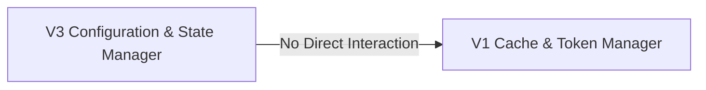

## Details

The revChatGPT application's architecture is characterized by its modular approach to interacting with different versions of the ChatGPT API. It features two primary, independent subsystems: the V3 Configuration & State Manager and the V1 Cache & Token Manager. The V3 Configuration & State Manager is responsible for the comprehensive management of the V3 API client's configuration, conversation state, and command-line interface interactions, ensuring data persistence and user control over the V3 experience. Concurrently, the V1 Cache & Token Manager is singularly focused on the efficient and secure caching and retrieval of access tokens for the V1 API client, streamlining its authentication process. These components are designed to operate autonomously, each addressing the specific requirements of their respective API versions without direct functional dependencies, thereby promoting a clear separation of concerns and facilitating independent development and maintenance.

### V3 Configuration & State Manager
Responsible for orchestrating the V3 API client's lifecycle, including parsing command-line arguments, initializing the V3 chatbot, managing conversation state, and persisting application configurations. It handles user commands like !save and !load to manage its own internal state and configuration files.

**Related Classes/Methods**:

- <a href="https://github.com/acheong08/ChatGPT/blob/main/src/revChatGPT/V3.py" target="_blank" rel="noopener noreferrer">`revChatGPT.V3:main`</a>
- <a href="https://github.com/acheong08/ChatGPT/blob/main/src/revChatGPT/V3.py" target="_blank" rel="noopener noreferrer">`revChatGPT.V3:handle_commands`</a>
- <a href="https://github.com/acheong08/ChatGPT/blob/main/src/revChatGPT/V3.py" target="_blank" rel="noopener noreferrer">`revChatGPT.V3:save`</a>
- <a href="https://github.com/acheong08/ChatGPT/blob/main/src/revChatGPT/V3.py" target="_blank" rel="noopener noreferrer">`revChatGPT.V3:load`</a>

### V1 Cache & Token Manager
Dedicated to managing access tokens and caching mechanisms specifically for the V1 API client. Its core functions are focused on ensuring the persistence and retrieval of V1 access tokens.

**Related Classes/Methods**:

- <a href="https://github.com/acheong08/ChatGPT/blob/main/src/revChatGPT/V1.py" target="_blank" rel="noopener noreferrer">`revChatGPT.V1:__init__`</a>
- <a href="https://github.com/acheong08/ChatGPT/blob/main/src/revChatGPT/V1.py" target="_blank" rel="noopener noreferrer">`revChatGPT.V1:set_access_token`</a>
- <a href="https://github.com/acheong08/ChatGPT/blob/main/src/revChatGPT/V1.py" target="_blank" rel="noopener noreferrer">`revChatGPT.V1:__read_cache`</a>
- <a href="https://github.com/acheong08/ChatGPT/blob/main/src/revChatGPT/V1.py" target="_blank" rel="noopener noreferrer">`revChatGPT.V1:__write_cache`</a>
- <a href="https://github.com/acheong08/ChatGPT/blob/main/src/revChatGPT/V1.py" target="_blank" rel="noopener noreferrer">`revChatGPT.V1:__get_cached_access_token`</a>
- <a href="https://github.com/acheong08/ChatGPT/blob/main/src/revChatGPT/V1.py" target="_blank" rel="noopener noreferrer">`revChatGPT.V1:__cache_access_token`</a>

### [FAQ](https://github.com/CodeBoarding/GeneratedOnBoardings/tree/main?tab=readme-ov-file#faq)