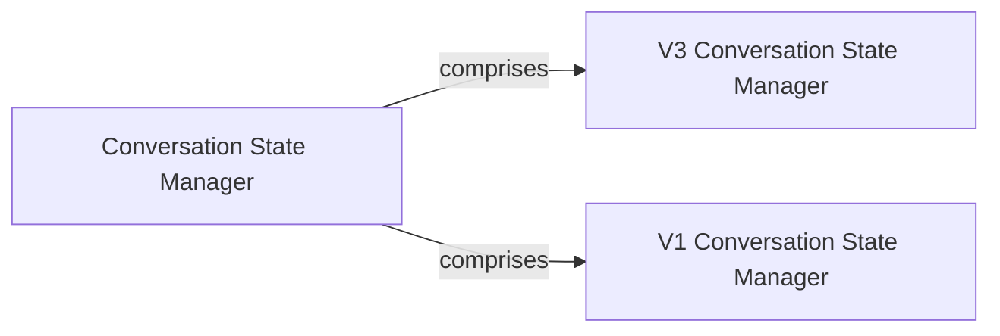

## Details

The `revChatGPT` project's conversation management subsystem is designed to handle conversational context across different API versions (V1 and V3) of the ChatGPT wrapper. The `Conversation State Manager` acts as an abstract, high-level component that logically groups the distinct functionalities of the `V3 Conversation State Manager` and `V1 Conversation State Manager`. Each version-specific manager is responsible for maintaining the unique state, history, and constraints pertinent to its respective API, ensuring seamless and consistent conversational flow.

### Conversation State Manager [[Expand]](./Conversation_State_Manager.md)
An abstract component representing the overarching system responsible for maintaining conversational context across different API versions (V1 and V3) of the ChatGPT wrapper. It encapsulates the general logic related to managing message history, state transitions, and adherence to conversation constraints, serving as a logical grouping for its more concrete sub-components.

**Related Classes/Methods**: _None_

### V3 Conversation State Manager
Manages the entire lifecycle and state of conversations specifically for the V3 API. This includes handling streaming responses, ensuring conversation history adheres to token limits, appending new messages, and providing mechanisms to revert or clear the conversation state.

**Related Classes/Methods**:

- <a href="https://github.com/acheong08/ChatGPT/blob/main/src/revChatGPT/V3.py#L182-L269" target="_blank" rel="noopener noreferrer">`ask_stream`:182-269</a>
- <a href="https://github.com/acheong08/ChatGPT/blob/main/src/revChatGPT/V3.py#L137-L149" target="_blank" rel="noopener noreferrer">`__truncate_conversation`:137-149</a>
- <a href="https://github.com/acheong08/ChatGPT/blob/main/src/revChatGPT/V3.py#L126-L135" target="_blank" rel="noopener noreferrer">`add_to_conversation`:126-135</a>
- <a href="https://github.com/acheong08/ChatGPT/blob/main/src/revChatGPT/V3.py#L394-L399" target="_blank" rel="noopener noreferrer">`rollback`:394-399</a>
- <a href="https://github.com/acheong08/ChatGPT/blob/main/src/revChatGPT/V3.py#L401-L407" target="_blank" rel="noopener noreferrer">`reset`:401-407</a>

### V1 Conversation State Manager
Manages the entire lifecycle and state of conversations specifically for the V1 API. This includes sending messages, maintaining conversation mappings, retrieving historical messages, and providing mechanisms to revert or clear the conversation state.

**Related Classes/Methods**:

- <a href="https://github.com/acheong08/ChatGPT/blob/main/src/revChatGPT/V1.py#L1221-L1312" target="_blank" rel="noopener noreferrer">`post_messages`:1221-1312</a>
- <a href="https://github.com/acheong08/ChatGPT/blob/main/src/revChatGPT/V1.py#L1041-L1050" target="_blank" rel="noopener noreferrer">`rollback_conversation`:1041-1050</a>
- <a href="https://github.com/acheong08/ChatGPT/blob/main/src/revChatGPT/V1.py#L1031-L1039" target="_blank" rel="noopener noreferrer">`reset_chat`:1031-1039</a>
- <a href="https://github.com/acheong08/ChatGPT/blob/main/src/revChatGPT/V1.py#L1453-L1468" target="_blank" rel="noopener noreferrer">`get_msg_history`:1453-1468</a>
- <a href="https://github.com/acheong08/ChatGPT/blob/main/src/revChatGPT/V1.py#L1559-L1563" target="_blank" rel="noopener noreferrer">`__map_conversations`:1559-1563</a>

### [FAQ](https://github.com/CodeBoarding/GeneratedOnBoardings/tree/main?tab=readme-ov-file#faq)