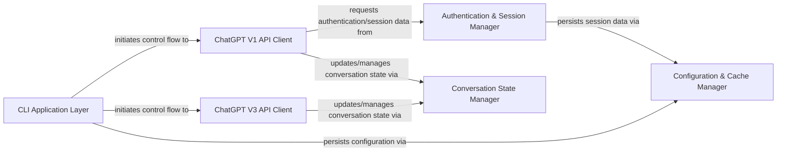

## Details

The ChatGPT project is architected as a client-server application with a clear separation between its command-line interface and the underlying API interaction logic. The CLI Application Layer serves as the primary entry point for users, directing requests to either the ChatGPT V1 API Client or ChatGPT V3 API Client based on the desired API version. The API clients are responsible for direct communication with the ChatGPT service, with the V1 client relying on the Authentication & Session Manager for secure access. Both API clients and the CLI applications leverage the Conversation State Manager to maintain and manipulate conversation history, which in turn utilizes a Token Management Utility for managing conversation length. All persistent data, including authentication tokens and configuration, is handled by the Configuration & Cache Manager. This design promotes modularity, allowing for independent development and maintenance of API versions and their respective functionalities, while providing a unified command-line experience.

### CLI Application Layer [[Expand]](./CLI_Application_Layer.md)
The user-facing component responsible for parsing command-line arguments, managing user input, and orchestrating the overall application flow. It acts as the bridge between the user and the core API functionalities.

**Related Classes/Methods**:

- <a href="https://github.com/acheong08/ChatGPT/blob/main/src/revChatGPT/__main__.py" target="_blank" rel="noopener noreferrer">`src/revChatGPT/__main__.py`</a>
- <a href="https://github.com/acheong08/ChatGPT/blob/main/src/revChatGPT/V1.py" target="_blank" rel="noopener noreferrer">`src/revChatGPT/V1.py`</a>
- <a href="https://github.com/acheong08/ChatGPT/blob/main/src/revChatGPT/V3.py" target="_blank" rel="noopener noreferrer">`src/revChatGPT/V3.py`</a>

### ChatGPT V1 API Client [[Expand]](./ChatGPT_V1_API_Client.md)
Handles all low-level HTTP requests and direct interactions with the ChatGPT V1 API endpoints. It encapsulates the logic for sending messages, retrieving conversations, and managing V1-specific API calls.

**Related Classes/Methods**:

- <a href="https://github.com/acheong08/ChatGPT/blob/main/src/revChatGPT/V1.py" target="_blank" rel="noopener noreferrer">`src/revChatGPT/V1.py`</a>

### ChatGPT V3 API Client
Manages interactions with the ChatGPT V3 API, focusing on streaming and asynchronous communication. It provides methods for sending messages and handling responses from the V3 API.

**Related Classes/Methods**:

- <a href="https://github.com/acheong08/ChatGPT/blob/main/src/revChatGPT/V3.py" target="_blank" rel="noopener noreferrer">`src/revChatGPT/V3.py`</a>

### Authentication & Session Manager [[Expand]](./Authentication_Session_Manager.md)
Responsible for handling user authentication, managing access tokens, and validating credentials for API access, primarily for the V1 API. It ensures secure and authorized communication with the ChatGPT service.

**Related Classes/Methods**:

- <a href="https://github.com/acheong08/ChatGPT/blob/main/src/revChatGPT/V1.py" target="_blank" rel="noopener noreferrer">`src/revChatGPT/V1.py`</a>

### Conversation State Manager [[Expand]](./Conversation_State_Manager.md)
Manages the flow and state of conversations across both V1 and V3 API interactions. This includes functionalities like message truncation, adding messages to the conversation history, and rolling back conversation states.

**Related Classes/Methods**:

- <a href="https://github.com/acheong08/ChatGPT/blob/main/src/revChatGPT/V3.py" target="_blank" rel="noopener noreferrer">`src/revChatGPT/V3.py`</a>
- <a href="https://github.com/acheong08/ChatGPT/blob/main/src/revChatGPT/V1.py" target="_blank" rel="noopener noreferrer">`src/revChatGPT/V1.py`</a>

### Configuration & Cache Manager [[Expand]](./Configuration_Cache_Manager.md)
Handles the persistence of application configuration and conversation state. It is responsible for saving and loading data to and from persistent storage (e.g., cache files), ensuring that user settings and conversation history are maintained across sessions.

**Related Classes/Methods**:

- <a href="https://github.com/acheong08/ChatGPT/blob/main/src/revChatGPT/V3.py" target="_blank" rel="noopener noreferrer">`src/revChatGPT/V3.py`</a>
- <a href="https://github.com/acheong08/ChatGPT/blob/main/src/revChatGPT/V1.py" target="_blank" rel="noopener noreferrer">`src/revChatGPT/V1.py`</a>

### [FAQ](https://github.com/CodeBoarding/GeneratedOnBoardings/tree/main?tab=readme-ov-file#faq)