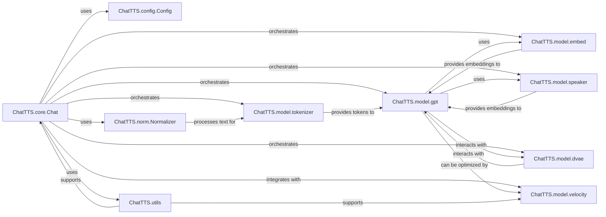

## Component Details

The central control unit and orchestrator of the ChatTTS application. It manages the entire text-to-speech workflow, coordinating model loading, asset management, text pre-processing, model inference, and audio output generation. It serves as the primary interface for user interaction, integrating various sub-components to achieve the final speech synthesis.

### ChatTTS.core.Chat
The central orchestrator of the ChatTTS application, managing the overall text-to-speech workflow.

**Related Classes/Methods**:

- <a href="https://github.com/2noise/ChatTTS/blob/master/ChatTTS/core.py#L31-L750" target="_blank" rel="noopener noreferrer">`ChatTTS.core.Chat` (31:750)</a>

### ChatTTS.model.gpt
The generative transformer model responsible for converting processed text and speaker information into latent speech representations. It's the core AI model for speech synthesis.

**Related Classes/Methods**:

- <a href="https://github.com/2noise/ChatTTS/blob/master/ChatTTS/model/gpt.py#L0-L0" target="_blank" rel="noopener noreferrer">`ChatTTS.model.gpt` (0:0)</a>

### ChatTTS.model.dvae
The Discrete Variational Autoencoder (DVAE) model. It encodes raw audio into discrete latent codes and decodes these codes back into audio, crucial for handling audio representations within the synthesis pipeline.

**Related Classes/Methods**:

- <a href="https://github.com/2noise/ChatTTS/blob/master/ChatTTS/model/dvae.py#L0-L0" target="_blank" rel="noopener noreferrer">`ChatTTS.model.dvae` (0:0)</a>

### ChatTTS.model.speaker
Manages speaker embeddings, allowing the system to generate speech in various voices. It can sample random speaker embeddings or encode speaker characteristics from audio.

**Related Classes/Methods**:

- <a href="https://github.com/2noise/ChatTTS/blob/master/ChatTTS/model/speaker.py#L0-L0" target="_blank" rel="noopener noreferrer">`ChatTTS.model.speaker` (0:0)</a>

### ChatTTS.model.tokenizer
Converts raw text input into a sequence of numerical tokens that the GPT model can process. It's a critical component for text pre-processing.

**Related Classes/Methods**:

- <a href="https://github.com/2noise/ChatTTS/blob/master/ChatTTS/model/tokenizer.py#L0-L0" target="_blank" rel="noopener noreferrer">`ChatTTS.model.tokenizer` (0:0)</a>

### ChatTTS.model.embed
Responsible for generating various embeddings, such as text embeddings, which serve as crucial inputs for the GPT model.

**Related Classes/Methods**:

- <a href="https://github.com/2noise/ChatTTS/blob/master/ChatTTS/model/embed.py#L0-L0" target="_blank" rel="noopener noreferrer">`ChatTTS.model.embed` (0:0)</a>

### ChatTTS.config.Config
Defines and manages application-wide configuration settings and parameters, including model paths and synthesis parameters.

**Related Classes/Methods**:

- <a href="https://github.com/2noise/ChatTTS/blob/master/ChatTTS/config/config.py#L124-L133" target="_blank" rel="noopener noreferrer">`ChatTTS.config.Config` (124:133)</a>

### ChatTTS.norm.Normalizer
Handles text normalization, converting raw text into a standardized format suitable for tokenization and speech synthesis, including handling homophones.

**Related Classes/Methods**:

- <a href="https://github.com/2noise/ChatTTS/blob/master/ChatTTS/norm.py#L70-L252" target="_blank" rel="noopener noreferrer">`ChatTTS.norm.Normalizer` (70:252)</a>

### ChatTTS.utils
A collection of general-purpose utility functions supporting various aspects of the application, such as downloading models, managing GPU resources, and file I/O.

**Related Classes/Methods**:

- `ChatTTS.utils` (0:0)

### ChatTTS.model.velocity
A package dedicated to optimizing LLM operations, potentially including components for efficient model loading, running, sampling, and scheduling, especially when `use_vllm` is enabled.

**Related Classes/Methods**:

- `ChatTTS.model.velocity` (0:0)

### [FAQ](https://github.com/CodeBoarding/GeneratedOnBoardings/tree/main?tab=readme-ov-file#faq)