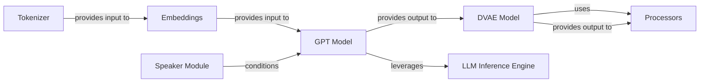

## Component Details

This composite component forms the heart of the text-to-speech system, responsible for transforming textual input into audible speech. It orchestrates several specialized neural network models and utility modules to achieve high-quality, controllable speech synthesis.

### GPT Model
This is the primary generative neural network. It takes input embeddings (representing text and speaker information) and generates a sequence of discrete tokens, which encode linguistic and prosodic information, and ultimately, acoustic features. It acts as the "brain" of the synthesis process, determining *what* to say and *how* it should sound at a high level.

**Related Classes/Methods**:

- <a href="https://github.com/2noise/ChatTTS/blob/master/ChatTTS/model/gpt.py#L20-L617" target="_blank" rel="noopener noreferrer">`ChatTTS.model.gpt.GPT` (20:617)</a>

### DVAE Model
The Digital Variational Autoencoder (DVAE) is responsible for manipulating and generating acoustic features. It can encode raw audio into discrete codes (for training or analysis) and, crucially, decode the discrete tokens generated by the GPT into continuous mel-spectrograms, which are a representation of the sound's frequency content over time.

**Related Classes/Methods**:

- <a href="https://github.com/2noise/ChatTTS/blob/master/ChatTTS/model/dvae.py#L208-L302" target="_blank" rel="noopener noreferrer">`ChatTTS.model.dvae.DVAE` (208:302)</a>

### Speaker Module
This module manages speaker embeddings, which are numerical representations of unique voice characteristics. It allows the system to control the timbre, pitch, and other vocal qualities of the synthesized speech by applying these embeddings to the input of the GPT model.

**Related Classes/Methods**:

- <a href="https://github.com/2noise/ChatTTS/blob/master/ChatTTS/model/speaker.py#L9-L153" target="_blank" rel="noopener noreferrer">`ChatTTS.model.speaker.Speaker` (9:153)</a>

### Embeddings
This component is responsible for converting various types of input data (e.g., text tokens, audio codes, speaker information) into dense vector representations (embeddings) that neural networks can effectively process. It also includes the "heads" that project the model's internal representations back into meaningful output spaces (e.g., logits for token prediction).

**Related Classes/Methods**:

- <a href="https://github.com/2noise/ChatTTS/blob/master/ChatTTS/model/embed.py#L1-L1" target="_blank" rel="noopener noreferrer">`ChatTTS.model.embed` (1:1)</a>

### Tokenizer
The Tokenizer converts raw text input into a sequence of numerical tokens. These tokens are the discrete units that the GPT model understands and processes. This is a critical pre-processing step before any neural network operations.

**Related Classes/Methods**:

- <a href="https://github.com/2noise/ChatTTS/blob/master/ChatTTS/model/tokenizer.py#L1-L1" target="_blank" rel="noopener noreferrer">`ChatTTS.model.tokenizer` (1:1)</a>

### LLM Inference Engine
This component provides optimized execution and inference capabilities specifically for large language models, such as the GPT. It includes functionalities like `LLM` (likely an optimized wrapper for the GPT model), `Scheduler`, and `ModelRunner` to ensure efficient and fast generation of tokens.

**Related Classes/Methods**:

- `ChatTTS.model.velocity` (1:1)

### Processors
This component encompasses various pre-processing and post-processing functionalities. This can include preparing input features for models (e.g., converting audio to mel-spectrograms for DVAE encoding) or handling final output formatting. It may also contain vocoder-like functionalities for converting mel-spectrograms into raw audio waveforms.

**Related Classes/Methods**:

- <a href="https://github.com/2noise/ChatTTS/blob/master/ChatTTS/model/processors.py#L1-L1" target="_blank" rel="noopener noreferrer">`ChatTTS.model.processors` (1:1)</a>

### [FAQ](https://github.com/CodeBoarding/GeneratedOnBoardings/tree/main?tab=readme-ov-file#faq)