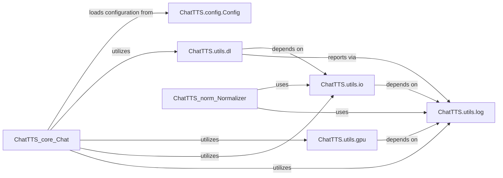

## Component Details

This section provides a detailed overview of the `System Utilities & Configuration` subsystem within the ChatTTS application. This subsystem is crucial for the foundational operation of ChatTTS, encompassing functionalities for managing model assets, handling application-wide configurations, and optimizing GPU device utilization.

### ChatTTS.config.Config
This is a central dataclass that consolidates all configuration parameters for the ChatTTS system. It defines paths to various essential model assets (Decoder, DVAE, GPT, Embed, Vocos) and other operational settings. Its purpose is to provide a single, consistent source of truth for application-wide configurations, ensuring that all modules access the same set of parameters. This prevents discrepancies and simplifies configuration management.

**Related Classes/Methods**:

- <a href="https://github.com/2noise/ChatTTS/blob/master/ChatTTS/config/config.py#L124-L133" target="_blank" rel="noopener noreferrer">`ChatTTS.config.Config` (124:133)</a>

### ChatTTS.utils.dl
This module is responsible for the secure and efficient management of ChatTTS model assets. It includes functionalities for verifying file integrity using SHA256 hashes (`sha256`, `check_model`), ensuring all required model files are present and correct (`check_folder`, `check_all_assets`), and handling the download and extraction of compressed model archives (`download_and_extract_tar_gz`, `download_and_extract_zip`, `download_all_assets`). Its primary purpose is to ensure that the necessary models are available and valid before the application attempts to load them.

**Related Classes/Methods**:

- <a href="https://github.com/2noise/ChatTTS/blob/master/ChatTTS/utils/dl.py#L1-L1" target="_blank" rel="noopener noreferrer">`ChatTTS.utils.dl` (1:1)</a>
- <a href="https://github.com/2noise/ChatTTS/blob/master/ChatTTS/utils/dl.py#L11-L15" target="_blank" rel="noopener noreferrer">`ChatTTS.utils.dl:sha256` (11:15)</a>
- <a href="https://github.com/2noise/ChatTTS/blob/master/ChatTTS/utils/dl.py#L18-L42" target="_blank" rel="noopener noreferrer">`ChatTTS.utils.dl:check_model` (18:42)</a>
- <a href="https://github.com/2noise/ChatTTS/blob/master/ChatTTS/utils/dl.py#L45-L62" target="_blank" rel="noopener noreferrer">`ChatTTS.utils.dl:check_folder` (45:62)</a>
- <a href="https://github.com/2noise/ChatTTS/blob/master/ChatTTS/utils/dl.py#L65-L110" target="_blank" rel="noopener noreferrer">`ChatTTS.utils.dl:check_all_assets` (65:110)</a>
- <a href="https://github.com/2noise/ChatTTS/blob/master/ChatTTS/utils/dl.py#L113-L126" target="_blank" rel="noopener noreferrer">`ChatTTS.utils.dl:download_and_extract_tar_gz` (113:126)</a>
- <a href="https://github.com/2noise/ChatTTS/blob/master/ChatTTS/utils/dl.py#L129-L142" target="_blank" rel="noopener noreferrer">`ChatTTS.utils.dl:download_and_extract_zip` (129:142)</a>
- <a href="https://github.com/2noise/ChatTTS/blob/master/ChatTTS/utils/dl.py#L153-L221" target="_blank" rel="noopener noreferrer">`ChatTTS.utils.dl:download_all_assets` (153:221)</a>

### ChatTTS.utils.gpu
This module intelligently selects the optimal computing device (CUDA GPU, Ascend NPU, Apple MPS, or CPU) for model inference. It prioritizes hardware acceleration when available and sufficient, gracefully falling back to CPU if dedicated accelerators are not present or lack the necessary resources. Its purpose is to maximize performance by leveraging available hardware while ensuring the application remains functional across diverse environments.

**Related Classes/Methods**:

- <a href="https://github.com/2noise/ChatTTS/blob/master/ChatTTS/utils/gpu.py#L1-L1" target="_blank" rel="noopener noreferrer">`ChatTTS.utils.gpu` (1:1)</a>

### ChatTTS.utils.io
This module provides essential utility functions for various file input/output operations, with a specific focus on loading model weights from `safetensors` files (`load_safetensors`). It also includes general utilities for identifying the most recently modified file within a directory and for recursively deleting data structures. Its purpose is to abstract common file operations, ensuring consistent and reliable data handling across the application.

**Related Classes/Methods**:

- <a href="https://github.com/2noise/ChatTTS/blob/master/ChatTTS/utils/io.py#L1-L1" target="_blank" rel="noopener noreferrer">`ChatTTS.utils.io` (1:1)</a>
- <a href="https://github.com/2noise/ChatTTS/blob/master/ChatTTS/utils/io.py#L19-L24" target="_blank" rel="noopener noreferrer">`ChatTTS.utils.io:load_safetensors` (19:24)</a>

### ChatTTS.utils.log
This module implements a centralized logging system for the entire ChatTTS application. It provides a `Logger` class and a global `logger` instance, enabling all other modules to output informational messages, warnings, and errors in a consistent and configurable manner. Its purpose is to facilitate debugging, monitoring, and operational insights by providing a structured way to record application events.

**Related Classes/Methods**:

- <a href="https://github.com/2noise/ChatTTS/blob/master/ChatTTS/utils/log.py#L1-L1" target="_blank" rel="noopener noreferrer">`ChatTTS.utils.log` (1:1)</a>
- <a href="https://github.com/2noise/ChatTTS/blob/master/ChatTTS/utils/log.py#L4-L12" target="_blank" rel="noopener noreferrer">`ChatTTS.utils.log:Logger` (4:12)</a>

### [FAQ](https://github.com/CodeBoarding/GeneratedOnBoardings/tree/main?tab=readme-ov-file#faq)