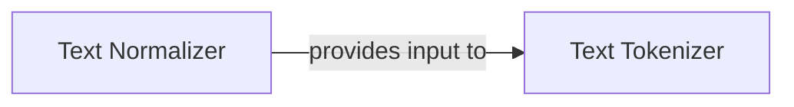

## Component Details

The `Text Processing Module` is a critical subsystem responsible for preparing raw input text for the speech synthesis pipeline. It ensures that the text is linguistically sound and converted into a numerical format suitable for machine learning models. This module comprises two fundamental components: the `Text Normalizer` and the `Text Tokenizer`.

### Text Normalizer
This component, implemented by the `ChatTTS.norm.Normalizer` class, is responsible for the linguistic pre-processing of raw input text. Its primary functions include standardizing punctuation (e.g., converting various symbols to a consistent set), applying character mappings (e.g., half-width to full-width conversions), performing homophone replacement to resolve ambiguities, and removing invalid characters. It also includes language detection to apply language-specific normalizations. The goal is to ensure the text is clean, consistent, and correctly interpreted before tokenization, which is crucial for accurate pronunciation by the speech synthesis model.

**Related Classes/Methods**:

- <a href="https://github.com/2noise/ChatTTS/blob/master/ChatTTS/norm.py#L70-L252" target="_blank" rel="noopener noreferrer">`ChatTTS.norm.Normalizer` (70:252)</a>

### Text Tokenizer
This component, implemented by the `ChatTTS.model.tokenizer.Tokenizer` class, serves as the interface between human-readable text and the numerical representations required by the machine learning models. It takes the normalized text and converts it into numerical token IDs and corresponding attention masks using a pre-trained `BertTokenizerFast`. Conversely, it can also decode sequences of token IDs back into human-readable text. It handles special tokens relevant to the ChatTTS model, such as `[spk_emb]` and `[break_0]`.

**Related Classes/Methods**:

- <a href="https://github.com/2noise/ChatTTS/blob/master/ChatTTS/model/tokenizer.py#L15-L137" target="_blank" rel="noopener noreferrer">`ChatTTS.model.tokenizer.Tokenizer` (15:137)</a>

### [FAQ](https://github.com/CodeBoarding/GeneratedOnBoardings/tree/main?tab=readme-ov-file#faq)