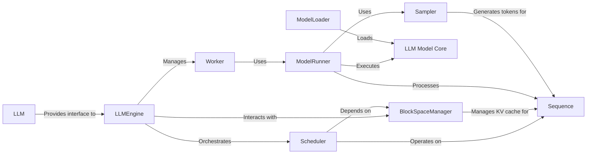

## Component Details

The `Velocity Inference Engine` is a high-performance subsystem designed for efficient execution of Large Language Models (LLMs) within the speech synthesis pipeline. It focuses on optimizing LLM inference through sophisticated request management, scheduling, and memory allocation, leveraging CUDA for accelerated execution.

### LLMEngine
The central orchestrator of the LLM inference process. It manages the lifecycle of requests, initializes and coordinates workers, handles the KV cache, and processes model outputs. It's responsible for the overall flow of text generation.

**Related Classes/Methods**:

- `LLMEngine` (1:1)

### Scheduler
Manages the scheduling of sequence groups, determining which sequences to process, preempt, or swap based on available resources and scheduling policies. It ensures efficient utilization of GPU resources.

**Related Classes/Methods**:

- <a href="https://github.com/2noise/ChatTTS/blob/master/ChatTTS/model/velocity/scheduler.py#L65-L425" target="_blank" rel="noopener noreferrer">`Scheduler` (65:425)</a>

### BlockSpaceManager
Responsible for managing the allocation, deallocation, and mapping of physical memory blocks (for the KV cache) to logical blocks used by sequences. It's crucial for efficient KV cache management and memory optimization.

**Related Classes/Methods**:

- `BlockSpaceManager` (1:1)

### Sequence
Represents a single sequence of tokens being processed by the LLM. It holds the token IDs, logical block mappings, and other metadata related to a generation request. (Conceptually includes `SequenceGroup` for batching).

**Related Classes/Methods**:

- <a href="https://github.com/2noise/ChatTTS/blob/master/ChatTTS/model/velocity/sequence.py#L117-L244" target="_blank" rel="noopener noreferrer">`Sequence` (117:244)</a>

### ModelRunner
Handles the actual execution of the LLM model. It prepares input tensors, executes the forward pass, and can utilize CUDA graphs for performance optimization.

**Related Classes/Methods**:

- <a href="https://github.com/2noise/ChatTTS/blob/master/ChatTTS/model/velocity/model_runner.py#L37-L688" target="_blank" rel="noopener noreferrer">`ModelRunner` (37:688)</a>

### Worker
Represents a worker process or thread in a distributed environment. It initializes the model, handles distributed communication, and executes model operations as directed by the `LLMEngine`.

**Related Classes/Methods**:

- <a href="https://github.com/2noise/ChatTTS/blob/master/ChatTTS/model/velocity/worker.py#L18-L203" target="_blank" rel="noopener noreferrer">`Worker` (18:203)</a>

### LLM
A high-level interface for interacting with the LLM system. It provides methods like `generate` to initiate text generation requests, abstracting away the complexities of the underlying engine.

**Related Classes/Methods**:

- `LLM` (1:1)

### LLM Model Core
The core implementation of the Large Language Model, responsible for the neural network architecture and forward pass computations. `TELlamaModel` represents a highly optimized (e.g., Triton-based) version of the Llama model.

**Related Classes/Methods**:

- `LLM Model Core` (1:1)
- `TELlamaModel` (1:1)

### ModelLoader
Responsible for loading the pre-trained LLM model weights and configurations into memory, preparing them for inference.

**Related Classes/Methods**:

- <a href="https://github.com/2noise/ChatTTS/blob/master/ChatTTS/model/velocity/model_loader.py#L1-L1" target="_blank" rel="noopener noreferrer">`ModelLoader` (1:1)</a>

### Sampler
Implements various sampling strategies (e.g., greedy, top-k, nucleus) to generate the next token based on the model's output probabilities.

**Related Classes/Methods**:

- <a href="https://github.com/2noise/ChatTTS/blob/master/ChatTTS/model/velocity/sampler.py#L7-L119" target="_blank" rel="noopener noreferrer">`Sampler` (7:119)</a>

### [FAQ](https://github.com/CodeBoarding/GeneratedOnBoardings/tree/main?tab=readme-ov-file#faq)