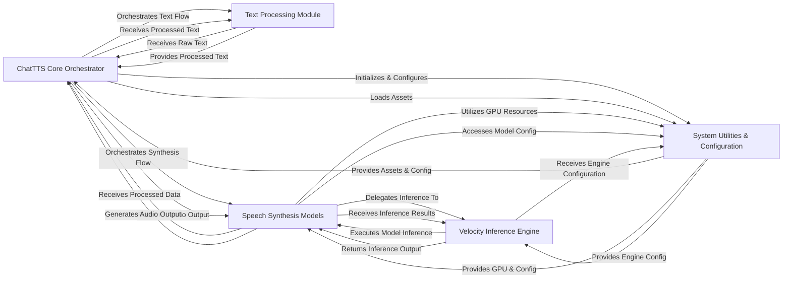

## Component Details

Abstract Components Overview of the ChatTTS application.

### ChatTTS Core Orchestrator
The central control unit of the ChatTTS application. It manages the overall text-to-speech workflow, coordinating model loading, asset management, text pre-processing, model inference, and audio output generation. It serves as the primary interface for user interaction.

**Related Classes/Methods**:

- <a href="https://github.com/2noise/ChatTTS/blob/master/ChatTTS/core.py#L31-L750" target="_blank" rel="noopener noreferrer">`ChatTTS.core.Chat` (31:750)</a>

### Text Processing Module
Responsible for preparing raw input text for the speech synthesis pipeline. This involves normalizing text (e.g., handling homophones, character mapping) and converting it into numerical tokens suitable for the core speech models.

**Related Classes/Methods**:

- <a href="https://github.com/2noise/ChatTTS/blob/master/ChatTTS/norm.py#L70-L252" target="_blank" rel="noopener noreferrer">`ChatTTS.norm.Normalizer` (70:252)</a>
- <a href="https://github.com/2noise/ChatTTS/blob/master/ChatTTS/model/tokenizer.py#L15-L137" target="_blank" rel="noopener noreferrer">`ChatTTS.model.tokenizer.Tokenizer` (15:137)</a>

### Speech Synthesis Models
This composite component encompasses the core neural network models responsible for transforming processed text into audible speech. It includes the Generative Pre-trained Transformer (GPT) for linguistic and prosodic generation, the Digital Variational Autoencoder (DVAE) for acoustic feature manipulation, the Vocoder (Vocos) for waveform generation, and the Speaker Embedding Module for voice control.

**Related Classes/Methods**:

- <a href="https://github.com/2noise/ChatTTS/blob/master/ChatTTS/model/gpt.py#L20-L617" target="_blank" rel="noopener noreferrer">`ChatTTS.model.gpt.GPT` (20:617)</a>
- <a href="https://github.com/2noise/ChatTTS/blob/master/ChatTTS/model/dvae.py#L208-L302" target="_blank" rel="noopener noreferrer">`ChatTTS.model.dvae.DVAE` (208:302)</a>
- <a href="https://github.com/2noise/ChatTTS/blob/master/ChatTTS/model/speaker.py#L9-L153" target="_blank" rel="noopener noreferrer">`ChatTTS.model.speaker.Speaker` (9:153)</a>

### Velocity Inference Engine
A high-performance, optimized inference engine specifically designed for efficient execution of large language models (LLMs) within the speech synthesis pipeline. It manages request queuing, scheduling, memory allocation (KV cache), and leverages CUDA-specific optimizations for accelerated model execution.

**Related Classes/Methods**:

- <a href="https://github.com/2noise/ChatTTS/blob/master/ChatTTS/model/velocity/llm_engine.py#L37-L832" target="_blank" rel="noopener noreferrer">`ChatTTS.model.velocity.llm_engine.LLMEngine` (37:832)</a>
- <a href="https://github.com/2noise/ChatTTS/blob/master/ChatTTS/model/velocity/scheduler.py#L65-L425" target="_blank" rel="noopener noreferrer">`ChatTTS.model.velocity.scheduler.Scheduler` (65:425)</a>
- <a href="https://github.com/2noise/ChatTTS/blob/master/ChatTTS/model/velocity/block_manager.py#L72-L295" target="_blank" rel="noopener noreferrer">`ChatTTS.model.velocity.block_manager.BlockSpaceManager` (72:295)</a>
- <a href="https://github.com/2noise/ChatTTS/blob/master/ChatTTS/model/velocity/model_runner.py#L37-L688" target="_blank" rel="noopener noreferrer">`ChatTTS.model.velocity.model_runner.ModelRunner` (37:688)</a>
- <a href="https://github.com/2noise/ChatTTS/blob/master/ChatTTS/model/velocity/sequence.py#L117-L244" target="_blank" rel="noopener noreferrer">`ChatTTS.model.velocity.sequence.Sequence` (117:244)</a>
- <a href="https://github.com/2noise/ChatTTS/blob/master/ChatTTS/model/velocity/sequence.py#L247-L346" target="_blank" rel="noopener noreferrer">`ChatTTS.model.velocity.sequence.SequenceGroup` (247:346)</a>
- <a href="https://github.com/2noise/ChatTTS/blob/master/ChatTTS/model/velocity/configs.py#L10-L16" target="_blank" rel="noopener noreferrer">`ChatTTS.model.velocity.configs.LoRAConfig` (10:16)</a>
- <a href="https://github.com/2noise/ChatTTS/blob/master/ChatTTS/model/velocity/llama.py#L316-L392" target="_blank" rel="noopener noreferrer">`ChatTTS.model.velocity.llama.LlamaForCausalLM` (316:392)</a>
- <a href="https://github.com/2noise/ChatTTS/blob/master/ChatTTS/model/cuda/te_llama.py#L95-L130" target="_blank" rel="noopener noreferrer">`ChatTTS.model.cuda.te_llama.TELlamaModel` (95:130)</a>
- <a href="https://github.com/2noise/ChatTTS/blob/master/ChatTTS/model/velocity/llm.py#L12-L212" target="_blank" rel="noopener noreferrer">`ChatTTS.model.velocity.llm.LLM` (12:212)</a>
- <a href="https://github.com/2noise/ChatTTS/blob/master/ChatTTS/model/velocity/model_loader.py#L10-L16" target="_blank" rel="noopener noreferrer">`ChatTTS.model.velocity.model_loader.ModelLoader` (10:16)</a>
- <a href="https://github.com/2noise/ChatTTS/blob/master/ChatTTS/model/velocity/output.py#L11-L55" target="_blank" rel="noopener noreferrer">`ChatTTS.model.velocity.output.CompletionOutput` (11:55)</a>
- <a href="https://github.com/2noise/ChatTTS/blob/master/ChatTTS/model/velocity/sampler.py#L7-L119" target="_blank" rel="noopener noreferrer">`ChatTTS.model.velocity.sampler.Sampler` (7:119)</a>
- <a href="https://github.com/2noise/ChatTTS/blob/master/ChatTTS/model/velocity/sampling_params.py#L23-L295" target="_blank" rel="noopener noreferrer">`ChatTTS.model.velocity.sampling_params.SamplingParams` (23:295)</a>
- <a href="https://github.com/2noise/ChatTTS/blob/master/ChatTTS/model/velocity/worker.py#L18-L203" target="_blank" rel="noopener noreferrer">`ChatTTS.model.velocity.worker.Worker` (18:203)</a>
- <a href="https://github.com/2noise/ChatTTS/blob/master/ChatTTS/model/cuda/patch.py#L10-L16" target="_blank" rel="noopener noreferrer">`ChatTTS.model.cuda.patch.patch_llama_for_text_generation` (10:16)</a>

### System Utilities & Configuration
Provides foundational support for the ChatTTS application, including functionalities for downloading and managing model assets, handling application-wide configuration parameters, and managing GPU device selection and operations.

**Related Classes/Methods**:

- <a href="https://github.com/2noise/ChatTTS/blob/master/ChatTTS/utils/dl.py#L10-L16" target="_blank" rel="noopener noreferrer">`ChatTTS.utils.dl.download_if_not_exist` (10:16)</a>
- <a href="https://github.com/2noise/ChatTTS/blob/master/ChatTTS/config/config.py#L124-L133" target="_blank" rel="noopener noreferrer">`ChatTTS.config.Config` (124:133)</a>
- <a href="https://github.com/2noise/ChatTTS/blob/master/ChatTTS/utils/gpu.py#L10-L16" target="_blank" rel="noopener noreferrer">`ChatTTS.utils.gpu.get_device_map` (10:16)</a>
- <a href="https://github.com/2noise/ChatTTS/blob/master/ChatTTS/utils/io.py#L10-L16" target="_blank" rel="noopener noreferrer">`ChatTTS.utils.io.load_json` (10:16)</a>
- <a href="https://github.com/2noise/ChatTTS/blob/master/ChatTTS/utils/log.py#L10-L16" target="_blank" rel="noopener noreferrer">`ChatTTS.utils.log.logger` (10:16)</a>

### [FAQ](https://github.com/CodeBoarding/GeneratedOnBoardings/tree/main?tab=readme-ov-file#faq)