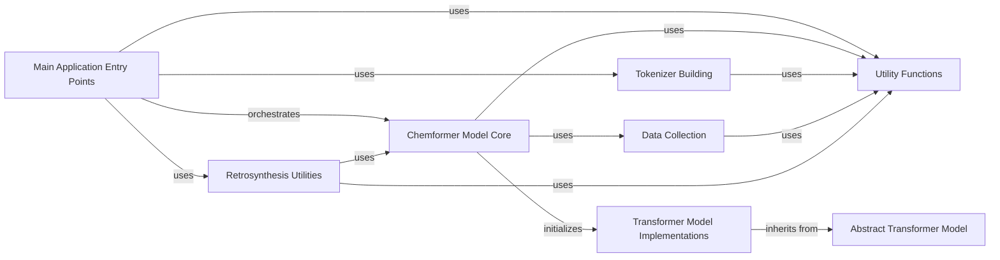

## Component Details

The Chemformer Core subsystem represents the central intelligence of the Chemformer project. It encompasses the main application entry points, the high-level Chemformer model, and the underlying transformer architectures (BART, Unified Transformer). This subsystem orchestrates various tasks such as training, prediction, and inference by leveraging the core neural network models. It interacts with utility functions for data handling, trainer utilities, and sampler implementations, as well as specialized retrosynthesis utilities. The core Chemformer model initializes and utilizes the specific transformer model implementations, which in turn inherit from an abstract transformer model, providing a structured and extensible architecture for molecular property prediction and retrosynthesis.

### Main Application Entry Points
These components represent the primary execution points for various tasks within the Chemformer system, including building tokenizers, performing inference, fine-tuning, pre-training, and predicting molecular properties. They orchestrate the overall flow of the application for their respective tasks.

**Related Classes/Methods**:

- <a href="https://github.com/MolecularAI/Chemformer/blob/master/molbart/build_tokenizer.py#L33-L55" target="_blank" rel="noopener noreferrer">`Chemformer.molbart.build_tokenizer.main` (33:55)</a>
- <a href="https://github.com/MolecularAI/Chemformer/blob/master/molbart/inference_score.py#L7-L21" target="_blank" rel="noopener noreferrer">`Chemformer.molbart.inference_score.main` (7:21)</a>
- <a href="https://github.com/MolecularAI/Chemformer/blob/master/molbart/fine_tune.py#L9-L18" target="_blank" rel="noopener noreferrer">`Chemformer.molbart.fine_tune.main` (9:18)</a>
- <a href="https://github.com/MolecularAI/Chemformer/blob/master/molbart/pretrain.py#L76-L118" target="_blank" rel="noopener noreferrer">`Chemformer.molbart.pretrain.main` (76:118)</a>
- <a href="https://github.com/MolecularAI/Chemformer/blob/master/molbart/predict.py#L30-L39" target="_blank" rel="noopener noreferrer">`Chemformer.molbart.predict.main` (30:39)</a>
- <a href="https://github.com/MolecularAI/Chemformer/blob/master/molbart/retrosynthesis/round_trip_inference.py#L84-L105" target="_blank" rel="noopener noreferrer">`Chemformer.molbart.retrosynthesis.round_trip_inference.main` (84:105)</a>

### Chemformer Model Core
This component encapsulates the core Chemformer model, handling its initialization, data module setup, model building (from scratch or checkpoint), and various operations like encoding, log-likelihood calculation, prediction, and scoring. It serves as the central interface for interacting with the Chemformer neural network.

**Related Classes/Methods**:

- <a href="https://github.com/MolecularAI/Chemformer/blob/master/molbart/models/chemformer.py#L21-L647" target="_blank" rel="noopener noreferrer">`Chemformer.molbart.models.chemformer.Chemformer` (21:647)</a>
- <a href="https://github.com/MolecularAI/Chemformer/blob/master/molbart/models/chemformer.py#L248-L254" target="_blank" rel="noopener noreferrer">`Chemformer.molbart.models.chemformer.Chemformer.fit` (248:254)</a>
- <a href="https://github.com/MolecularAI/Chemformer/blob/master/molbart/models/chemformer.py#L527-L569" target="_blank" rel="noopener noreferrer">`Chemformer.molbart.models.chemformer.Chemformer.predict` (527:569)</a>
- <a href="https://github.com/MolecularAI/Chemformer/blob/master/molbart/models/chemformer.py#L571-L647" target="_blank" rel="noopener noreferrer">`Chemformer.molbart.models.chemformer.Chemformer.score_model` (571:647)</a>
- <a href="https://github.com/MolecularAI/Chemformer/blob/master/molbart/models/chemformer.py#L402-L439" target="_blank" rel="noopener noreferrer">`Chemformer.molbart.models.chemformer.Chemformer.build_model` (402:439)</a>
- <a href="https://github.com/MolecularAI/Chemformer/blob/master/molbart/models/chemformer.py#L152-L184" target="_blank" rel="noopener noreferrer">`Chemformer.molbart.models.chemformer.Chemformer.encode` (152:184)</a>
- <a href="https://github.com/MolecularAI/Chemformer/blob/master/molbart/models/chemformer.py#L215-L246" target="_blank" rel="noopener noreferrer">`Chemformer.molbart.models.chemformer.Chemformer.set_datamodule` (215:246)</a>
- <a href="https://github.com/MolecularAI/Chemformer/blob/master/molbart/models/chemformer.py#L259-L318" target="_blank" rel="noopener noreferrer">`Chemformer.molbart.models.chemformer.Chemformer._random_initialization` (259:318)</a>
- <a href="https://github.com/MolecularAI/Chemformer/blob/master/molbart/models/chemformer.py#L470-L511" target="_blank" rel="noopener noreferrer">`Chemformer.molbart.models.chemformer.Chemformer.log_likelihood` (470:511)</a>

### Abstract Transformer Model
This component defines the foundational structure and common functionalities for transformer-based models within Chemformer. It provides abstract methods and shared logic for training, validation, and testing steps, including forward passes, loss calculation, and token accuracy.

**Related Classes/Methods**:

- <a href="https://github.com/MolecularAI/Chemformer/blob/master/molbart/models/base_transformer.py#L16-L294" target="_blank" rel="noopener noreferrer">`Chemformer.molbart.models.base_transformer._AbsTransformerModel` (16:294)</a>
- <a href="https://github.com/MolecularAI/Chemformer/blob/master/molbart/models/base_transformer.py#L99-L107" target="_blank" rel="noopener noreferrer">`Chemformer.molbart.models.base_transformer._AbsTransformerModel.training_step` (99:107)</a>
- <a href="https://github.com/MolecularAI/Chemformer/blob/master/molbart/models/base_transformer.py#L109-L129" target="_blank" rel="noopener noreferrer">`Chemformer.molbart.models.base_transformer._AbsTransformerModel.validation_step` (109:129)</a>
- <a href="https://github.com/MolecularAI/Chemformer/blob/master/molbart/models/base_transformer.py#L136-L158" target="_blank" rel="noopener noreferrer">`Chemformer.molbart.models.base_transformer._AbsTransformerModel.test_step` (136:158)</a>

### Transformer Model Implementations
This component includes concrete implementations of transformer models, such as BART and Unified models, which inherit from the Abstract Transformer Model. They define the specific architecture and forward pass logic for their respective transformer variants.

**Related Classes/Methods**:

- <a href="https://github.com/MolecularAI/Chemformer/blob/master/molbart/models/transformer_models.py#L17-L310" target="_blank" rel="noopener noreferrer">`Chemformer.molbart.models.transformer_models.BARTModel` (17:310)</a>
- <a href="https://github.com/MolecularAI/Chemformer/blob/master/molbart/models/transformer_models.py#L313-L512" target="_blank" rel="noopener noreferrer">`Chemformer.molbart.models.transformer_models.UnifiedModel` (313:512)</a>
- <a href="https://github.com/MolecularAI/Chemformer/blob/master/molbart/models/transformer_models.py#L78-L121" target="_blank" rel="noopener noreferrer">`Chemformer.molbart.models.transformer_models.BARTModel.forward` (78:121)</a>
- <a href="https://github.com/MolecularAI/Chemformer/blob/master/molbart/models/transformer_models.py#L365-L399" target="_blank" rel="noopener noreferrer">`Chemformer.molbart.models.transformer_models.UnifiedModel.forward` (365:399)</a>

### Utility Functions
This component provides a collection of utility functions that support various aspects of the Chemformer system, including data handling, trainer utilities, and sampler implementations. These functions are generally stateless and perform specific, reusable tasks.

**Related Classes/Methods**:

- <a href="https://github.com/MolecularAI/Chemformer/blob/master/molbart/utils/data_utils.py#L105-L106" target="_blank" rel="noopener noreferrer">`Chemformer.molbart.utils.data_utils.seed_everything` (105:106)</a>
- <a href="https://github.com/MolecularAI/Chemformer/blob/master/molbart/utils/data_utils.py#L42-L60" target="_blank" rel="noopener noreferrer">`Chemformer.molbart.utils.data_utils.build_molecule_datamodule` (42:60)</a>
- <a href="https://github.com/MolecularAI/Chemformer/blob/master/molbart/utils/trainer_utils.py#L74-L82" target="_blank" rel="noopener noreferrer">`Chemformer.molbart.utils.trainer_utils.calc_train_steps` (74:82)</a>
- <a href="https://github.com/MolecularAI/Chemformer/blob/master/molbart/utils/samplers/beam_search_samplers.py#L162-L597" target="_blank" rel="noopener noreferrer">`Chemformer.molbart.utils.samplers.beam_search_samplers.DecodeSampler` (162:597)</a>
- <a href="https://github.com/MolecularAI/Chemformer/blob/master/molbart/utils/trainer_utils.py#L85-L108" target="_blank" rel="noopener noreferrer">`Chemformer.molbart.utils.trainer_utils.build_trainer` (85:108)</a>
- <a href="https://github.com/MolecularAI/Chemformer/blob/master/molbart/utils/tokenizers/tokenizers.py#L13-L133" target="_blank" rel="noopener noreferrer">`Chemformer.molbart.utils.tokenizers.tokenizers.ChemformerTokenizer` (13:133)</a>
- <a href="https://github.com/MolecularAI/Chemformer/blob/master/molbart/utils/samplers/beam_search_samplers.py#L21-L159" target="_blank" rel="noopener noreferrer">`Chemformer.molbart.utils.samplers.beam_search_samplers.BeamSearchSampler` (21:159)</a>
- <a href="https://github.com/MolecularAI/Chemformer/blob/master/molbart/utils/trainer_utils.py#L25-L34" target="_blank" rel="noopener noreferrer">`Chemformer.molbart.utils.trainer_utils.instantiate_scorers` (25:34)</a>

### Retrosynthesis Utilities
This component focuses on utilities specifically designed for retrosynthesis tasks, including creating round-trip datasets, setting output files, converting data formats, and computing round-trip accuracy. It supports the specialized workflow of retrosynthesis inference.

**Related Classes/Methods**:

- <a href="https://github.com/MolecularAI/Chemformer/blob/master/molbart/retrosynthesis/round_trip_inference.py#L17-L72" target="_blank" rel="noopener noreferrer">`Chemformer.molbart.retrosynthesis.round_trip_inference.create_round_trip_dataset` (17:72)</a>
- <a href="https://github.com/MolecularAI/Chemformer/blob/master/molbart/retrosynthesis/round_trip_utils.py#L105-L109" target="_blank" rel="noopener noreferrer">`Chemformer.molbart.retrosynthesis.round_trip_utils.set_output_files` (105:109)</a>
- <a href="https://github.com/MolecularAI/Chemformer/blob/master/molbart/retrosynthesis/round_trip_utils.py#L60-L102" target="_blank" rel="noopener noreferrer">`Chemformer.molbart.retrosynthesis.round_trip_utils.convert_to_input_format` (60:102)</a>
- <a href="https://github.com/MolecularAI/Chemformer/blob/master/molbart/retrosynthesis/round_trip_utils.py#L7-L35" target="_blank" rel="noopener noreferrer">`Chemformer.molbart.retrosynthesis.round_trip_utils.compute_round_trip_accuracy` (7:35)</a>
- <a href="https://github.com/MolecularAI/Chemformer/blob/master/molbart/retrosynthesis/round_trip_inference.py#L75-L80" target="_blank" rel="noopener noreferrer">`Chemformer.molbart.retrosynthesis.round_trip_inference._run_test_callbacks` (75:80)</a>

### Tokenizer Building
This component is responsible for building and managing the tokenizer used by the Chemformer model. It includes functionalities for reading extra tokens and building unused tokens, which are crucial for preparing the vocabulary for the model.

**Related Classes/Methods**:

- <a href="https://github.com/MolecularAI/Chemformer/blob/master/molbart/build_tokenizer.py#L9-L20" target="_blank" rel="noopener noreferrer">`Chemformer.molbart.build_tokenizer.read_extra_tokens` (9:20)</a>
- <a href="https://github.com/MolecularAI/Chemformer/blob/master/molbart/build_tokenizer.py#L23-L29" target="_blank" rel="noopener noreferrer">`Chemformer.molbart.build_tokenizer.build_unused_tokens` (23:29)</a>

### Data Collection
This component handles the collection and management of data for the Chemformer model. It provides methods to retrieve data modules, which are essential for feeding data into the model during training, validation, and inference.

**Related Classes/Methods**:

- <a href="https://github.com/MolecularAI/Chemformer/blob/master/molbart/data/data_collection.py#L18-L115" target="_blank" rel="noopener noreferrer">`Chemformer.molbart.data.data_collection.DataCollection` (18:115)</a>
- <a href="https://github.com/MolecularAI/Chemformer/blob/master/molbart/data/data_collection.py#L87-L92" target="_blank" rel="noopener noreferrer">`Chemformer.molbart.data.data_collection.DataCollection.get_datamodule` (87:92)</a>

### [FAQ](https://github.com/CodeBoarding/GeneratedOnBoardings/tree/main?tab=readme-ov-file#faq)