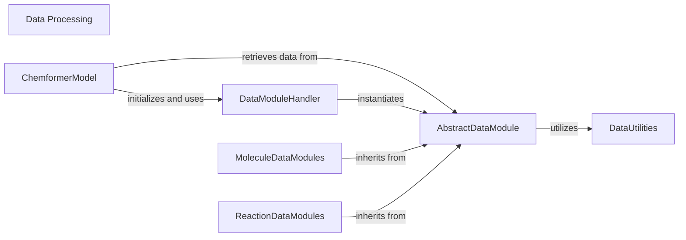

## Component Details

The Data Processing subsystem is central to handling all data-related operations for the Chemformer model. It encompasses abstract and concrete data modules for various chemical datasets (molecules and reactions), a handler for managing these modules, and utility functions for data transformation and batching. The main flow involves the DataModuleHandler instantiating specific AbstractDataModule implementations, which then load, process, and split data, utilizing DataUtilities for tasks like batch encoding and attention mask generation. The ChemformerModel interacts with these data modules to retrieve prepared data for training, encoding, and prediction.

### Data Processing
This component is responsible for all aspects of data handling, including loading, processing, splitting, and preparing chemical datasets (e.g., ChEMBL, ZINC, USPTO) for model consumption. It manages data loaders, batch transformations, and provides utilities for data collection.

**Related Classes/Methods**:

- <a href="https://github.com/MolecularAI/Chemformer/blob/master/molbart/data/base.py#L73-L343" target="_blank" rel="noopener noreferrer">`Chemformer.molbart.data.base._AbsDataModule` (73:343)</a>
- <a href="https://github.com/MolecularAI/Chemformer/blob/master/molbart/data/mol_data.py#L11-L31" target="_blank" rel="noopener noreferrer">`Chemformer.molbart.data.mol_data.ChemblDataModule` (11:31)</a>
- <a href="https://github.com/MolecularAI/Chemformer/blob/master/molbart/data/mol_data.py#L34-L50" target="_blank" rel="noopener noreferrer">`Chemformer.molbart.data.mol_data.ZincDataModule` (34:50)</a>
- <a href="https://github.com/MolecularAI/Chemformer/blob/master/molbart/data/datamodules.py#L6-L59" target="_blank" rel="noopener noreferrer">`Chemformer.molbart.data.datamodules.SynthesisDataModule` (6:59)</a>
- <a href="https://github.com/MolecularAI/Chemformer/blob/master/molbart/data/seq2seq_data.py#L8-L42" target="_blank" rel="noopener noreferrer">`Chemformer.molbart.data.seq2seq_data.Uspto50DataModule` (8:42)</a>
- <a href="https://github.com/MolecularAI/Chemformer/blob/master/molbart/data/seq2seq_data.py#L45-L66" target="_blank" rel="noopener noreferrer">`Chemformer.molbart.data.seq2seq_data.UsptoMixedDataModule` (45:66)</a>
- <a href="https://github.com/MolecularAI/Chemformer/blob/master/molbart/data/seq2seq_data.py#L69-L98" target="_blank" rel="noopener noreferrer">`Chemformer.molbart.data.seq2seq_data.UsptoSepDataModule` (69:98)</a>
- <a href="https://github.com/MolecularAI/Chemformer/blob/master/molbart/data/seq2seq_data.py#L101-L128" target="_blank" rel="noopener noreferrer">`Chemformer.molbart.data.seq2seq_data.MolecularOptimizationDataModule` (101:128)</a>
- <a href="https://github.com/MolecularAI/Chemformer/blob/master/molbart/data/base.py#L346-L421" target="_blank" rel="noopener noreferrer">`Chemformer.molbart.data.base.MoleculeListDataModule` (346:421)</a>
- <a href="https://github.com/MolecularAI/Chemformer/blob/master/molbart/data/base.py#L424-L487" target="_blank" rel="noopener noreferrer">`Chemformer.molbart.data.base.ReactionListDataModule` (424:487)</a>
- <a href="https://github.com/MolecularAI/Chemformer/blob/master/molbart/data/base.py#L20-L70" target="_blank" rel="noopener noreferrer">`Chemformer.molbart.data.base.ChemistryDataset` (20:70)</a>
- <a href="https://github.com/MolecularAI/Chemformer/blob/master/molbart/data/data_collection.py#L1-L100" target="_blank" rel="noopener noreferrer">`Chemformer.molbart.data.data_collection.DataCollection` (1:100)</a>
- <a href="https://github.com/MolecularAI/Chemformer/blob/master/molbart/data/util.py#L7-L84" target="_blank" rel="noopener noreferrer">`Chemformer.molbart.data.util.BatchEncoder` (7:84)</a>
- <a href="https://github.com/MolecularAI/Chemformer/blob/master/molbart/data/zinc_utils.py#L56-L69" target="_blank" rel="noopener noreferrer">`Chemformer.molbart.data.zinc_utils.read_zinc_slice` (56:69)</a>

### ChemformerModel
This component encapsulates the core Chemformer model, handling its initialization, training (fitting), encoding, decoding, prediction, and scoring. It manages the model's interaction with data loaders and the underlying BART/Unified models.

**Related Classes/Methods**:

- <a href="https://github.com/MolecularAI/Chemformer/blob/master/molbart/models/chemformer.py#L21-L647" target="_blank" rel="noopener noreferrer">`Chemformer.molbart.models.chemformer.Chemformer` (21:647)</a>
- <a href="https://github.com/MolecularAI/Chemformer/blob/master/molbart/models/chemformer.py#L27-L150" target="_blank" rel="noopener noreferrer">`Chemformer.molbart.models.chemformer.Chemformer.__init__` (27:150)</a>
- <a href="https://github.com/MolecularAI/Chemformer/blob/master/molbart/models/chemformer.py#L152-L184" target="_blank" rel="noopener noreferrer">`Chemformer.molbart.models.chemformer.Chemformer.encode` (152:184)</a>
- <a href="https://github.com/MolecularAI/Chemformer/blob/master/molbart/models/chemformer.py#L215-L246" target="_blank" rel="noopener noreferrer">`Chemformer.molbart.models.chemformer.Chemformer.set_datamodule` (215:246)</a>
- <a href="https://github.com/MolecularAI/Chemformer/blob/master/molbart/models/chemformer.py#L470-L511" target="_blank" rel="noopener noreferrer">`Chemformer.molbart.models.chemformer.Chemformer.log_likelihood` (470:511)</a>
- <a href="https://github.com/MolecularAI/Chemformer/blob/master/molbart/models/chemformer.py#L527-L569" target="_blank" rel="noopener noreferrer">`Chemformer.molbart.models.chemformer.Chemformer.predict` (527:569)</a>
- <a href="https://github.com/MolecularAI/Chemformer/blob/master/molbart/models/chemformer.py#L571-L647" target="_blank" rel="noopener noreferrer">`Chemformer.molbart.models.chemformer.Chemformer.score_model` (571:647)</a>
- <a href="https://github.com/MolecularAI/Chemformer/blob/master/molbart/models/chemformer.py#L441-L467" target="_blank" rel="noopener noreferrer">`Chemformer.molbart.models.chemformer.Chemformer.get_dataloader` (441:467)</a>

### DataModuleHandler
This component is responsible for collecting, loading, and providing access to various data modules used by the Chemformer model. It handles the configuration and instantiation of specific data modules based on the application's needs.

**Related Classes/Methods**:

- <a href="https://github.com/MolecularAI/Chemformer/blob/master/molbart/data/data_collection.py#L1-L100" target="_blank" rel="noopener noreferrer">`Chemformer.molbart.data.data_collection.DataCollection` (1:100)</a>
- `Chemformer.molbart.data.data_collection.DataCollection.__init__` (full file reference)
- `Chemformer.molbart.data.data_collection.DataCollection.load_from_config` (full file reference)
- `Chemformer.molbart.data.data_collection.DataCollection.get_datamodule` (full file reference)
- `Chemformer.molbart.data.data_collection.DataCollection._set_datamodule_kwargs` (full file reference)

### AbstractDataModule
This abstract component defines the common interface and base functionalities for all specific data modules within the Chemformer project. It handles data loading, splitting, batching, and basic transformations, providing a standardized way to interact with different datasets.

**Related Classes/Methods**:

- <a href="https://github.com/MolecularAI/Chemformer/blob/master/molbart/data/base.py#L73-L343" target="_blank" rel="noopener noreferrer">`Chemformer.molbart.data.base._AbsDataModule` (73:343)</a>
- <a href="https://github.com/MolecularAI/Chemformer/blob/master/molbart/data/base.py#L140-L164" target="_blank" rel="noopener noreferrer">`Chemformer.molbart.data.base._AbsDataModule.train_dataloader` (140:164)</a>
- <a href="https://github.com/MolecularAI/Chemformer/blob/master/molbart/data/base.py#L166-L173" target="_blank" rel="noopener noreferrer">`Chemformer.molbart.data.base._AbsDataModule.val_dataloader` (166:173)</a>
- <a href="https://github.com/MolecularAI/Chemformer/blob/master/molbart/data/base.py#L175-L182" target="_blank" rel="noopener noreferrer">`Chemformer.molbart.data.base._AbsDataModule.test_dataloader` (175:182)</a>
- <a href="https://github.com/MolecularAI/Chemformer/blob/master/molbart/data/base.py#L184-L195" target="_blank" rel="noopener noreferrer">`Chemformer.molbart.data.base._AbsDataModule.full_dataloader` (184:195)</a>
- <a href="https://github.com/MolecularAI/Chemformer/blob/master/molbart/data/base.py#L197-L200" target="_blank" rel="noopener noreferrer">`Chemformer.molbart.data.base._AbsDataModule.setup` (197:200)</a>
- <a href="https://github.com/MolecularAI/Chemformer/blob/master/molbart/data/base.py#L254-L255" target="_blank" rel="noopener noreferrer">`Chemformer.molbart.data.base._AbsDataModule._load_all_data` (254:255)</a>
- <a href="https://github.com/MolecularAI/Chemformer/blob/master/molbart/data/base.py#L313-L338" target="_blank" rel="noopener noreferrer">`Chemformer.molbart.data.base._AbsDataModule._split_dataset` (313:338)</a>
- <a href="https://github.com/MolecularAI/Chemformer/blob/master/molbart/data/base.py#L208-L226" target="_blank" rel="noopener noreferrer">`Chemformer.molbart.data.base._AbsDataModule._collate` (208:226)</a>
- <a href="https://github.com/MolecularAI/Chemformer/blob/master/molbart/data/base.py#L267-L295" target="_blank" rel="noopener noreferrer">`Chemformer.molbart.data.base._AbsDataModule._make_unified_model_batch` (267:295)</a>
- <a href="https://github.com/MolecularAI/Chemformer/blob/master/molbart/data/base.py#L205-L206" target="_blank" rel="noopener noreferrer">`Chemformer.molbart.data.base._AbsDataModule._build_attention_mask` (205:206)</a>

### MoleculeDataModules
This component represents concrete implementations of data modules specifically designed for handling molecular data, such as ChEMBL and ZINC datasets. They inherit from AbstractDataModule and implement dataset-specific loading and transformation logic.

**Related Classes/Methods**:

- <a href="https://github.com/MolecularAI/Chemformer/blob/master/molbart/data/mol_data.py#L11-L31" target="_blank" rel="noopener noreferrer">`Chemformer.molbart.data.mol_data.ChemblDataModule` (11:31)</a>
- <a href="https://github.com/MolecularAI/Chemformer/blob/master/molbart/data/mol_data.py#L19-L25" target="_blank" rel="noopener noreferrer">`Chemformer.molbart.data.mol_data.ChemblDataModule._load_all_data` (19:25)</a>
- <a href="https://github.com/MolecularAI/Chemformer/blob/master/molbart/data/mol_data.py#L27-L31" target="_blank" rel="noopener noreferrer">`Chemformer.molbart.data.mol_data.ChemblDataModule._transform_batch` (27:31)</a>
- <a href="https://github.com/MolecularAI/Chemformer/blob/master/molbart/data/mol_data.py#L34-L50" target="_blank" rel="noopener noreferrer">`Chemformer.molbart.data.mol_data.ZincDataModule` (34:50)</a>
- <a href="https://github.com/MolecularAI/Chemformer/blob/master/molbart/data/mol_data.py#L42-L50" target="_blank" rel="noopener noreferrer">`Chemformer.molbart.data.mol_data.ZincDataModule._load_all_data` (42:50)</a>
- <a href="https://github.com/MolecularAI/Chemformer/blob/master/molbart/data/base.py#L346-L421" target="_blank" rel="noopener noreferrer">`Chemformer.molbart.data.base.MoleculeListDataModule` (346:421)</a>
- <a href="https://github.com/MolecularAI/Chemformer/blob/master/molbart/data/base.py#L375-L389" target="_blank" rel="noopener noreferrer">`Chemformer.molbart.data.base.MoleculeListDataModule.__init__` (375:389)</a>
- <a href="https://github.com/MolecularAI/Chemformer/blob/master/molbart/data/base.py#L407-L421" target="_blank" rel="noopener noreferrer">`Chemformer.molbart.data.base.MoleculeListDataModule._transform_batch` (407:421)</a>

### ReactionDataModules
This component encompasses concrete data modules tailored for reaction-based datasets, such as USPTO. Similar to MoleculeDataModules, they extend AbstractDataModule and provide specialized methods for loading and processing reaction data.

**Related Classes/Methods**:

- <a href="https://github.com/MolecularAI/Chemformer/blob/master/molbart/data/base.py#L424-L487" target="_blank" rel="noopener noreferrer">`Chemformer.molbart.data.base.ReactionListDataModule` (424:487)</a>
- <a href="https://github.com/MolecularAI/Chemformer/blob/master/molbart/data/base.py#L450-L454" target="_blank" rel="noopener noreferrer">`Chemformer.molbart.data.base.ReactionListDataModule.__init__` (450:454)</a>
- <a href="https://github.com/MolecularAI/Chemformer/blob/master/molbart/data/base.py#L456-L457" target="_blank" rel="noopener noreferrer">`Chemformer.molbart.data.base.ReactionListDataModule._build_attention_mask` (456:457)</a>
- <a href="https://github.com/MolecularAI/Chemformer/blob/master/molbart/data/base.py#L479-L487" target="_blank" rel="noopener noreferrer">`Chemformer.molbart.data.base.ReactionListDataModule._transform_batch` (479:487)</a>
- <a href="https://github.com/MolecularAI/Chemformer/blob/master/molbart/data/datamodules.py#L6-L59" target="_blank" rel="noopener noreferrer">`Chemformer.molbart.data.datamodules.SynthesisDataModule` (6:59)</a>
- <a href="https://github.com/MolecularAI/Chemformer/blob/master/molbart/data/datamodules.py#L22-L34" target="_blank" rel="noopener noreferrer">`Chemformer.molbart.data.datamodules.SynthesisDataModule.__init__` (22:34)</a>
- <a href="https://github.com/MolecularAI/Chemformer/blob/master/molbart/data/datamodules.py#L47-L59" target="_blank" rel="noopener noreferrer">`Chemformer.molbart.data.datamodules.SynthesisDataModule._load_all_data` (47:59)</a>
- <a href="https://github.com/MolecularAI/Chemformer/blob/master/molbart/data/seq2seq_data.py#L8-L42" target="_blank" rel="noopener noreferrer">`Chemformer.molbart.data.seq2seq_data.Uspto50DataModule` (8:42)</a>
- <a href="https://github.com/MolecularAI/Chemformer/blob/master/molbart/data/seq2seq_data.py#L16-L18" target="_blank" rel="noopener noreferrer">`Chemformer.molbart.data.seq2seq_data.Uspto50DataModule.__init__` (16:18)</a>
- <a href="https://github.com/MolecularAI/Chemformer/blob/master/molbart/data/seq2seq_data.py#L35-L42" target="_blank" rel="noopener noreferrer">`Chemformer.molbart.data.seq2seq_data.Uspto50DataModule._load_all_data` (35:42)</a>
- <a href="https://github.com/MolecularAI/Chemformer/blob/master/molbart/data/seq2seq_data.py#L60-L66" target="_blank" rel="noopener noreferrer">`Chemformer.molbart.data.seq2seq_data.UsptoMixedDataModule._load_all_data` (60:66)</a>
- <a href="https://github.com/MolecularAI/Chemformer/blob/master/molbart/data/seq2seq_data.py#L91-L98" target="_blank" rel="noopener noreferrer">`Chemformer.molbart.data.seq2seq_data.UsptoSepDataModule._load_all_data` (91:98)</a>
- <a href="https://github.com/MolecularAI/Chemformer/blob/master/molbart/data/seq2seq_data.py#L121-L128" target="_blank" rel="noopener noreferrer">`Chemformer.molbart.data.seq2seq_data.MolecularOptimizationDataModule._load_all_data` (121:128)</a>

### DataUtilities
This component provides utility functions and classes that support data processing and batch encoding within the data modules. These utilities handle tasks like building attention masks, target masks, and encoding sequences for model input.

**Related Classes/Methods**:

- <a href="https://github.com/MolecularAI/Chemformer/blob/master/molbart/utils/data_utils.py#L42-L60" target="_blank" rel="noopener noreferrer">`Chemformer.molbart.utils.data_utils.build_molecule_datamodule` (42:60)</a>
- <a href="https://github.com/MolecularAI/Chemformer/blob/master/molbart/data/util.py#L7-L84" target="_blank" rel="noopener noreferrer">`Chemformer.molbart.data.util.BatchEncoder` (7:84)</a>
- <a href="https://github.com/MolecularAI/Chemformer/blob/master/molbart/data/util.py#L43-L63" target="_blank" rel="noopener noreferrer">`Chemformer.molbart.data.util.BatchEncoder.__call__` (43:63)</a>
- <a href="https://github.com/MolecularAI/Chemformer/blob/master/molbart/data/util.py#L80-L84" target="_blank" rel="noopener noreferrer">`Chemformer.molbart.data.util.BatchEncoder._pad_seqs` (80:84)</a>
- <a href="https://github.com/MolecularAI/Chemformer/blob/master/molbart/data/util.py#L65-L77" target="_blank" rel="noopener noreferrer">`Chemformer.molbart.data.util.BatchEncoder._check_seq_len` (65:77)</a>
- <a href="https://github.com/MolecularAI/Chemformer/blob/master/molbart/data/util.py#L87-L102" target="_blank" rel="noopener noreferrer">`Chemformer.molbart.data.util.build_attention_mask` (87:102)</a>
- <a href="https://github.com/MolecularAI/Chemformer/blob/master/molbart/data/util.py#L105-L121" target="_blank" rel="noopener noreferrer">`Chemformer.molbart.data.util.build_target_mask` (105:121)</a>

### [FAQ](https://github.com/CodeBoarding/GeneratedOnBoardings/tree/main?tab=readme-ov-file#faq)