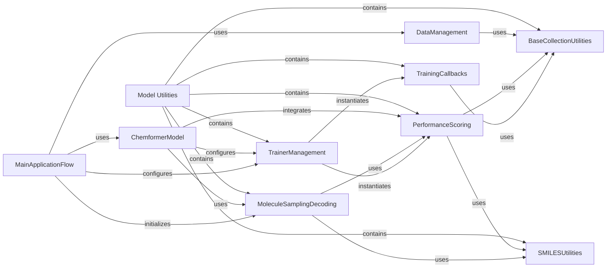

## Component Details

The Model Utilities component provides a comprehensive set of functionalities crucial for the training, inference, and evaluation of the Chemformer model. It encapsulates sub-components responsible for managing the PyTorch Lightning Trainer configuration, implementing diverse molecule sampling and decoding strategies (including beam search), defining and aggregating performance metrics, and offering foundational utilities for dynamic class loading and SMILES string manipulation. This component is central to the Chemformer's operational pipeline, ensuring robust model training, accurate molecule generation, and thorough performance assessment.

### Model Utilities
This overarching component provides a suite of utilities that support the training, inference, and evaluation processes of the Chemformer model. It encompasses functionalities for building and configuring the PyTorch Lightning Trainer, implementing various sampling and decoding strategies (like beam search), defining metrics for scoring and evaluating model performance, and providing foundational collection and SMILES string manipulation utilities.

**Related Classes/Methods**:

- `Chemformer.molbart.utils.trainer_utils` (full file reference)
- `Chemformer.molbart.utils.samplers` (full file reference)
- `Chemformer.molbart.utils.callbacks` (full file reference)
- `Chemformer.molbart.utils.scores` (full file reference)
- `Chemformer.molbart.utils.base_collection` (full file reference)
- `Chemformer.molbart.utils.smiles_utils` (full file reference)

### TrainerManagement
Manages the configuration and construction of the PyTorch Lightning training environment, including calculating training steps, and instantiating loggers, callbacks, and plugins for the training process. It is a core part of the Model Utilities.

**Related Classes/Methods**:

- <a href="https://github.com/MolecularAI/Chemformer/blob/master/molbart/utils/trainer_utils.py#L85-L108" target="_blank" rel="noopener noreferrer">`Chemformer.molbart.utils.trainer_utils.build_trainer` (85:108)</a>
- <a href="https://github.com/MolecularAI/Chemformer/blob/master/molbart/utils/trainer_utils.py#L13-L22" target="_blank" rel="noopener noreferrer">`Chemformer.molbart.utils.trainer_utils.instantiate_callbacks` (13:22)</a>
- <a href="https://github.com/MolecularAI/Chemformer/blob/master/molbart/utils/trainer_utils.py#L74-L82" target="_blank" rel="noopener noreferrer">`Chemformer.molbart.utils.trainer_utils.calc_train_steps` (74:82)</a>
- <a href="https://github.com/MolecularAI/Chemformer/blob/master/molbart/utils/trainer_utils.py#L37-L52" target="_blank" rel="noopener noreferrer">`Chemformer.molbart.utils.trainer_utils.instantiate_logger` (37:52)</a>
- <a href="https://github.com/MolecularAI/Chemformer/blob/master/molbart/utils/trainer_utils.py#L55-L71" target="_blank" rel="noopener noreferrer">`Chemformer.molbart.utils.trainer_utils.instantiate_plugins` (55:71)</a>
- <a href="https://github.com/MolecularAI/Chemformer/blob/master/molbart/utils/trainer_utils.py#L25-L34" target="_blank" rel="noopener noreferrer">`Chemformer.molbart.utils.trainer_utils.instantiate_scorers` (25:34)</a>

### MoleculeSamplingDecoding
Provides functionalities for generating and decoding molecules, implementing various sampling strategies such as greedy and beam search, and managing the search process through nodes and termination conditions. It is a core part of the Model Utilities.

**Related Classes/Methods**:

- <a href="https://github.com/MolecularAI/Chemformer/blob/master/molbart/utils/samplers/beam_search_samplers.py#L162-L597" target="_blank" rel="noopener noreferrer">`Chemformer.molbart.utils.samplers.beam_search_samplers.DecodeSampler` (162:597)</a>
- <a href="https://github.com/MolecularAI/Chemformer/blob/master/molbart/utils/samplers/beam_search_samplers.py#L21-L159" target="_blank" rel="noopener noreferrer">`Chemformer.molbart.utils.samplers.beam_search_samplers.BeamSearchSampler` (21:159)</a>
- <a href="https://github.com/MolecularAI/Chemformer/blob/master/molbart/utils/samplers/beam_search_utils.py#L4-L184" target="_blank" rel="noopener noreferrer">`Chemformer.molbart.utils.samplers.beam_search_utils.Node` (4:184)</a>
- <a href="https://github.com/MolecularAI/Chemformer/blob/master/molbart/utils/samplers/beam_search_utils.py#L218-L224" target="_blank" rel="noopener noreferrer">`Chemformer.molbart.utils.samplers.beam_search_utils.LogicalOr` (218:224)</a>
- <a href="https://github.com/MolecularAI/Chemformer/blob/master/molbart/utils/samplers/beam_search_utils.py#L192-L198" target="_blank" rel="noopener noreferrer">`Chemformer.molbart.utils.samplers.beam_search_utils.MaxLength` (192:198)</a>
- <a href="https://github.com/MolecularAI/Chemformer/blob/master/molbart/utils/samplers/beam_search_utils.py#L201-L206" target="_blank" rel="noopener noreferrer">`Chemformer.molbart.utils.samplers.beam_search_utils.EOS` (201:206)</a>
- <a href="https://github.com/MolecularAI/Chemformer/blob/master/molbart/utils/samplers/beam_search_utils.py#L227-L241" target="_blank" rel="noopener noreferrer">`Chemformer.molbart.utils.samplers.beam_search_utils.beamsearch` (227:241)</a>

### TrainingCallbacks
Offers a collection of callback mechanisms that can be invoked at different stages of the training lifecycle, such as saving model checkpoints and logging validation scores. It is a core part of the Model Utilities.

**Related Classes/Methods**:

- <a href="https://github.com/MolecularAI/Chemformer/blob/master/molbart/utils/callbacks/callback_collection.py#L1-L100" target="_blank" rel="noopener noreferrer">`Chemformer.molbart.utils.callbacks.callback_collection.CallbackCollection` (1:100)</a>
- <a href="https://github.com/MolecularAI/Chemformer/blob/master/molbart/utils/callbacks/callbacks.py#L60-L102" target="_blank" rel="noopener noreferrer">`Chemformer.molbart.utils.callbacks.callbacks.StepCheckpoint` (60:102)</a>
- <a href="https://github.com/MolecularAI/Chemformer/blob/master/molbart/utils/callbacks/callbacks.py#L123-L184" target="_blank" rel="noopener noreferrer">`Chemformer.molbart.utils.callbacks.callbacks.ValidationScoreCallback` (123:184)</a>
- <a href="https://github.com/MolecularAI/Chemformer/blob/master/molbart/utils/callbacks/callbacks.py#L187-L253" target="_blank" rel="noopener noreferrer">`Chemformer.molbart.utils.callbacks.callbacks.ScoreCallback` (187:253)</a>

### PerformanceScoring
Defines and aggregates various metrics to evaluate the quality and diversity of generated molecules, including invalid fraction, uniqueness, Tanimoto similarity, and top-k accuracy. It is a core part of the Model Utilities.

**Related Classes/Methods**:

- <a href="https://github.com/MolecularAI/Chemformer/blob/master/molbart/utils/scores/score_collection.py#L19-L100" target="_blank" rel="noopener noreferrer">`Chemformer.molbart.utils.scores.score_collection.ScoreCollection` (19:100)</a>
- <a href="https://github.com/MolecularAI/Chemformer/blob/master/molbart/utils/scores/scores.py#L9-L30" target="_blank" rel="noopener noreferrer">`Chemformer.molbart.utils.scores.scores.BaseScore` (9:30)</a>
- <a href="https://github.com/MolecularAI/Chemformer/blob/master/molbart/utils/scores/scores.py#L33-L66" target="_blank" rel="noopener noreferrer">`Chemformer.molbart.utils.scores.scores.FractionInvalidScore` (33:66)</a>
- <a href="https://github.com/MolecularAI/Chemformer/blob/master/molbart/utils/scores/scores.py#L69-L107" target="_blank" rel="noopener noreferrer">`Chemformer.molbart.utils.scores.scores.FractionUniqueScore` (69:107)</a>
- <a href="https://github.com/MolecularAI/Chemformer/blob/master/molbart/utils/scores/scores.py#L110-L165" target="_blank" rel="noopener noreferrer">`Chemformer.molbart.utils.scores.scores.TanimotoSimilarityScore` (110:165)</a>
- <a href="https://github.com/MolecularAI/Chemformer/blob/master/molbart/utils/scores/scores.py#L168-L217" target="_blank" rel="noopener noreferrer">`Chemformer.molbart.utils.scores.scores.TopKAccuracyScore` (168:217)</a>

### BaseCollectionUtilities
Provides foundational utilities for managing collections of objects, particularly for dynamically loading and instantiating classes from configuration, serving as a base for other collection components within Model Utilities.

**Related Classes/Methods**:

- `Chemformer.molbart.utils.base_collection.BaseCollection` (full file reference)

### SMILESUtilities
Contains helper functions for processing and manipulating SMILES strings, such as canonicalization, generating InChI keys, and uniqueifying sampled SMILES. It is a core part of the Model Utilities.

**Related Classes/Methods**:

- <a href="https://github.com/MolecularAI/Chemformer/blob/master/molbart/utils/smiles_utils.py#L40-L81" target="_blank" rel="noopener noreferrer">`Chemformer.molbart.utils.smiles_utils.uniqueify_sampled_smiles` (40:81)</a>
- <a href="https://github.com/MolecularAI/Chemformer/blob/master/molbart/utils/smiles_utils.py#L25-L37" target="_blank" rel="noopener noreferrer">`Chemformer.molbart.utils.smiles_utils.inchi_key` (25:37)</a>
- <a href="https://github.com/MolecularAI/Chemformer/blob/master/molbart/utils/smiles_utils.py#L7-L22" target="_blank" rel="noopener noreferrer">`Chemformer.molbart.utils.smiles_utils.canonicalize_smiles` (7:22)</a>

### MainApplicationFlow
Orchestrates the entire pre-training process for the Chemformer model, including setting up the tokeniser, data module, model, and trainer, and initiating the training run.

**Related Classes/Methods**:

- <a href="https://github.com/MolecularAI/Chemformer/blob/master/molbart/pretrain.py#L76-L118" target="_blank" rel="noopener noreferrer">`Chemformer.molbart.pretrain.main` (76:118)</a>

### DataManagement
Responsible for handling the data pipeline, including loading datasets and preparing data modules for training and evaluation, often by dynamically loading data sources from configuration.

**Related Classes/Methods**:

- `Chemformer.molbart.data.data_collection.DataCollection` (full file reference)

### ChemformerModel
Represents the core Chemformer model, which integrates various components like samplers, scorers, and trainer utilities to perform molecular generation and property prediction tasks.

**Related Classes/Methods**:

- <a href="https://github.com/MolecularAI/Chemformer/blob/master/molbart/models/chemformer.py#L21-L647" target="_blank" rel="noopener noreferrer">`Chemformer.molbart.models.chemformer.Chemformer` (21:647)</a>

### [FAQ](https://github.com/CodeBoarding/GeneratedOnBoardings/tree/main?tab=readme-ov-file#faq)