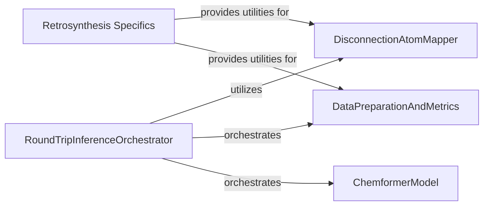

## Component Details

This component overview details the structure and interactions of key modules involved in the retrosynthesis process within the Chemformer project. It highlights how the `RoundTripInferenceOrchestrator` manages the overall workflow, leveraging `DataPreparationAndMetrics` for data handling and evaluation, the `ChemformerModel` for core prediction tasks, and the `DisconnectionAtomMapper` for specialized atom mapping functionalities. The `Retrosynthesis Specifics` component provides utilities tailored for retrosynthesis, including data conversion and atom mapping.

### Retrosynthesis Specifics
This specialized component provides utilities and functionalities specifically tailored for retrosynthesis tasks within the Chemformer project. It handles data conversion to specific input formats and manages atom mapping for accurate reaction predictions.

**Related Classes/Methods**:

- <a href="https://github.com/MolecularAI/Chemformer/blob/master/molbart/retrosynthesis/round_trip_utils.py#L60-L102" target="_blank" rel="noopener noreferrer">`Chemformer.molbart.retrosynthesis.round_trip_utils.convert_to_input_format` (60:102)</a>
- <a href="https://github.com/MolecularAI/Chemformer/blob/master/molbart/retrosynthesis/disconnection_aware/disconnection_atom_mapper.py#L13-L161" target="_blank" rel="noopener noreferrer">`molbart.retrosynthesis.disconnection_aware.disconnection_atom_mapper.DisconnectionAtomMapper` (13:161)</a>

### RoundTripInferenceOrchestrator
Manages the overall flow of the round-trip inference process for retrosynthesis, including dataset creation, model initialization, prediction execution, and integration with metric computation and callbacks.

**Related Classes/Methods**:

- `Chemformer.molbart.retrosynthesis.round_trip_inference.main` (full file reference)
- `Chemformer.molbart.retrosynthesis.round_trip_inference.create_round_trip_dataset` (full file reference)
- `Chemformer.molbart.retrosynthesis.round_trip_inference._run_test_callbacks` (full file reference)

### DataPreparationAndMetrics
Handles the preparation and formatting of input and output data for the round-trip inference, including batching, and is responsible for computing and reporting accuracy metrics based on the model's predictions.

**Related Classes/Methods**:

- <a href="https://github.com/MolecularAI/Chemformer/blob/master/molbart/retrosynthesis/round_trip_utils.py#L60-L102" target="_blank" rel="noopener noreferrer">`Chemformer.molbart.retrosynthesis.round_trip_utils.convert_to_input_format` (60:102)</a>
- <a href="https://github.com/MolecularAI/Chemformer/blob/master/molbart/retrosynthesis/round_trip_utils.py#L38-L57" target="_blank" rel="noopener noreferrer">`Chemformer.molbart.retrosynthesis.round_trip_utils.batchify` (38:57)</a>
- <a href="https://github.com/MolecularAI/Chemformer/blob/master/molbart/retrosynthesis/round_trip_utils.py#L105-L109" target="_blank" rel="noopener noreferrer">`molbart.retrosynthesis.round_trip_utils.set_output_files` (105:109)</a>
- <a href="https://github.com/MolecularAI/Chemformer/blob/master/molbart/retrosynthesis/round_trip_utils.py#L7-L35" target="_blank" rel="noopener noreferrer">`molbart.retrosynthesis.round_trip_utils.compute_round_trip_accuracy` (7:35)</a>

### ChemformerModel
Represents the core Chemformer model, providing functionalities for loading, initializing, and performing predictions on chemical data, which are central to the retrosynthesis task.

**Related Classes/Methods**:

- <a href="https://github.com/MolecularAI/Chemformer/blob/master/molbart/models/chemformer.py#L21-L647" target="_blank" rel="noopener noreferrer">`molbart.models.chemformer.Chemformer` (21:647)</a>
- <a href="https://github.com/MolecularAI/Chemformer/blob/master/molbart/models/chemformer.py#L527-L569" target="_blank" rel="noopener noreferrer">`molbart.models.chemformer.Chemformer.predict` (527:569)</a>

### DisconnectionAtomMapper
Manages the complex logic of atom mapping within retrosynthesis, specifically handling operations like removing atom mappings, propagating input mappings to reactants, and canonicalizing mapped structures to ensure consistency.

**Related Classes/Methods**:

- <a href="https://github.com/MolecularAI/Chemformer/blob/master/molbart/retrosynthesis/disconnection_aware/disconnection_atom_mapper.py#L13-L161" target="_blank" rel="noopener noreferrer">`molbart.retrosynthesis.disconnection_aware.disconnection_atom_mapper.DisconnectionAtomMapper` (13:161)</a>
- <a href="https://github.com/MolecularAI/Chemformer/blob/master/molbart/retrosynthesis/disconnection_aware/disconnection_atom_mapper.py#L31-L58" target="_blank" rel="noopener noreferrer">`molbart.retrosynthesis.disconnection_aware.disconnection_atom_mapper.DisconnectionAtomMapper.predictions_atom_mapping` (31:58)</a>
- <a href="https://github.com/MolecularAI/Chemformer/blob/master/molbart/retrosynthesis/disconnection_aware/disconnection_atom_mapper.py#L102-L115" target="_blank" rel="noopener noreferrer">`molbart.retrosynthesis.disconnection_aware.disconnection_atom_mapper.DisconnectionAtomMapper.remove_atom_mapping` (102:115)</a>
- <a href="https://github.com/MolecularAI/Chemformer/blob/master/molbart/retrosynthesis/disconnection_aware/disconnection_atom_mapper.py#L60-L100" target="_blank" rel="noopener noreferrer">`molbart.retrosynthesis.disconnection_aware.disconnection_atom_mapper.DisconnectionAtomMapper.propagate_input_mapping_to_reactants` (60:100)</a>
- <a href="https://github.com/MolecularAI/Chemformer/blob/master/molbart/retrosynthesis/disconnection_aware/disconnection_atom_mapper.py#L137-L148" target="_blank" rel="noopener noreferrer">`molbart.retrosynthesis.disconnection_aware.disconnection_atom_mapper.DisconnectionAtomMapper._canonicalize_mapped` (137:148)</a>
- <a href="https://github.com/MolecularAI/Chemformer/blob/master/molbart/retrosynthesis/disconnection_aware/disconnection_atom_mapper.py#L150-L161" target="_blank" rel="noopener noreferrer">`molbart.retrosynthesis.disconnection_aware.disconnection_atom_mapper.DisconnectionAtomMapper._reaction_smiles_lst` (150:161)</a>
- <a href="https://github.com/MolecularAI/Chemformer/blob/master/molbart/retrosynthesis/disconnection_aware/disconnection_atom_mapper.py#L20-L29" target="_blank" rel="noopener noreferrer">`molbart.retrosynthesis.disconnection_aware.disconnection_atom_mapper.DisconnectionAtomMapper.mapping_to_index` (20:29)</a>

### [FAQ](https://github.com/CodeBoarding/GeneratedOnBoardings/tree/main?tab=readme-ov-file#faq)