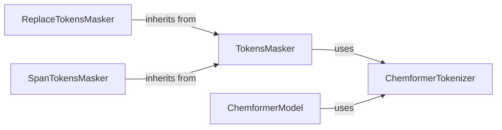

## Component Details

This component specializes in converting chemical structures (SMILES) into numerical tokens, which is a prerequisite for the transformer models. It also implements various masking strategies (e.g., random token replacement, span masking) essential for pre-training objectives.

### ChemformerTokenizer
This component is responsible for converting chemical structures (SMILES) into numerical tokens and managing the vocabulary, including special tokens like start, end, mask, and separation tokens. It extends `pysmilesutils.tokenize.SMILESTokenizer` and distinguishes between chemical and non-chemical tokens.

**Related Classes/Methods**:

- <a href="https://github.com/MolecularAI/Chemformer/blob/master/molbart/utils/tokenizers/tokenizers.py#L13-L133" target="_blank" rel="noopener noreferrer">`molbart.utils.tokenizers.tokenizers.ChemformerTokenizer` (13:133)</a>

### TokensMasker
This is an abstract base class that defines the common interface for token masking strategies. It orchestrates the masking process, including the addition of start and end special tokens, and delegates the specific masking logic to its subclasses. It depends on `ChemformerTokenizer` to perform its operations.

**Related Classes/Methods**:

- <a href="https://github.com/MolecularAI/Chemformer/blob/master/molbart/utils/tokenizers/tokenizers.py#L136-L179" target="_blank" rel="noopener noreferrer">`Chemformer.molbart.utils.tokenizers.tokenizers.TokensMasker` (136:179)</a>
- <a href="https://github.com/MolecularAI/Chemformer/blob/master/molbart/utils/tokenizers/tokenizers.py#L148-L149" target="_blank" rel="noopener noreferrer">`Chemformer.molbart.utils.tokenizers.tokenizers.TokensMasker.__call__` (148:149)</a>
- <a href="https://github.com/MolecularAI/Chemformer/blob/master/molbart/utils/tokenizers/tokenizers.py#L151-L176" target="_blank" rel="noopener noreferrer">`Chemformer.molbart.utils.tokenizers.tokenizers.TokensMasker.mask_tokens` (151:176)</a>
- <a href="https://github.com/MolecularAI/Chemformer/blob/master/molbart/utils/tokenizers/tokenizers.py#L178-L179" target="_blank" rel="noopener noreferrer">`Chemformer.molbart.utils.tokenizers.tokenizers.TokensMasker._apply_mask` (178:179)</a>
- <a href="https://github.com/MolecularAI/Chemformer/blob/master/molbart/utils/tokenizers/tokenizers.py#L139-L146" target="_blank" rel="noopener noreferrer">`Chemformer.molbart.utils.tokenizers.tokenizers.TokensMasker.__init__` (139:146)</a>

### ReplaceTokensMasker
This component implements a token masking strategy where selected tokens are replaced with either a special mask token or a random chemical token, based on a defined probability. It extends the `TokensMasker` base class.

**Related Classes/Methods**:

- <a href="https://github.com/MolecularAI/Chemformer/blob/master/molbart/utils/tokenizers/tokenizers.py#L182-L219" target="_blank" rel="noopener noreferrer">`Chemformer.molbart.utils.tokenizers.tokenizers.ReplaceTokensMasker` (182:219)</a>
- <a href="https://github.com/MolecularAI/Chemformer/blob/master/molbart/utils/tokenizers/tokenizers.py#L194-L201" target="_blank" rel="noopener noreferrer">`Chemformer.molbart.utils.tokenizers.tokenizers.ReplaceTokensMasker.__init__` (194:201)</a>
- <a href="https://github.com/MolecularAI/Chemformer/blob/master/molbart/utils/tokenizers/tokenizers.py#L203-L208" target="_blank" rel="noopener noreferrer">`Chemformer.molbart.utils.tokenizers.tokenizers.ReplaceTokensMasker._apply_mask` (203:208)</a>
- <a href="https://github.com/MolecularAI/Chemformer/blob/master/molbart/utils/tokenizers/tokenizers.py#L210-L219" target="_blank" rel="noopener noreferrer">`Chemformer.molbart.utils.tokenizers.tokenizers.ReplaceTokensMasker._mask_token` (210:219)</a>

### SpanTokensMasker
This component implements a token masking strategy that masks a contiguous span of tokens. The length of the span is determined by a Poisson distribution. It extends the `TokensMasker` base class.

**Related Classes/Methods**:

- <a href="https://github.com/MolecularAI/Chemformer/blob/master/molbart/utils/tokenizers/tokenizers.py#L222-L266" target="_blank" rel="noopener noreferrer">`Chemformer.molbart.utils.tokenizers.tokenizers.SpanTokensMasker` (222:266)</a>
- <a href="https://github.com/MolecularAI/Chemformer/blob/master/molbart/utils/tokenizers/tokenizers.py#L234-L241" target="_blank" rel="noopener noreferrer">`Chemformer.molbart.utils.tokenizers.tokenizers.SpanTokensMasker.__init__` (234:241)</a>
- <a href="https://github.com/MolecularAI/Chemformer/blob/master/molbart/utils/tokenizers/tokenizers.py#L243-L266" target="_blank" rel="noopener noreferrer">`Chemformer.molbart.utils.tokenizers.tokenizers.SpanTokensMasker._apply_mask` (243:266)</a>

### ChemformerModel
This is the main Chemformer model component responsible for building, fine-tuning, predicting, and scoring chemical reactions. It initializes with a tokenizer (specifically `ChemformerTokenizer`), builds the underlying BART or Unified model, and manages training and inference workflows, including data handling and model evaluation.

**Related Classes/Methods**:

- <a href="https://github.com/MolecularAI/Chemformer/blob/master/molbart/models/chemformer.py#L21-L647" target="_blank" rel="noopener noreferrer">`Chemformer.molbart.models.chemformer.Chemformer` (21:647)</a>
- <a href="https://github.com/MolecularAI/Chemformer/blob/master/molbart/models/chemformer.py#L27-L150" target="_blank" rel="noopener noreferrer">`Chemformer.molbart.models.chemformer.Chemformer.__init__` (27:150)</a>
- <a href="https://github.com/MolecularAI/Chemformer/blob/master/molbart/models/chemformer.py#L152-L184" target="_blank" rel="noopener noreferrer">`Chemformer.molbart.models.chemformer.Chemformer.encode` (152:184)</a>
- <a href="https://github.com/MolecularAI/Chemformer/blob/master/molbart/models/chemformer.py#L186-L213" target="_blank" rel="noopener noreferrer">`Chemformer.molbart.models.chemformer.Chemformer.decode` (186:213)</a>
- <a href="https://github.com/MolecularAI/Chemformer/blob/master/molbart/models/chemformer.py#L215-L246" target="_blank" rel="noopener noreferrer">`Chemformer.molbart.models.chemformer.Chemformer.set_datamodule` (215:246)</a>
- <a href="https://github.com/MolecularAI/Chemformer/blob/master/molbart/models/chemformer.py#L248-L254" target="_blank" rel="noopener noreferrer">`Chemformer.molbart.models.chemformer.Chemformer.fit` (248:254)</a>
- <a href="https://github.com/MolecularAI/Chemformer/blob/master/molbart/models/chemformer.py#L256-L257" target="_blank" rel="noopener noreferrer">`Chemformer.molbart.models.chemformer.Chemformer.parameters` (256:257)</a>
- <a href="https://github.com/MolecularAI/Chemformer/blob/master/molbart/models/chemformer.py#L259-L318" target="_blank" rel="noopener noreferrer">`Chemformer.molbart.models.chemformer.Chemformer._random_initialization` (259:318)</a>
- <a href="https://github.com/MolecularAI/Chemformer/blob/master/molbart/models/chemformer.py#L320-L400" target="_blank" rel="noopener noreferrer">`Chemformer.molbart.models.chemformer.Chemformer._initialize_from_ckpt` (320:400)</a>
- <a href="https://github.com/MolecularAI/Chemformer/blob/master/molbart/models/chemformer.py#L402-L439" target="_blank" rel="noopener noreferrer">`Chemformer.molbart.models.chemformer.Chemformer.build_model` (402:439)</a>
- <a href="https://github.com/MolecularAI/Chemformer/blob/master/molbart/models/chemformer.py#L441-L467" target="_blank" rel="noopener noreferrer">`Chemformer.molbart.models.chemformer.Chemformer.get_dataloader` (441:467)</a>
- <a href="https://github.com/MolecularAI/Chemformer/blob/master/molbart/models/chemformer.py#L470-L511" target="_blank" rel="noopener noreferrer">`Chemformer.molbart.models.chemformer.Chemformer.log_likelihood` (470:511)</a>
- <a href="https://github.com/MolecularAI/Chemformer/blob/master/molbart/models/chemformer.py#L513-L525" target="_blank" rel="noopener noreferrer">`Chemformer.molbart.models.chemformer.Chemformer.on_device` (513:525)</a>
- <a href="https://github.com/MolecularAI/Chemformer/blob/master/molbart/models/chemformer.py#L527-L569" target="_blank" rel="noopener noreferrer">`Chemformer.molbart.models.chemformer.Chemformer.predict` (527:569)</a>
- <a href="https://github.com/MolecularAI/Chemformer/blob/master/molbart/models/chemformer.py#L571-L647" target="_blank" rel="noopener noreferrer">`Chemformer.molbart.models.chemformer.Chemformer.score_model` (571:647)</a>

### [FAQ](https://github.com/CodeBoarding/GeneratedOnBoardings/tree/main?tab=readme-ov-file#faq)