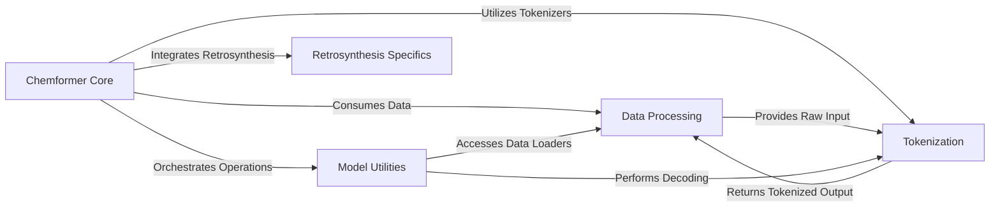

## Component Details

The Chemformer project is designed for chemical language modeling, leveraging transformer architectures to process and generate chemical structures (SMILES). The core functionality revolves around a central Chemformer model that handles training, prediction, and inference tasks. Data is managed by a dedicated processing component, which prepares chemical datasets and interacts with a tokenization component to convert SMILES into numerical representations. Various utilities support the model's operations, including training management, molecule generation strategies, and performance evaluation metrics. Additionally, a specialized component addresses specific retrosynthesis tasks.

### Chemformer Core
This component represents the central intelligence of the Chemformer project, encompassing the main application entry points, the high-level `Chemformer` model, and the underlying transformer architectures (BART, Unified Transformer). It orchestrates various tasks like training, prediction, and inference, leveraging the core neural network models.

**Related Classes/Methods**:

- <a href="https://github.com/MolecularAI/Chemformer/blob/master/molbart/build_tokenizer.py#L33-L55" target="_blank" rel="noopener noreferrer">`Chemformer.molbart.build_tokenizer.main` (33:55)</a>
- <a href="https://github.com/MolecularAI/Chemformer/blob/master/molbart/inference_score.py#L7-L21" target="_blank" rel="noopener noreferrer">`Chemformer.molbart.inference_score.main` (7:21)</a>
- <a href="https://github.com/MolecularAI/Chemformer/blob/master/molbart/fine_tune.py#L9-L18" target="_blank" rel="noopener noreferrer">`Chemformer.molbart.fine_tune.main` (9:18)</a>
- <a href="https://github.com/MolecularAI/Chemformer/blob/master/molbart/pretrain.py#L76-L118" target="_blank" rel="noopener noreferrer">`Chemformer.molbart.pretrain.main` (76:118)</a>
- <a href="https://github.com/MolecularAI/Chemformer/blob/master/molbart/predict.py#L30-L39" target="_blank" rel="noopener noreferrer">`Chemformer.molbart.predict.main` (30:39)</a>
- <a href="https://github.com/MolecularAI/Chemformer/blob/master/molbart/retrosynthesis/round_trip_inference.py#L1-L100" target="_blank" rel="noopener noreferrer">`Chemformer.molbart.retrosynthesis.round_trip_inference.main` (1:100)</a>
- <a href="https://github.com/MolecularAI/Chemformer/blob/master/molbart/models/chemformer.py#L21-L647" target="_blank" rel="noopener noreferrer">`Chemformer.molbart.models.chemformer.Chemformer` (21:647)</a>
- <a href="https://github.com/MolecularAI/Chemformer/blob/master/molbart/models/chemformer.py#L248-L254" target="_blank" rel="noopener noreferrer">`Chemformer.molbart.models.chemformer.Chemformer.fit` (248:254)</a>
- <a href="https://github.com/MolecularAI/Chemformer/blob/master/molbart/models/chemformer.py#L527-L569" target="_blank" rel="noopener noreferrer">`Chemformer.molbart.models.chemformer.Chemformer.predict` (527:569)</a>
- <a href="https://github.com/MolecularAI/Chemformer/blob/master/molbart/models/chemformer.py#L571-L647" target="_blank" rel="noopener noreferrer">`Chemformer.molbart.models.chemformer.Chemformer.score_model` (571:647)</a>
- <a href="https://github.com/MolecularAI/Chemformer/blob/master/molbart/models/chemformer.py#L402-L439" target="_blank" rel="noopener noreferrer">`Chemformer.molbart.models.chemformer.Chemformer.build_model` (402:439)</a>
- <a href="https://github.com/MolecularAI/Chemformer/blob/master/molbart/models/chemformer.py#L152-L184" target="_blank" rel="noopener noreferrer">`Chemformer.molbart.models.chemformer.Chemformer.encode` (152:184)</a>
- <a href="https://github.com/MolecularAI/Chemformer/blob/master/molbart/models/chemformer.py#L215-L246" target="_blank" rel="noopener noreferrer">`Chemformer.molbart.models.chemformer.Chemformer.set_datamodule` (215:246)</a>
- <a href="https://github.com/MolecularAI/Chemformer/blob/master/molbart/models/chemformer.py#L259-L318" target="_blank" rel="noopener noreferrer">`Chemformer.molbart.models.chemformer.Chemformer._random_initialization` (259:318)</a>
- <a href="https://github.com/MolecularAI/Chemformer/blob/master/molbart/models/chemformer.py#L470-L511" target="_blank" rel="noopener noreferrer">`Chemformer.molbart.models.chemformer.Chemformer.log_likelihood` (470:511)</a>
- <a href="https://github.com/MolecularAI/Chemformer/blob/master/molbart/models/transformer_models.py#L17-L310" target="_blank" rel="noopener noreferrer">`Chemformer.molbart.models.transformer_models.BARTModel` (17:310)</a>
- <a href="https://github.com/MolecularAI/Chemformer/blob/master/molbart/models/transformer_models.py#L313-L512" target="_blank" rel="noopener noreferrer">`Chemformer.molbart.models.transformer_models.UnifiedModel` (313:512)</a>
- <a href="https://github.com/MolecularAI/Chemformer/blob/master/molbart/models/base_transformer.py#L16-L294" target="_blank" rel="noopener noreferrer">`Chemformer.molbart.models.base_transformer._AbsTransformerModel` (16:294)</a>
- <a href="https://github.com/MolecularAI/Chemformer/blob/master/molbart/models/base_transformer.py#L99-L107" target="_blank" rel="noopener noreferrer">`Chemformer.molbart.models.base_transformer._AbsTransformerModel.training_step` (99:107)</a>
- <a href="https://github.com/MolecularAI/Chemformer/blob/master/molbart/models/base_transformer.py#L109-L129" target="_blank" rel="noopener noreferrer">`Chemformer.molbart.models.base_transformer._AbsTransformerModel.validation_step` (109:129)</a>
- <a href="https://github.com/MolecularAI/Chemformer/blob/master/molbart/models/base_transformer.py#L136-L158" target="_blank" rel="noopener noreferrer">`Chemformer.molbart.models.base_transformer._AbsTransformerModel.test_step` (136:158)</a>
- <a href="https://github.com/MolecularAI/Chemformer/blob/master/molbart/models/transformer_models.py#L78-L121" target="_blank" rel="noopener noreferrer">`Chemformer.molbart.models.transformer_models.BARTModel.forward` (78:121)</a>
- <a href="https://github.com/MolecularAI/Chemformer/blob/master/molbart/models/transformer_models.py#L365-L399" target="_blank" rel="noopener noreferrer">`Chemformer.molbart.models.transformer_models.UnifiedModel.forward` (365:399)</a>

### Data Processing
This component is responsible for all aspects of data handling, including loading, processing, splitting, and preparing chemical datasets (e.g., ChEMBL, ZINC, USPTO) for model consumption. It manages data loaders, batch transformations, and provides utilities for data collection.

**Related Classes/Methods**:

- <a href="https://github.com/MolecularAI/Chemformer/blob/master/molbart/data/base.py#L73-L343" target="_blank" rel="noopener noreferrer">`Chemformer.molbart.data.base._AbsDataModule` (73:343)</a>
- <a href="https://github.com/MolecularAI/Chemformer/blob/master/molbart/data/mol_data.py#L11-L31" target="_blank" rel="noopener noreferrer">`Chemformer.molbart.data.mol_data.ChemblDataModule` (11:31)</a>
- <a href="https://github.com/MolecularAI/Chemformer/blob/master/molbart/data/mol_data.py#L34-L50" target="_blank" rel="noopener noreferrer">`Chemformer.molbart.data.mol_data.ZincDataModule` (34:50)</a>
- <a href="https://github.com/MolecularAI/Chemformer/blob/master/molbart/data/datamodules.py#L6-L59" target="_blank" rel="noopener noreferrer">`Chemformer.molbart.data.datamodules.SynthesisDataModule` (6:59)</a>
- <a href="https://github.com/MolecularAI/Chemformer/blob/master/molbart/data/seq2seq_data.py#L8-L42" target="_blank" rel="noopener noreferrer">`Chemformer.molbart.data.seq2seq_data.Uspto50DataModule` (8:42)</a>
- <a href="https://github.com/MolecularAI/Chemformer/blob/master/molbart/data/seq2seq_data.py#L45-L66" target="_blank" rel="noopener noreferrer">`Chemformer.molbart.data.seq2seq_data.UsptoMixedDataModule` (45:66)</a>
- <a href="https://github.com/MolecularAI/Chemformer/blob/master/molbart/data/seq2seq_data.py#L69-L98" target="_blank" rel="noopener noreferrer">`Chemformer.molbart.data.seq2seq_data.UsptoSepDataModule` (69:98)</a>
- <a href="https://github.com/MolecularAI/Chemformer/blob/master/molbart/data/seq2seq_data.py#L101-L128" target="_blank" rel="noopener noreferrer">`Chemformer.molbart.data.seq2seq_data.MolecularOptimizationDataModule` (101:128)</a>
- <a href="https://github.com/MolecularAI/Chemformer/blob/master/molbart/data/base.py#L346-L421" target="_blank" rel="noopener noreferrer">`Chemformer.molbart.data.base.MoleculeListDataModule` (346:421)</a>
- <a href="https://github.com/MolecularAI/Chemformer/blob/master/molbart/data/base.py#L424-L487" target="_blank" rel="noopener noreferrer">`Chemformer.molbart.data.base.ReactionListDataModule` (424:487)</a>
- <a href="https://github.com/MolecularAI/Chemformer/blob/master/molbart/data/base.py#L20-L70" target="_blank" rel="noopener noreferrer">`Chemformer.molbart.data.base.ChemistryDataset` (20:70)</a>
- <a href="https://github.com/MolecularAI/Chemformer/blob/master/molbart/data/data_collection.py#L1-L100" target="_blank" rel="noopener noreferrer">`Chemformer.molbart.data.data_collection.DataCollection` (1:100)</a>
- <a href="https://github.com/MolecularAI/Chemformer/blob/master/molbart/data/util.py#L7-L84" target="_blank" rel="noopener noreferrer">`Chemformer.molbart.data.util.BatchEncoder` (7:84)</a>
- <a href="https://github.com/MolecularAI/Chemformer/blob/master/molbart/data/zinc_utils.py#L56-L69" target="_blank" rel="noopener noreferrer">`Chemformer.molbart.data.zinc_utils.read_zinc_slice` (56:69)</a>

### Tokenization
This component specializes in converting chemical structures (SMILES) into numerical tokens, which is a prerequisite for the transformer models. It also implements various masking strategies (e.g., random token replacement, span masking) essential for pre-training objectives.

**Related Classes/Methods**:

- <a href="https://github.com/MolecularAI/Chemformer/blob/master/molbart/utils/tokenizers/tokenizers.py#L136-L179" target="_blank" rel="noopener noreferrer">`Chemformer.molbart.utils.tokenizers.tokenizers.TokensMasker` (136:179)</a>
- <a href="https://github.com/MolecularAI/Chemformer/blob/master/molbart/utils/tokenizers/tokenizers.py#L182-L219" target="_blank" rel="noopener noreferrer">`Chemformer.molbart.utils.tokenizers.tokenizers.ReplaceTokensMasker` (182:219)</a>
- <a href="https://github.com/MolecularAI/Chemformer/blob/master/molbart/utils/tokenizers/tokenizers.py#L222-L266" target="_blank" rel="noopener noreferrer">`Chemformer.molbart.utils.tokenizers.tokenizers.SpanTokensMasker` (222:266)</a>
- <a href="https://github.com/MolecularAI/Chemformer/blob/master/molbart/utils/tokenizers/tokenizers.py#L13-L133" target="_blank" rel="noopener noreferrer">`molbart.utils.tokenizers.tokenizers.ChemformerTokenizer` (13:133)</a>

### Model Utilities
This component provides a suite of utilities that support the training, inference, and evaluation processes of the Chemformer model. This includes functions for building and configuring the PyTorch Lightning Trainer, implementing various sampling and decoding strategies (like beam search), and defining metrics for scoring and evaluating model performance.

**Related Classes/Methods**:

- <a href="https://github.com/MolecularAI/Chemformer/blob/master/molbart/utils/trainer_utils.py#L85-L108" target="_blank" rel="noopener noreferrer">`Chemformer.molbart.utils.trainer_utils.build_trainer` (85:108)</a>
- <a href="https://github.com/MolecularAI/Chemformer/blob/master/molbart/utils/trainer_utils.py#L13-L22" target="_blank" rel="noopener noreferrer">`Chemformer.molbart.utils.trainer_utils.instantiate_callbacks` (13:22)</a>
- <a href="https://github.com/MolecularAI/Chemformer/blob/master/molbart/utils/callbacks/callback_collection.py#L1-L100" target="_blank" rel="noopener noreferrer">`Chemformer.molbart.utils.callbacks.callback_collection.CallbackCollection` (1:100)</a>
- <a href="https://github.com/MolecularAI/Chemformer/blob/master/molbart/utils/callbacks/callbacks.py#L60-L102" target="_blank" rel="noopener noreferrer">`Chemformer.molbart.utils.callbacks.callbacks.StepCheckpoint` (60:102)</a>
- <a href="https://github.com/MolecularAI/Chemformer/blob/master/molbart/utils/callbacks/callbacks.py#L123-L184" target="_blank" rel="noopener noreferrer">`Chemformer.molbart.utils.callbacks.callbacks.ValidationScoreCallback` (123:184)</a>
- <a href="https://github.com/MolecularAI/Chemformer/blob/master/molbart/utils/callbacks/callbacks.py#L187-L253" target="_blank" rel="noopener noreferrer">`Chemformer.molbart.utils.callbacks.callbacks.ScoreCallback` (187:253)</a>
- <a href="https://github.com/MolecularAI/Chemformer/blob/master/molbart/utils/samplers/beam_search_samplers.py#L162-L597" target="_blank" rel="noopener noreferrer">`Chemformer.molbart.utils.samplers.beam_search_samplers.DecodeSampler` (162:597)</a>
- <a href="https://github.com/MolecularAI/Chemformer/blob/master/molbart/utils/samplers/beam_search_samplers.py#L21-L159" target="_blank" rel="noopener noreferrer">`Chemformer.molbart.utils.samplers.beam_search_samplers.BeamSearchSampler` (21:159)</a>
- <a href="https://github.com/MolecularAI/Chemformer/blob/master/molbart/utils/samplers/beam_search_utils.py#L4-L184" target="_blank" rel="noopener noreferrer">`Chemformer.molbart.utils.samplers.beam_search_utils.Node` (4:184)</a>
- <a href="https://github.com/MolecularAI/Chemformer/blob/master/molbart/utils/samplers/beam_search_utils.py#L218-L224" target="_blank" rel="noopener noreferrer">`molbart.utils.samplers.beam_search_utils.LogicalOr` (218:224)</a>
- <a href="https://github.com/MolecularAI/Chemformer/blob/master/molbart/utils/samplers/beam_search_utils.py#L192-L198" target="_blank" rel="noopener noreferrer">`molbart.utils.samplers.beam_search_utils.MaxLength` (192:198)</a>
- <a href="https://github.com/MolecularAI/Chemformer/blob/master/molbart/utils/samplers/beam_search_utils.py#L201-L206" target="_blank" rel="noopener noreferrer">`molbart.utils.samplers.beam_search_utils.EOS` (201:206)</a>
- <a href="https://github.com/MolecularAI/Chemformer/blob/master/molbart/utils/scores/score_collection.py#L19-L100" target="_blank" rel="noopener noreferrer">`Chemformer.molbart.utils.scores.score_collection.ScoreCollection` (19:100)</a>
- <a href="https://github.com/MolecularAI/Chemformer/blob/master/molbart/utils/scores/scores.py#L9-L30" target="_blank" rel="noopener noreferrer">`Chemformer.molbart.utils.scores.scores.BaseScore` (9:30)</a>
- <a href="https://github.com/MolecularAI/Chemformer/blob/master/molbart/utils/scores/scores.py#L33-L66" target="_blank" rel="noopener noreferrer">`Chemformer.molbart.utils.scores.scores.FractionInvalidScore` (33:66)</a>
- <a href="https://github.com/MolecularAI/Chemformer/blob/master/molbart/utils/scores/scores.py#L69-L107" target="_blank" rel="noopener noreferrer">`Chemformer.molbart.utils.scores.scores.FractionUniqueScore` (69:107)</a>
- <a href="https://github.com/MolecularAI/Chemformer/blob/master/molbart/utils/scores/scores.py#L110-L165" target="_blank" rel="noopener noreferrer">`Chemformer.molbart.utils.scores.scores.TanimotoSimilarityScore` (110:165)</a>
- <a href="https://github.com/MolecularAI/Chemformer/blob/master/molbart/utils/scores/scores.py#L168-L217" target="_blank" rel="noopener noreferrer">`Chemformer.molbart.utils.scores.scores.TopKAccuracyScore` (168:217)</a>

### Retrosynthesis Specifics
This specialized component provides utilities and functionalities specifically tailored for retrosynthesis tasks within the Chemformer project. It handles data conversion to specific input formats and manages atom mapping for accurate reaction predictions.

**Related Classes/Methods**:

- <a href="https://github.com/MolecularAI/Chemformer/blob/master/molbart/retrosynthesis/round_trip_utils.py#L60-L102" target="_blank" rel="noopener noreferrer">`Chemformer.molbart.retrosynthesis.round_trip_utils.convert_to_input_format` (60:102)</a>
- <a href="https://github.com/MolecularAI/Chemformer/blob/master/molbart/retrosynthesis/disconnection_aware/disconnection_atom_mapper.py#L13-L161" target="_blank" rel="noopener noreferrer">`molbart.retrosynthesis.disconnection_aware.disconnection_atom_mapper.DisconnectionAtomMapper` (13:161)</a>

### [FAQ](https://github.com/CodeBoarding/GeneratedOnBoardings/tree/main?tab=readme-ov-file#faq)