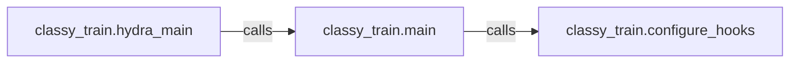

## Details

This subsystem is the foundational layer for initiating and configuring the entire training process within ClassyVision. It is responsible for parsing command-line arguments, loading and resolving the training configuration, and performing essential initial setup tasks before the main training loop commences.

### classy_train.hydra_main
Serves as the application's primary entry point. It is responsible for parsing command-line arguments and integrating with the Hydra configuration framework to load and resolve the complete training configuration (e.g., model parameters, data paths, training schedules). This component ensures that all necessary parameters are available and correctly structured for the subsequent training process.

**Related Classes/Methods**:

- <a href="https://github.com/facebookresearch/ClassyVision/blob/main/classy_train.py#L160-L165" target="_blank" rel="noopener noreferrer">`classy_train.hydra_main`:160-165</a>

### classy_train.main
Acts as the central orchestrator for the entire training process. It receives the resolved configuration from `hydra_main` and performs critical initial setup tasks. These tasks include configuring distributed training environments (if applicable), preparing the overall training pipeline, and setting up various lifecycle hooks (e.g., for logging, checkpointing, evaluation) before the main training loop begins.

**Related Classes/Methods**:

- <a href="https://github.com/facebookresearch/ClassyVision/blob/main/classy_train.py#L71-L114" target="_blank" rel="noopener noreferrer">`classy_train.main`:71-114</a>

### classy_train.configure_hooks
A specialized component responsible for configuring and initializing various lifecycle hooks. These hooks are integral to the training process, enabling functionalities like logging metrics, saving model checkpoints, performing evaluation at specific intervals, and other callback-driven behaviors. This component ensures that the training pipeline is equipped with the necessary monitoring and control mechanisms.

**Related Classes/Methods**:

- <a href="https://github.com/facebookresearch/ClassyVision/blob/main/classy_train.py#L117-L155" target="_blank" rel="noopener noreferrer">`classy_train.configure_hooks`:117-155</a>

### [FAQ](https://github.com/CodeBoarding/GeneratedOnBoardings/tree/main?tab=readme-ov-file#faq)