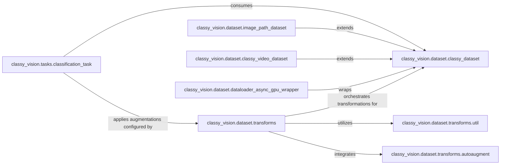

## Details

The `Data Pipeline` subsystem in ClassyVision is responsible for all aspects of data handling, from loading raw data to applying complex transformations and preparing data batches for model training. It is designed to be highly modular and extensible, aligning with the project's ML Toolkit/Framework nature.

### classy_vision.dataset.classy_dataset
Defines the foundational interface for all datasets, ensuring consistent methods for data access, iteration, and batching. It serves as the abstract base for specific dataset implementations.

**Related Classes/Methods**:

- <a href="https://github.com/facebookresearch/ClassyVision/blob/main/classy_vision/dataset/classy_dataset.py" target="_blank" rel="noopener noreferrer">`classy_vision.dataset.classy_dataset`</a>

### classy_vision.dataset.transforms
Acts as a central factory and orchestrator for constructing and composing various data transformation pipelines. It aggregates and manages individual transformation utilities.

**Related Classes/Methods**:

- <a href="https://github.com/facebookresearch/ClassyVision/blob/main/classy_vision/dataset/transforms/__init__.py" target="_blank" rel="noopener noreferrer">`classy_vision.dataset.transforms`</a>

### classy_vision.dataset.image_path_dataset
Handles the loading and management of image data directly from file system paths, implementing the `classy_dataset` interface for common image classification tasks.

**Related Classes/Methods**:

- <a href="https://github.com/facebookresearch/ClassyVision/blob/main/classy_vision/dataset/image_path_dataset.py" target="_blank" rel="noopener noreferrer">`classy_vision.dataset.image_path_dataset`</a>

### classy_vision.dataset.classy_video_dataset
Manages the specific complexities of video data, including frame/clip sampling and worker initialization, extending the `classy_dataset` interface for video-based tasks.

**Related Classes/Methods**:

- <a href="https://github.com/facebookresearch/ClassyVision/blob/main/classy_vision/dataset/classy_video_dataset.py" target="_blank" rel="noopener noreferrer">`classy_vision.dataset.classy_video_dataset`</a>

### classy_vision.dataset.dataloader_async_gpu_wrapper
Enhances data loading performance by asynchronously prefetching data to the GPU, thereby reducing CPU-GPU transfer bottlenecks during the training process.

**Related Classes/Methods**:

- <a href="https://github.com/facebookresearch/ClassyVision/blob/main/classy_vision/dataset/dataloader_async_gpu_wrapper.py" target="_blank" rel="noopener noreferrer">`classy_vision.dataset.dataloader_async_gpu_wrapper`</a>

### classy_vision.dataset.transforms.util
Provides a library of common image transformations, including those optimized for standard benchmarks like ImageNet, serving as fundamental building blocks for transformation pipelines.

**Related Classes/Methods**:

- <a href="https://github.com/facebookresearch/ClassyVision/blob/main/classy_vision/dataset/transforms/util.py" target="_blank" rel="noopener noreferrer">`classy_vision.dataset.transforms.util`</a>

### classy_vision.dataset.transforms.autoaugment
Implements and applies automated data augmentation policies to enhance model robustness and generalization, integrated into transformation pipelines.

**Related Classes/Methods**:

- <a href="https://github.com/facebookresearch/ClassyVision/blob/main/classy_vision/dataset/transforms/autoaugment.py" target="_blank" rel="noopener noreferrer">`classy_vision.dataset.transforms.autoaugment`</a>

### classy_vision.tasks.classification_task
Orchestrates the entire data flow for classification tasks, including configuring datasets, building dataloaders, and managing the batching process for consumption by the model. This component represents the primary consumer and orchestrator of the data pipeline within a training task.

**Related Classes/Methods**:

- <a href="https://github.com/facebookresearch/ClassyVision/blob/main/classy_vision/tasks/classification_task.py" target="_blank" rel="noopener noreferrer">`classy_vision.tasks.classification_task`</a>

### [FAQ](https://github.com/CodeBoarding/GeneratedOnBoardings/tree/main?tab=readme-ov-file#faq)