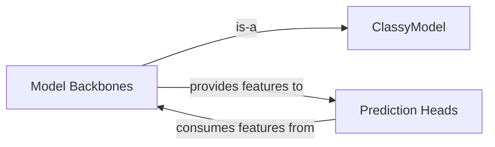

## Details

The ClassyVision model subsystem is designed with a clear separation of concerns, centered around the abstract ClassyModel component. This foundational interface ensures uniformity across diverse neural network architectures. Model Backbones, which are specialized implementations extending ClassyModel, are responsible for the crucial task of feature extraction from raw input data, transforming it into rich, high-dimensional representations. These extracted features are then passed to Prediction Heads, which consume them to perform task-specific transformations, ultimately yielding the final predictions. This modular architecture facilitates flexible composition, allowing various backbones and heads to be combined, thereby streamlining the development and experimentation with different model configurations.

### ClassyModel
Serves as the abstract base class for all neural network models within ClassyVision. It defines a standardized interface for model construction, feature extraction, and the integration of prediction heads, ensuring consistency across diverse model architectures. This component is fundamental for the framework's extensibility, allowing new model backbones to be easily integrated.

**Related Classes/Methods**:

- <a href="https://github.com/facebookresearch/ClassyVision/blob/main/classy_vision/models/classy_model.py#L130-L420" target="_blank" rel="noopener noreferrer">`classy_vision.models.classy_model.ClassyModel`:130-420</a>

### Model Backbones
These components represent specific neural network architectures (e.g., DenseNet, EfficientNet, ResNeXt, VisionTransformer, AnyNet, RegNet, ResNeXt3D) designed for feature extraction from input data. Each backbone provides a unique way to transform raw inputs into a rich, high-dimensional feature representation suitable for downstream tasks. They are the "feature extractors" of the model.

**Related Classes/Methods**:

- <a href="https://github.com/facebookresearch/ClassyVision/blob/main/classy_vision/models/densenet.py#L103-L276" target="_blank" rel="noopener noreferrer">`classy_vision.models.densenet.DenseNet`:103-276</a>
- <a href="https://github.com/facebookresearch/ClassyVision/blob/main/classy_vision/models/efficientnet.py#L257-L481" target="_blank" rel="noopener noreferrer">`classy_vision.models.efficientnet.EfficientNet`:257-481</a>
- <a href="https://github.com/facebookresearch/ClassyVision/blob/main/classy_vision/models/resnext.py#L259-L477" target="_blank" rel="noopener noreferrer">`classy_vision.models.resnext.ResNeXt`:259-477</a>
- <a href="https://github.com/facebookresearch/ClassyVision/blob/main/classy_vision/models/vision_transformer.py#L189-L394" target="_blank" rel="noopener noreferrer">`classy_vision.models.vision_transformer.VisionTransformer`:189-394</a>
- <a href="https://github.com/facebookresearch/ClassyVision/blob/main/classy_vision/models/anynet.py#L407-L536" target="_blank" rel="noopener noreferrer">`classy_vision.models.anynet.AnyNet`:407-536</a>
- <a href="https://github.com/facebookresearch/ClassyVision/blob/main/classy_vision/models/regnet.py#L139-L203" target="_blank" rel="noopener noreferrer">`classy_vision.models.regnet.RegNet`:139-203</a>
- <a href="https://github.com/facebookresearch/ClassyVision/blob/main/classy_vision/models/resnext3d.py#L288-L417" target="_blank" rel="noopener noreferrer">`classy_vision.models.resnext3d.ResNeXt3D`:288-417</a>

### Prediction Heads
These components (e.g., FullyConvolutionalLinearHead, VisionTransformerHead) are responsible for transforming the features extracted by the Model Backbones into final predictions. They typically apply linear transformations or other task-specific layers to produce outputs like class probabilities for classification. They act as the final layer(s) of the neural network.

**Related Classes/Methods**:

- <a href="https://github.com/facebookresearch/ClassyVision/blob/main/classy_vision/heads/fully_convolutional_linear_head.py#L47-L144" target="_blank" rel="noopener noreferrer">`classy_vision.heads.fully_convolutional_linear_head.FullyConvolutionalLinearHead`:47-144</a>
- <a href="https://github.com/facebookresearch/ClassyVision/blob/main/classy_vision/heads/vision_transformer_head.py#L28-L87" target="_blank" rel="noopener noreferrer">`classy_vision.heads.vision_transformer_head.VisionTransformerHead`:28-87</a>

### [FAQ](https://github.com/CodeBoarding/GeneratedOnBoardings/tree/main?tab=readme-ov-file#faq)