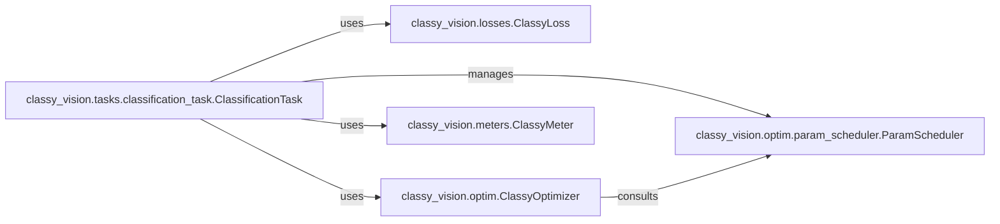

## Details

The ClassyVision training and evaluation subsystem is centered around the ClassificationTask, which acts as the primary orchestrator. It leverages a set of abstract components to perform its functions: ClassyLoss for loss computation, ClassyOptimizer for parameter updates, ParamScheduler for dynamic adjustment of optimizer parameters, and ClassyMeter for performance monitoring. This modular design allows for flexible integration of various algorithms and strategies, with the ClassificationTask coordinating their interactions to execute the training and evaluation pipeline efficiently.

### classy_vision.losses.ClassyLoss
Defines the interface and common methods for all loss functions. Its concrete subclasses (e.g., BarronLoss, LabelSmoothingLoss) implement specific algorithms to quantify the discrepancy between model predictions and true labels.

**Related Classes/Methods**:

- <a href="https://github.com/facebookresearch/ClassyVision/blob/main/classy_vision/losses/classy_loss.py" target="_blank" rel="noopener noreferrer">`classy_vision.losses.ClassyLoss`</a>

### classy_vision.optim.ClassyOptimizer
Abstract base for optimizers. Its concrete subclasses (e.g., RMSprop) implement algorithms (e.g., SGD, Adam) to adjust model parameters based on the gradients computed from the loss. It manages parameter groups and applies updates.

**Related Classes/Methods**:

- <a href="https://github.com/facebookresearch/ClassyVision/blob/main/classy_vision/optim/classy_optimizer.py" target="_blank" rel="noopener noreferrer">`classy_vision.optim.ClassyOptimizer`</a>

### classy_vision.optim.param_scheduler.ParamScheduler
Abstract base for parameter schedulers. Its concrete subclasses define strategies for dynamically adjusting optimizer parameters (e.g., learning rate, momentum) over time, typically across epochs or iterations.

**Related Classes/Methods**:

- <a href="https://github.com/facebookresearch/ClassyVision/blob/main/classy_vision/optim/param_scheduler/param_scheduler.py" target="_blank" rel="noopener noreferrer">`classy_vision.optim.param_scheduler.ParamScheduler`</a>

### classy_vision.meters.ClassyMeter
Abstract base for performance metrics. Its concrete subclasses (e.g., AccuracyMeter, PrecisionMeter) track, aggregate, and compute various performance statistics (e.g., accuracy, precision, recall) during training and evaluation.

**Related Classes/Methods**:

- <a href="https://github.com/facebookresearch/ClassyVision/blob/main/classy_vision/meters/classy_meter.py" target="_blank" rel="noopener noreferrer">`classy_vision.meters.ClassyMeter`</a>

### classy_vision.tasks.classification_task.ClassificationTask
Acts as the central orchestrator for the training and evaluation phases. It is responsible for configuring, initializing, and coordinating the use of ClassyLoss, ClassyOptimizer, ParamScheduler, and ClassyMeter instances based on the overall experiment configuration. It drives the execution flow, including forward pass, loss calculation, backward pass, parameter updates, and metric aggregation.

**Related Classes/Methods**:

- <a href="https://github.com/facebookresearch/ClassyVision/blob/main/classy_vision/tasks/classification_task.py#L106-L1358" target="_blank" rel="noopener noreferrer">`classy_vision.tasks.classification_task.ClassificationTask`:106-1358</a>

### [FAQ](https://github.com/CodeBoarding/GeneratedOnBoardings/tree/main?tab=readme-ov-file#faq)