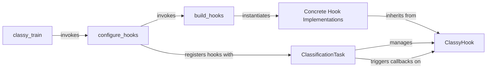

## Details

The `classy_train` subsystem orchestrates the training process by leveraging a flexible hook-based architecture. The `classy_train.main` function serves as the primary entry point, responsible for initializing the training environment and setting up the core components. It invokes `configure_hooks` to dynamically create and register various `Concrete Hook Implementations`, which all adhere to the `ClassyHook` abstract interface. These hooks are then integrated with the `ClassificationTask`, the central component that manages the training and evaluation loops. The `ClassificationTask` acts as a "hook manager," triggering the appropriate callback methods on the registered `ClassyHook` instances at different stages of the training lifecycle, enabling modular and extensible training workflows.

### ClassyHook
The abstract base class that defines the interface and contract for all training hooks. It provides standardized callback methods (e.g., `on_start`, `on_end`, `on_step`) that concrete hooks override, enabling custom logic injection at various stages of the training lifecycle. It also manages hook state and priority.

**Related Classes/Methods**:

- <a href="https://github.com/facebookresearch/ClassyVision/blob/main/classy_vision/hooks/classy_hook.py#L29-L121" target="_blank" rel="noopener noreferrer">`classy_vision.hooks.classy_hook.ClassyHook`:29-121</a>
- <a href="https://github.com/facebookresearch/ClassyVision/blob/main/classy_vision/hooks/classy_hook.py" target="_blank" rel="noopener noreferrer">`classy_vision.hooks.classy_hook.ClassyHook:on_start`</a>
- <a href="https://github.com/facebookresearch/ClassyVision/blob/main/classy_vision/hooks/classy_hook.py" target="_blank" rel="noopener noreferrer">`classy_vision.hooks.classy_hook.ClassyHook:on_end`</a>
- <a href="https://github.com/facebookresearch/ClassyVision/blob/main/classy_vision/hooks/classy_hook.py" target="_blank" rel="noopener noreferrer">`classy_vision.hooks.classy_hook.ClassyHook:on_step`</a>

### Concrete Hook Implementations
A collection of specific hook implementations that extend `ClassyHook`. These components encapsulate distinct functionalities such as saving model checkpoints, logging training metrics, performing precise batch normalization, or integrating with visualization tools like TensorBoard.

**Related Classes/Methods**:

- <a href="https://github.com/facebookresearch/ClassyVision/blob/main/classy_vision/hooks/checkpoint_hook.py#L17-L112" target="_blank" rel="noopener noreferrer">`classy_vision.hooks.checkpoint_hook.CheckpointHook`:17-112</a>
- <a href="https://github.com/facebookresearch/ClassyVision/blob/main/classy_vision/hooks/loss_lr_meter_logging_hook.py#L15-L85" target="_blank" rel="noopener noreferrer">`classy_vision.hooks.loss_lr_meter_logging_hook.LossLRMeterLoggingHook`:15-85</a>
- <a href="https://github.com/facebookresearch/ClassyVision/blob/main/classy_vision/hooks/tensorboard_plot_hook.py#L29-L212" target="_blank" rel="noopener noreferrer">`classy_vision.hooks.tensorboard_plot_hook.TensorboardPlotHook`:29-212</a>

### build_hooks
A factory function responsible for instantiating concrete hook objects based on the provided configuration. This centralizes hook creation, promoting modularity and decoupling the creation process from the training task.

**Related Classes/Methods**:

- <a href="https://github.com/facebookresearch/ClassyVision/blob/main/classy_vision/hooks/__init__.py" target="_blank" rel="noopener noreferrer">`classy_vision.hooks.build_hooks`</a>

### configure_hooks
Reads the training configuration related to hooks, invokes `build_hooks` to create hook instances, and registers these instances with the training task (`ClassificationTask`) during the initial setup of a training run.

**Related Classes/Methods**:

- <a href="https://github.com/facebookresearch/ClassyVision/blob/main/classy_train.py#L117-L155" target="_blank" rel="noopener noreferrer">`configure_hooks`:117-155</a>

### ClassificationTask
The central orchestrator of the training and evaluation loops. It maintains a collection of registered hooks and is responsible for iterating through them and triggering their respective lifecycle methods (e.g., `on_start`, `on_epoch_end`, `on_step`) at the appropriate points during training. This component acts as the "hook manager" within the training loop.

**Related Classes/Methods**:

- <a href="https://github.com/facebookresearch/ClassyVision/blob/main/classy_vision/tasks/classification_task.py#L106-L1358" target="_blank" rel="noopener noreferrer">`classy_vision.tasks.classification_task.ClassificationTask`:106-1358</a>
- <a href="https://github.com/facebookresearch/ClassyVision/blob/main/classy_vision/tasks/classification_task.py" target="_blank" rel="noopener noreferrer">`classy_vision.tasks.classification_task.ClassificationTask:on_start`</a>
- <a href="https://github.com/facebookresearch/ClassyVision/blob/main/classy_vision/tasks/classification_task.py" target="_blank" rel="noopener noreferrer">`classy_vision.tasks.classification_task.ClassificationTask:on_epoch_end`</a>
- <a href="https://github.com/facebookresearch/ClassyVision/blob/main/classy_vision/tasks/classification_task.py" target="_blank" rel="noopener noreferrer">`classy_vision.tasks.classification_task.ClassificationTask:on_step`</a>

### classy_train
The top-level entry point for initiating a training run. It handles the overall configuration and setup of the training run, including the initialization and registration of hooks by invoking `configure_hooks`.

**Related Classes/Methods**:

- <a href="https://github.com/facebookresearch/ClassyVision/blob/main/classy_train.py#L71-L114" target="_blank" rel="noopener noreferrer">`classy_train.main`:71-114</a>

### [FAQ](https://github.com/CodeBoarding/GeneratedOnBoardings/tree/main?tab=readme-ov-file#faq)