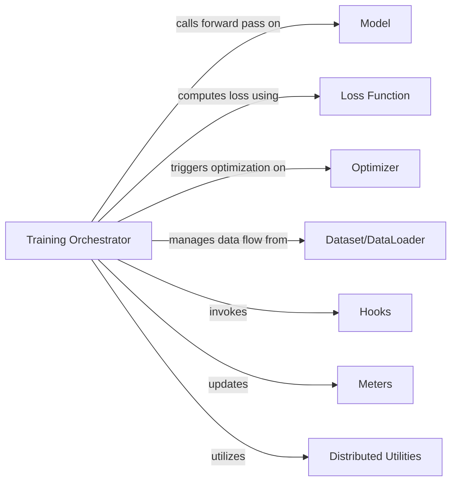

## Details

The Training Orchestrator subsystem in ClassyVision is centered around the ClassificationTask component, which orchestrates the entire machine learning training and evaluation lifecycle.

### Training Orchestrator [[Expand]](./Training_Orchestrator.md)
The core orchestrator of the training and evaluation lifecycle for classification tasks. It manages the entire flow, from data loading and model execution to loss computation, optimization, and distributed training coordination. It acts as the central control unit, defining the training and evaluation steps.

**Related Classes/Methods**:

- <a href="https://github.com/facebookresearch/ClassyVision/blob/main/classy_vision/tasks/classification_task.py#L106-L1358" target="_blank" rel="noopener noreferrer">`classy_vision.tasks.classification_task.ClassificationTask`:106-1358</a>

### Model
Represents the neural network model used for predictions.

**Related Classes/Methods**:

- <a href="https://github.com/facebookresearch/ClassyVision/blob/main/classy_vision/models/classy_model.py#L130-L420" target="_blank" rel="noopener noreferrer">`classy_vision.models.classy_model.ClassyModel`:130-420</a>

### Loss Function
Calculates the discrepancy between model predictions and ground truth.

**Related Classes/Methods**:

- <a href="https://github.com/facebookresearch/ClassyVision/blob/main/classy_vision/losses/classy_loss.py#L12-L71" target="_blank" rel="noopener noreferrer">`classy_vision.losses.classy_loss.ClassyLoss`:12-71</a>

### Optimizer
Updates model parameters based on the computed loss.

**Related Classes/Methods**:

- <a href="https://github.com/facebookresearch/ClassyVision/blob/main/classy_vision/optim/classy_optimizer.py#L45-L277" target="_blank" rel="noopener noreferrer">`classy_vision.optim.classy_optimizer.ClassyOptimizer`:45-277</a>

### Dataset/DataLoader
Manages and provides data batches for training and evaluation.

**Related Classes/Methods**:

- <a href="https://github.com/facebookresearch/ClassyVision/blob/main/classy_vision/dataset/__init__.py" target="_blank" rel="noopener noreferrer">`classy_vision.dataset.Dataset`</a>

### Hooks [[Expand]](./Hooks.md)
Provides extension points for custom logic at various stages of the training lifecycle.

**Related Classes/Methods**:

- <a href="https://github.com/facebookresearch/ClassyVision/blob/main/classy_vision/hooks/classy_hook.py#L29-L121" target="_blank" rel="noopener noreferrer">`classy_vision.hooks.classy_hook.ClassyHook`:29-121</a>

### Meters
Tracks and aggregates performance metrics during training and evaluation.

**Related Classes/Methods**:

- <a href="https://github.com/facebookresearch/ClassyVision/blob/main/classy_vision/meters/__init__.py" target="_blank" rel="noopener noreferrer">`classy_vision.meters.Meter`</a>

### Distributed Utilities
Provides functionalities for distributed training operations.

**Related Classes/Methods**:

- <a href="https://github.com/facebookresearch/ClassyVision/blob/main/classy_vision/generic/distributed_util.py" target="_blank" rel="noopener noreferrer">`classy_vision.generic.distributed_util.DistributedUtil`</a>

### [FAQ](https://github.com/CodeBoarding/GeneratedOnBoardings/tree/main?tab=readme-ov-file#faq)