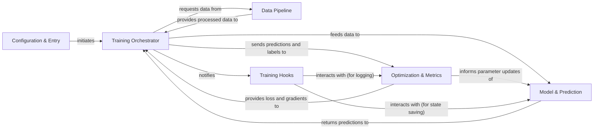

## Details

The `ClassyVision` project implements a modular and extensible machine learning training pipeline, primarily focusing on image classification tasks. The core architecture revolves around a central `Training Orchestrator` that coordinates data flow, model execution, and optimization. Data is managed by a dedicated `Data Pipeline`, ensuring efficient loading and transformation. The `Model & Prediction` component encapsulates the neural network, handling forward passes to generate predictions. `Optimization & Metrics` is responsible for calculating loss, applying parameter updates, and tracking performance. A flexible `Training Hooks` system allows for custom logic injection at various stages of the training lifecycle, such as logging or checkpointing. The `Configuration & Entry` component serves as the initial setup point, parsing arguments and initiating the entire process. This design promotes clear separation of concerns, making the system adaptable for various training scenarios and facilitating diagrammatic representation with distinct component boundaries and clear data flow arrows.

### Configuration & Entry [[Expand]](./Configuration_Entry.md)
The initial setup and control point for the entire training process, responsible for parsing arguments, loading configurations, and orchestrating the start of the training run.

**Related Classes/Methods**:

- <a href="https://github.com/facebookresearch/ClassyVision/blob/main/classy_train.py" target="_blank" rel="noopener noreferrer">`classy_train.py`</a>

### Training Orchestrator [[Expand]](./Training_Orchestrator.md)
The central coordinator of the training and evaluation lifecycle, managing the flow of data, model execution, loss calculation, and optimization steps.

**Related Classes/Methods**:

- <a href="https://github.com/facebookresearch/ClassyVision/blob/main/classy_vision/tasks/classification_task.py" target="_blank" rel="noopener noreferrer">`classy_vision.tasks.classification_task.py`</a>

### Data Pipeline [[Expand]](./Data_Pipeline.md)
Handles all aspects of data management, including loading datasets, applying transformations (e.g., augmentations, normalization), and providing data batches to the training process.

**Related Classes/Methods**:

- <a href="https://github.com/facebookresearch/ClassyVision/blob/main/classy_vision/dataset/classy_dataset.py" target="_blank" rel="noopener noreferrer">`classy_vision/dataset/classy_dataset.py`</a>
- <a href="https://github.com/facebookresearch/ClassyVision/blob/main/classy_vision/dataset/transforms/__init__.py" target="_blank" rel="noopener noreferrer">`classy_vision/dataset/transforms/__init__.py`</a>

### Model & Prediction [[Expand]](./Model_Prediction.md)
Encapsulates the neural network architecture, including the backbone for feature extraction and specific prediction heads, responsible for generating model outputs.

**Related Classes/Methods**:

- <a href="https://github.com/facebookresearch/ClassyVision/blob/main/classy_vision/models/classy_model.py" target="_blank" rel="noopener noreferrer">`classy_vision/models/classy_model.py`</a>
- <a href="https://github.com/facebookresearch/ClassyVision/blob/main/classy_vision/heads/fully_convolutional_linear_head.py" target="_blank" rel="noopener noreferrer">`classy_vision/heads/fully_convolutional_linear_head.py`</a>

### Optimization & Metrics [[Expand]](./Optimization_Metrics.md)
Manages the training dynamics by calculating loss, performing parameter updates (via optimizers and schedulers), and tracking various performance metrics throughout the training and evaluation phases.

**Related Classes/Methods**:

- <a href="https://github.com/facebookresearch/ClassyVision/blob/main/classy_vision/losses/classy_loss.py" target="_blank" rel="noopener noreferrer">`classy_vision/losses/classy_loss.py`</a>
- <a href="https://github.com/facebookresearch/ClassyVision/blob/main/classy_vision/optim/classy_optimizer.py" target="_blank" rel="noopener noreferrer">`classy_vision/optim/classy_optimizer.py`</a>
- <a href="https://github.com/facebookresearch/ClassyVision/blob/main/classy_vision/optim/param_scheduler/__init__.py" target="_blank" rel="noopener noreferrer">`classy_vision/optim/param_scheduler/__init__.py`</a>
- <a href="https://github.com/facebookresearch/ClassyVision/blob/main/classy_vision/meters/classy_meter.py" target="_blank" rel="noopener noreferrer">`classy_vision/meters/classy_meter.py`</a>

### Training Hooks [[Expand]](./Training_Hooks.md)
Provides a flexible callback mechanism to inject custom logic or perform actions at predefined points during the training lifecycle, such as logging, checkpointing, or early stopping.

**Related Classes/Methods**:

- <a href="https://github.com/facebookresearch/ClassyVision/blob/main/classy_vision/hooks/classy_hook.py" target="_blank" rel="noopener noreferrer">`classy_vision/hooks/classy_hook.py`</a>

### [FAQ](https://github.com/CodeBoarding/GeneratedOnBoardings/tree/main?tab=readme-ov-file#faq)