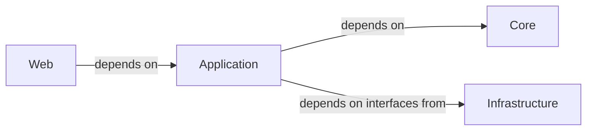

## Details

One paragraph explaining the functionality which is represented by this graph. What the main flow is and what is its purpose.

### Application [[Expand]](./Application.md)
The Application Layer (also known as the Use Cases Project) defines application-specific business logic, use cases (commands and queries), Data Transfer Objects (DTOs), and application services. It orchestrates interactions with the Core (Domain) layer and utilizes interfaces (ports) defined in the Core layer, which are then implemented by the Infrastructure layer. It also defines interfaces for Infrastructure services, adhering to the Dependency Inversion Principle.

**Related Classes/Methods**: _None_

### Core [[Expand]](./Core.md)
Core component.

**Related Classes/Methods**: _None_

### Infrastructure
Infrastructure component.

**Related Classes/Methods**: _None_

### Web [[Expand]](./Web.md)
Web component.

**Related Classes/Methods**: _None_

### [FAQ](https://github.com/CodeBoarding/GeneratedOnBoardings/tree/main?tab=readme-ov-file#faq)